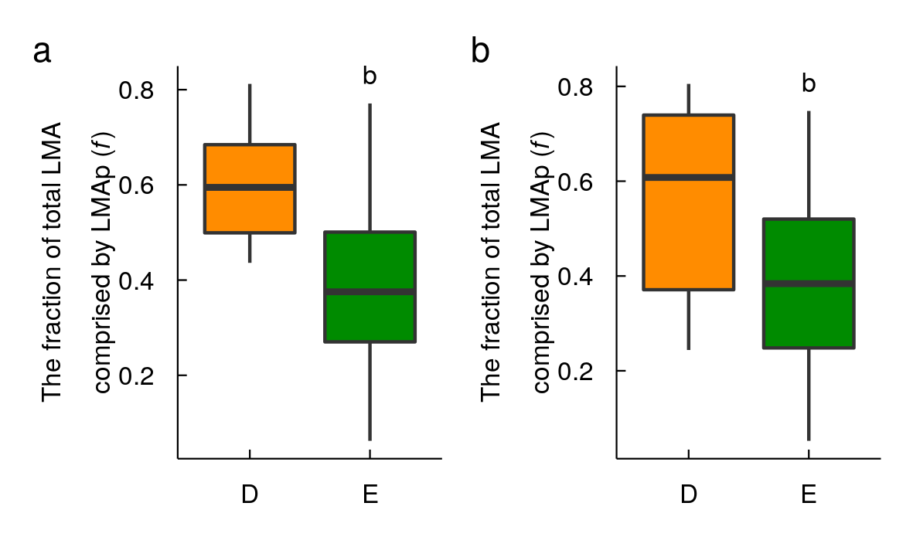

```{r global_options, include=FALSE}
knitr::opts_chunk$set(echo=TRUE,
                      warning=FALSE,
                      cache=TRUE,
                      message=FALSE)
```

# Library

```{r, message=FALSE}
library(tidyverse)
library(loo)
library(rstan)
library(scales)
library(patchwork)

settings <- yaml::yaml.load_file("../settings.yml")
r_vals <- yaml::yaml.load_file("../r_val.yml")
para_vals <- yaml::yaml.load_file("../para_val.yml")
p_letters <- yaml::yaml.load_file("../letters.yml")
source("../fig_theme.r")

theme_set(theme_LES() +
          theme(axis.text.x = element_text(size = 6),
                axis.text.y = element_text(size = 6),
                axis.title = element_text(size = 6),
                axis.ticks.length = unit(-0.1, "cm"),
                axis.title.y = element_text(margin = margin(t = 0,
                                                            b = 0,
                                                            l = -5,
                                                            r = 0)),
                axis.title.x = element_text(margin = margin(t = 0,
                                                            b = -5,
                                                            l = -5,
                                                            r = -5)),
                ))

```


# Scatter plot (Hypo)

This figure is based on a hypothetical data. 
var(LMAp) > var(LMAs), alpha_m > 0 and alpha_s < 0. 
This parameter setting mimics GLOPNET values. All the values were generated from the following parameter setting.
No covariance between LMAp and LMAs

```{r h2,  comment=NA}

a0 <- para_vals$GL$a0
ap <- para_vals$GL$ap
as <- para_vals$GL$as
sig1 <- para_vals$GL$sig1

set.seed(12)
N <- 200
LMAp <- rlnorm(N, log(80), 0.8)
LMAs <- rlnorm(N, log(80), 0.7)
LMA <- LMAp + LMAs
log_Aarea <- rnorm(N, log(a0 * LMAp^ap * LMAs^as) - 0.5 * sig1^2, sig1)
Aarea <- exp(log_Aarea)
#Aarea <- rlnorm(N, log(a0 * LMAp^ap * LMAs^as), sig1)
tmp <- tibble(LMA, LMAp, LMAs, Aarea)

cor.test(log(Aarea), log(LMA))
cor.test(log(Aarea/LMA), log(LMA))

p1 <- ggplot(tmp, aes(LMAp, LMAs, color = LMA)) +
  geom_point(alpha = 0.9) +
  scale_x_log10() +
  scale_y_log10() +
  scale_color_viridis_c(trans = "log10",
                        breaks = c(50, 100, 200 ,500)
                        ) +
  #scale_color_gradient2(midpoint = median(LMA),
  #                     low = "#e66101",
  #                     high = "#5e3c99") +
  xlab(expression(LMAp~(g~m^{-2}))) +
  ylab(expression(LMAs~(g~m^{-2}))) +
  theme(legend.position = "none")

p2 <- ggplot(tmp, aes(LMA, Aarea, color = LMA)) +
  geom_point(alpha = 0.9) +
  scale_x_log10() +
  scale_y_log10() +
  scale_color_viridis_c(trans = "log10") +
  xlab(expression(Total~LMA~(g~m^{-2}))) +
  ylab(expression(italic(A)[area]~(~mu~mol~m^{-2}~s^{-1}))) +
  theme(legend.position = "none")

p3 <- ggplot(tmp, aes(LMA, y = Aarea / LMA, color = LMA)) +
  geom_point(alpha = 0.9) +
  scale_x_log10() +
  scale_y_log10() +
  scale_color_viridis_c(trans = "log10",
                        breaks = c(50, 100, 300, 500),
                        name = "Total LMA"
                        ) +
  xlab(expression(Total~LMA~(g~m^{-2}))) +
  ylab(expression(italic(A)[mass]~(~mu~mol~g^{-1}~s^{-1}))) +
  theme(legend.position = "right",
        legend.key.size = unit(0.3, "cm"),
        legend.spacing.y = unit(0.1, "cm"),
        legend.text = element_text(size = 8),
        legend.title = element_text(size = 8))


p4 <- p1 + p2  + p3 +
  plot_annotation(tag_levels = "a") &
  theme(plot.tag = element_text(face = "bold"),
        legend.background =  element_blank())

my_ggsave("../figs/fig_hypo.png", p4,
          height = 5, width = 16)

```


# Scatter plots (estimated)


## GL simple

```{r GLdat, comment=NA}
GL <- read_csv("../data/GL_res.csv")
```

```{r GL-scatter-simple,  comment=NA}

GL_dat <- GL %>% 
  gather(LMA, Val, c(LMA, LMAs, LMAp)) %>%
  gather(Trait, Val2, c(Aarea, Rarea, LL,
                        Parea, Narea)) %>%
  mutate(DE = factor(DE,
          levels = c("D", "E", "U"))) %>%
  mutate(LMA = factor(LMA,
    labels = c("LMA", "LMAm", "LMAs"))) %>%
  mutate(LMA = factor(LMA,
    labels = c("LMA~(~g~m^{-2})", "LMAm~(~g~m^{-2})", "LMAs~(~g~m^{-2})"))) %>%
  mutate(Trait = factor(Trait,
    levels = c("Aarea", "Rarea", "LL", "Narea", "Parea"))) %>%
  mutate(Trait2 = factor(Trait,
    labels = c("italic(A)[area]~(~mu~mol~m^{-2}~s^{-1})",
               "italic(R)[area]~(~mu~mol~m^{-2}~s^{-1})",
               "LL~(months)",
               "italic(N)[area]~(~g~m^{-2})",
               "italic(P)[area]~(~g~m^{-2})"))) 

GL_dat1 <- GL_dat |>
  filter(Trait %in% c("LL", "Aarea", "Rarea"))

lim_GL <- lim_func(GL_dat1)

lim_GL2 <- lim_func(GL_dat1, LMA = FALSE)

lab1 <- tibble(lab = paste("(", letters[1:9], ")", sep = ""),
                   Val2 = lim_GL2$max_val %>% rep(each = 3),
                  # Val2 = Inf,
                   Val = lim_GL$min_val %>% rep(3),
                   Val_max = lim_GL$max_val %>% rep(3),
                   gr = "Evergreen",
                   r_vals = r_vals$r_vals$GL %>% unlist,
                   Trait2 = rep(lim_GL2$Trait2, each = 3),
                   LMA = rep(lim_GL$LMA, 3)
                   )

fills <- c("Deciduous" = settings$fills$D,
          "Evergreen" = settings$fills$E,
          "Unclassified" = settings$fills$U)

cols <- c("Deciduous" = settings$colors$D,
          "Evergreen" = settings$colors$E,
          "Unclassified" = settings$colors$U)

GL_plot <- scatter_plt(GL_dat1)

my_ggsave("../figs/GL_scatter.png", GL_plot)

```


## NP

```{r GL-NP,  comment=NA}

GL_dat2 <- GL_dat |>
  filter(Trait %in% c("Narea", "Parea"))

lim_GL <- lim_func(GL_dat2 %>% filter(DE != "Rand"))
lim_GL2 <- lim_func(GL_dat2 %>% filter(DE != "Rand"),
                    LMA = FALSE)

lab1 <- tibble(lab = paste("(", letters[1:6], ")", sep = ""),
                   Val2 = lim_GL2$max_val %>% rep(each = 3),
                   Val = lim_GL$min_val %>% rep(2),
                   Val_max = lim_GL$max_val %>% rep(2),
                   gr = "Evergreen",
                   r_vals = r_vals$r_vals$GL_NP %>% unlist,
                   Trait2 = rep(lim_GL2$Trait2, each = 3),
                   LMA = rep(lim_GL$LMA, 2)
                   )

GL_NP_plot <- scatter_plt(GL_dat2)

my_ggsave("../figs/GL_NP.png", GL_NP_plot)

```


## Panama

```{r PAdat, comment=NA}
PA <- read_csv("../data/PA_res.csv")
```


```{r PA-scatter-simple,  comment=NA}

PA_dat <- PA %>% 
  gather(LMA, Val, c(LMA, LMAs, LMAp)) %>%
  gather(Trait, Val2, c(Aarea, Rarea, LL,
                        Parea, Narea, cell_area)) %>%
  mutate(site_strata = factor(site_strata,
          levels = c("WET_CAN", "DRY_CAN", "WET_UNDER", "DRY_UNDER"))) %>%
  mutate(gr = factor(site_strata,
    labels = c("Sun-Wet",
               "Sun-Dry",
               "Shade-Wet",
               "Shade-Dry"
                      ))) %>%
  mutate(LMA = factor(LMA,
    labels = c("LMA", "LMAm", "LMAs"))) %>%
  mutate(LMA = factor(LMA,
    labels = c("LMA~(~g~m^{-2})", "LMAm~(~g~m^{-2})", "LMAs~(~g~m^{-2})"))) %>%
  mutate(Trait = factor(Trait,
    levels = c("Aarea", "Rarea", "LL", "Narea", "Parea", "cell_area"))) %>%
  mutate(Trait2 = factor(Trait,
    labels = c("italic(A)[area]~(~mu~mol~m^{-2}~s^{-1})",
               "italic(R)[area]~(~mu~mol~m^{-2}~s^{-1})",
               "LL~(months)",
               "italic(N)[area]~(~g~m^{-2})",
               "italic(P)[area]~(~g~m^{-2})",
               "italic(CL)[area]~(~g~m^{-2})"
               )))

PA_dat1 <- PA_dat |>
  filter(Trait %in% c("LL", "Aarea", "Rarea"))

lim_PA <- lim_func(PA_dat1)
lim_PA2 <- lim_func(PA_dat1, LMA = FALSE)

lab1 <- tibble(lab = paste("(", letters[1:9], ")", sep = ""),
                   Val2 = lim_PA2$max_val %>% rep(each = 3),
                  # Val2 = Inf,
                   Val = lim_PA$min_val %>% rep(3),
                   Val_max = lim_PA$max_val %>% rep(3),
                   gr = "Sun-Dry",
                   r_vals = r_vals$r_vals$PA %>% unlist,
                   #r_vals = "hoge",
                   Trait2 = rep(lim_PA2$Trait2, each = 3),
                   LMA = rep(lim_PA$LMA, 3)
                   )

fills <- c("Sun-Dry" = settings$fills$sun_dry,
          "Sun-Wet" = settings$fills$sun_wet,
          "Shade-Dry" = settings$fills$shade_dry,
          "Shade-Wet" = settings$fills$shade_wet)

cols <- c("Sun-Dry" = settings$colors$sun_dry,
          "Sun-Wet" = settings$colors$sun_wet,
          "Shade-Dry" = settings$colors$shade_dry,
          "Shade-Wet" = settings$colors$shade_wet)

PA_plot <- scatter_plt(PA_dat1)

my_ggsave("../figs/PA_scatter.png", PA_plot)

```


## Panama NPCL

```{r PA-NPCL, comment=NA, eval = TRUE}

PA_dat2 <- PA_dat %>%
  filter(Trait %in% c("Narea", "Parea", "cell_area"))

lim_PA <- lim_func(PA_dat2)

lim_PA2 <- lim_func(PA_dat2, LMA = FALSE)

lab1 <- tibble(lab = paste("(", letters[1:9], ")", sep = ""),
                   Val2 = lim_PA2$max_val %>% rep(each = 3),
                   Val = lim_PA$min_val %>% rep(3),
                   Val_max = lim_PA$max_val %>% rep(3),
                   gr = "Sun-Dry",
                   r_vals = r_vals$r_vals$PA_NP %>% unlist,
                   Trait2 = rep(lim_PA2$Trait2, each = 3),
                   LMA = rep(lim_PA$LMA, 3)
                   )

PA_NPC_plot <- scatter_plt(PA_dat2)

my_ggsave("../figs/PA_NPC.png", PA_NPC_plot)

```


## LL: Obs vs Pred

```{r LL-pre, comment=NA}

LLdat <- PA |>
  mutate(site_strata = factor(site_strata,
          levels = c("WET_CAN", "DRY_CAN", "WET_UNDER", "DRY_UNDER"))) %>%
  mutate(gr = factor(site_strata,
    labels = c("Sun-Wet",
               "Sun-Dry",
               "Shade-Wet",
               "Shade-Dry"
                      )))


LL_plot <- ggplot(LLdat, aes(x = LL, y = exp(Mu2),
                              fill = gr, col = gr)) +
  geom_point(shape = 21) +
  scale_fill_manual(values = fills) +
  scale_colour_manual(values = cols) +
  scale_x_log10(breaks = my_breaks(), expand = c(0.1, 0),
                limits = c(min(PA$LL), max(PA$LL))) +
  scale_y_log10(breaks = my_breaks(), expand = c(0.1, 0),
                limits = c(min(PA$LL), max(PA$LL))) +
  xlab("Predicted LL (months)") +
  ylab("Observed LL (months)") +
  geom_abline(aes(slope = 1, intercept = 0),
              lty = 2,
              lwd = 0.25,
              col = "gray20") +
  annotate("text", x = max(PA$LL) - 20, y = 3,5,
           label = r_vals$r_vals$PA_R2$LL_R2,
           parse = TRUE) +
  coord_fixed() +
  theme_LES() +
  theme(
    legend.position = c(0.2, 0.85),
    axis.title.x = element_text(margin = margin(t = 1,
                                                b = 1,
                                                l = 0,
                                                r = 0)),
    axis.title.y = element_text(margin = margin(t = 1,
                                                b = 1,
                                                l = 1,
                                                r = 1))
        )

my_ggsave("../figs/LL_plot.png", LL_plot,
          width = 6.7,
          height = 6.7)

```


# Mass-proportionality

```{r}

Sun <- PA %>%
  filter(strata == "CAN")

Shade <- PA %>%
  filter(strata != "CAN")

GL_para <- read_csv("../data/GLpara.csv")
PA_para <- read_csv("../data/PApara.csv")

point_dat <- bind_rows(
  GL_para |>
    filter(para %in% c("ap", "as")) |> 
    mutate(site = "GL"), 
  PA_para |>
    filter(para %in% c("ap", "as")) |> 
    mutate(site = "PA")
) |>
  dplyr::select(site, para, mean, lwr = X2.5., upr = X97.5.)


point_dat2 <- tibble(type = c("GLOPNET", "Panama Sun", "Panama Shade"),
  ap = c(point_dat$mean[1], point_dat$mean[3], point_dat$mean[3]),
  as = c(point_dat$mean[2], 0, 0)
)


GLb <- lm(log(Aarea) ~ log(LMA), GL)$coefficients[2]
Sunb <- lm(log(Aarea) ~ log(LMA), Sun)$coefficients[2]
Shadeb <- lm(log(Aarea) ~ log(LMA), Shade)$coefficients[2]

b_vec <- c(GLb, Sunb, Shadeb) %>% round(2)

point_dat3 <- point_dat2 %>%
  mutate(b = paste("italic('b')==", b_vec))


my_rlnorm <- function(n, mu, sigma)rlnorm(n, mu - 0.5 * sigma^2, sigma)

var_fun <- \(LMAs) {
  LMA <- LMAp + LMAs
  cov(LMA, LMAs) / var(LMA) * 100
}

PA_varS <- cov(PA$LMA, PA$LMAs) / var(PA$LMA) * 100
GL_varS <- cov(GL$LMA, GL$LMAs) / var(GL$LMA) * 100
Sun_varS <- cov(Sun$LMA, Sun$LMAs) / var(Sun$LMA) * 100
Shade_varS <- cov(Shade$LMA, Shade$LMAs) / var(Shade$LMA) * 100

GL_sim <- \(LMAs) {
  A <- exp(log(GL_para$`X50.`[1]) +  
           GL_para$`X50.`[2] * log(LMAp) +
           GL_para$`X50.`[3] * log(LMAs)
  )
  fit <- lm(log(A) ~ log(LMAp + LMAs))
  fit$coefficients[2]
}

PA_sim <- \(LMAs) {
  A <- exp(
           PA_para$`X50.`[2] * log(LMAp))
  fit <- lm(log(A) ~ log(LMAp + LMAs))
  fit$coefficients[2]
}


set.seed(123)
N <- 100
b_GL <- NULL
b_PA <- NULL
LMAs_var <- NULL
x_len <- 20

sig_fun <- function(x) {
  mu <- mean(x)
  sig <- sd(x)
  sqrt(log((sig/mu)^2 + 1))
}

mu_fun <- function(x) {
  mu <- mean(x)
  sig <- sd(x)
  log(mu^2 / sqrt(sig^2 + mu^2))
}


# GL
mu_GL <- mu_fun(GL$LMAp)
mu_GL2 <- mu_fun(GL$LMAs)
sig_GL <- sig_fun(GL$LMAp)
LMAs_var <- NULL
b_GL <- NULL
for (i in 1:1000) {
  LMAp <- rlnorm(N, mu_GL, sig_GL)
  tmp <- seq(log(1.01), log(10), length = x_len)
  LMAs <- map(tmp, \(x) rlnorm(N, mu_GL2, x))
  LMAs_var <- cbind(LMAs_var, map_dbl(LMAs, var_fun))
  b_GL <- cbind(b_GL, map_dbl(LMAs, GL_sim))
}

LMAs_var_mean <- apply(LMAs_var, 1, mean)
mean_GL <- apply(b_GL, 1, mean)
upr_GL <- apply(b_GL, 1, \(x)(quantile(x, 0.975)))
lwr_GL <- apply(b_GL, 1, \(x)(quantile(x, 0.025)))
sim1 <- tibble(mean = mean_GL, upr = upr_GL, lwr = lwr_GL,
               LMAs_var_mean, site = "GLOPNET")


# PA - Sun
mu_Sun <- mu_fun(Sun$LMAp)
mu_Sun2 <- mu_fun(Sun$LMAs)
sig_Sun <- sig_fun(Sun$LMAp)
LMAs_var <- NULL
b_Sun <- NULL
for (i in 1:1000) {
  LMAp <- rlnorm(N, mu_Sun, sig_Sun)
  tmp <- seq(log(1.01), log(10), length = x_len)
  LMAs <- map(tmp, \(x) rlnorm(N, mu_Sun2, x))
  LMAs_var <- cbind(LMAs_var, map_dbl(LMAs, var_fun))
  b_Sun <- cbind(b_Sun, map_dbl(LMAs, PA_sim))
}

LMAs_var_mean <- apply(LMAs_var, 1, mean)
mean_Sun <- apply(b_Sun, 1, mean)
upr_Sun <- apply(b_Sun, 1, \(x)(quantile(x, 0.975)))
lwr_Sun <- apply(b_Sun, 1, \(x)(quantile(x, 0.025)))
sim2 <- tibble(mean = mean_Sun, upr = upr_Sun, lwr = lwr_Sun,
               LMAs_var_mean, site = "Sun")

# PA - Shade

cor.test(log(Shade$LMAp), log(Shade$LMAs))
cor.test(log(Sun$LMAp), log(Sun$LMAs))
cor.test(log(GL$LMAp), log(GL$LMAs))

mu_Shade <- mu_fun(Shade$LMAp)
mu_Shade2 <- mu_fun(Shade$LMAs)
sig_Shade <- sig_fun(Shade$LMAp)
LMAs_var <- NULL
b_Shade <- NULL
for (i in 1:1000) {
  LMAp <- rlnorm(N, mu_Shade, sig_Shade)
  tmp <- seq(log(1.01), log(10), length = x_len)
  LMAs <- map(tmp, \(x) rlnorm(N, mu_Shade2, x))
  LMAs_var <- cbind(LMAs_var, map_dbl(LMAs, var_fun))
  b_Shade <- cbind(b_Shade, map_dbl(LMAs, PA_sim))
}

LMAs_var_mean <- apply(LMAs_var, 1, mean)
mean_Shade <- apply(b_Shade, 1, mean)
upr_Shade <- apply(b_Shade, 1, \(x)(quantile(x, 0.975)))
lwr_Shade <- apply(b_Shade, 1, \(x)(quantile(x, 0.025)))
sim3 <- tibble(mean = mean_Shade, upr = upr_Shade, lwr = lwr_Shade,
               LMAs_var_mean, site = "Shade")

# PA - shade 2 (MVN)


Mu <- c(mean(log(Shade$LMAp)) - var(log(Shade$LMAp)) / 2,
        mean(log(Shade$LMAs)) - var(log(Shade$LMAs)) / 2)

rho <- -0.4 
sig1 <- sd(log(Shade$LMAp))
sig2 <- seq(log(1.01), log(10), length = x_len)
var_fun2 <- function(LMAp, LMAs) {
  LMA <- LMAp + LMAs
  cov(LMA, LMAs) / var(LMA) * 100
}

PA_sim2 <- \(LMAp, LMAs) {
  A <- exp(
           PA_para$`X50.`[2] * log(LMAp))
  fit <- lm(log(A) ~ log(LMAp + LMAs))
  fit$coefficients[2]
}

LMAs_var <- NULL
b_Shade2 <- NULL
for (j in 1:1000) {
  LMAp <- NULL
  LMAs <- NULL
  for (i in 1:10) {
    S <- matrix(c(sig1^2, rho*sig1*sig2[i], rho*sig1*sig2[i], sig2[i]^2), ncol = 2)
    tmp <- MASS::mvrnorm(100, Mu, S)
    LMAp[[i]] <- tmp[,1] |> exp()
    LMAs[[i]] <- tmp[,2] |> exp()
  }
  LMAs_var <- cbind(LMAs_var, map2_dbl(LMAp, LMAs, var_fun2))
  b_Shade2 <- cbind(b_Shade2, map2_dbl(LMAp, LMAs, PA_sim2))
}

LMAs_var_mean <- apply(LMAs_var, 1, mean)
mean_Shade2 <- apply(b_Shade2, 1, mean)
upr_Shade2 <- apply(b_Shade2, 1, \(x)(quantile(x, 0.975)))
lwr_Shade2 <- apply(b_Shade2, 1, \(x)(quantile(x, 0.025)))
sim4 <- tibble(mean = mean_Shade2, upr = upr_Shade2, lwr = lwr_Shade2,
               LMAs_var_mean, site = "Shade")

var_dat <- tibble(var_ = c(GL_varS, Sun_varS, Shade_varS),
                  b = c(GLb, Sunb, Shadeb),
                  site = c("GLOPNET", "Sun", "Shade") |>
                    factor(levels =  c("GLOPNET", "Sun", "Shade")))

fills2 <- c("Sun\nDry" = settings$fills$sun_dry,
          "Sun\nWet" = settings$fills$sun_wet,
          "Shade\nDry" = settings$fills$shade_dry,
          "Shade\nWet" = settings$fills$shade_wet,
          "Rand" = settings$fills$R)

cols2 <- c("Sun\nDry" = settings$colors$sun_dry,
          "Sun\nWet" = settings$colors$sun_wet,
          "Shade\nDry" = settings$colors$shade_dry,
          "Shade\nWet" = settings$colors$shade_wet,
          "Rand" = settings$colors$R)
#FF8C00
#008B00

#8B7355" "#1874CD"   "black"   "black"

fills3 <- c("GLOPNET" = "#008B00",
            "Sun" = "#1874CD",
            "Shade" = "gray"
)

cols3 <- c("GLOPNET" = "#008B00",
            "Sun" = "#1874CD",
            "Shade" = "black"
)

#[1] "#CA0020" "#F4A582" "#92C5DE" "#0571B0"

# [1] "#EF8A62" "#F7F7F7" "#67A9CF"

RColorBrewer::brewer.pal(3, "RdBu")

my_col <- RColorBrewer::brewer.pal(4, "RdBu")

#fills3 <- RColorBrewer::brewer.pal(4, "RdBu")[1:3]
#cols3 <- fills3

#theme_set(theme_LES() +
#          theme(axis.text.x = element_text(size = 6),
#                axis.text.y = element_text(size = 6),
#                axis.title = element_text(size = 6),
#                axis.ticks.length = unit(-0.1, "cm"),
#                axis.title.y = element_text(margin = margin(t = 0,
#                                                            b = 0,
#                                                            l = -5,
#                                                            r = 0)),
#                axis.title.x = element_text(margin = margin(t = 0,
#                                                            b = -4,
#                                                            l = -5,
#                                                            r = -5)),
#                ))

```

```{r}
mass_plt_simple <- bind_rows(sim1, sim2, sim4) |>
  mutate(site = factor(site, levels = c("GLOPNET", "Sun", "Shade")))  |>
#mass_plt_simple <- bind_rows(sim1, sim2, sim3, sim4) |>
  ggplot() +
  geom_ribbon(aes(ymin = lwr, ymax = upr,
                  x = LMAs_var_mean,
                  fill = site),
              alpha = 0.4)  +
  geom_line(aes(y = mean, x = LMAs_var_mean, col = site)) +
  geom_point(data = var_dat, aes(x = var_, y = b, shape = site, col = site)) +
  scale_fill_manual(values = fills3, name = "Parameter") +
  scale_color_manual(values = cols3, name = "Parameter") +
  scale_shape_discrete(name = "Parameter")  +
#  geom_point(aes(x = GL_varS, y = GLb)) +
#  geom_point(aes(x = Sun_varS, y = Sunb)) +
#  geom_point(aes(x = Shade_varS, y = Shadeb)) +
#  coord_cartesian(ylim = c(-0.2, 1)) +
  ylab(expression(Mass~proportionality~(italic(b)))) +
  xlab("Relative variance of LMAs (%)") +
  theme(legend.position = c(0.75, 0.66),
        legend.key.size = unit(0.5, "cm"),
        legend.spacing.y = unit(0.1, "cm"),
        legend.text.align = 0,
        legend.key.height = unit(0.2, "cm"),
        legend.text = element_text(size = 8),
        legend.title = element_text(size = 8)
  )
#mass_plt_simple

my_ggsave("../figs/mass_prop_simple.png", mass_plt_simple,
          height = 6, width = 6)
```

```{r}
mass_plt_simple2 <- bind_rows(sim1, sim2, sim4) |>
  mutate(site = factor(site, levels = c("GLOPNET", "Sun", "Shade")))  |>
#mass_plt_simple <- bind_rows(sim1, sim2, sim3, sim4) |>
  ggplot() +
  geom_ribbon(aes(ymin = lwr, ymax = upr, 
                  x = LMAs_var_mean, 
                  group = site),
              alpha = 0.4)  +
  geom_line(aes(y = mean, x = LMAs_var_mean)) +
  geom_point(data = var_dat, aes(x = var_, y = b )) +
  facet_wrap(~ site) +
#  geom_point(aes(x = GL_varS, y = GLb)) +
#  geom_point(aes(x = Sun_varS, y = Sunb)) +
#  geom_point(aes(x = Shade_varS, y = Shadeb)) +
#  coord_cartesian(ylim = c(-0.2, 1)) +
  ylab(expression(Mass~proportionality~(italic(b)))) +
  xlab("Relative variance of LMAs (%)")
mass_plt_simple2

my_ggsave("../figs/mass_prop_simple2.png", mass_plt_simple2,
          height = 6, width = 18)

```


# Boxplot

## Main plot

```{r box, comment=NA}

fills <- c("D" = settings$fills$D,
          "E" = settings$fills$E)

cols <- c("D" = settings$colors$D,
          "E" = settings$colors$E)


GL_dat_box <- GL |>
  filter(DE != "U") |>
  dplyr::select(sp, DE, GF, LMA, LMAp, LMAs) |>
  pivot_longer(LMA:LMAs, names_to = "LMA", values_to = "Val") |>
  mutate(gr = factor(DE,
                     levels = c("D", "E"))) |>
  unique()


theme_box <- function(base_size = 9,
                      base_family = "sans") {
  ret <- theme_LES() %+replace%
  theme(
    panel.border = element_blank(),
    panel.spacing = unit(0.5, "lines"),
    #plot.margin = margin(1,10,1,1),
    axis.line = element_line(colour = "black", size = 0.25),
    axis.title.y = element_text(margin = margin(t = 0,
                                                b = 0,
                                                l = -4,
                                                r = 0),
                                angle = 90)
        )
}

lab1 <- GL_dat_box %>%
  group_by(gr, LMA) %>%
  summarize(Val = max(Val)) %>%
  ungroup %>%
  arrange(LMA) %>%
  mutate(lab = p_letters$GL 
         %>% unlist)

GL_box <- ggplot(GL_dat_box, aes(x = gr, y = Val, fill = gr)) +
  geom_boxplot(outlier.shape = 21, outlier.size = 1) +
  geom_text(data= lab1, aes(label = lab),
            vjust = -1,
            size = 8 * 5/14) +
  facet_grid(.~ LMA) +
  ylab(expression(atop("GLOPNET",
                LMA~(g~m^{-2})))) +
  xlab("") +
  scale_fill_manual(values = fills, guide = "none") +
  #guides(fill = FALSE, colour = FALSE) +
  #scale_x_log10(breaks = my_breaks(), expand = c(0.1, 0)) +
  scale_y_log10(breaks = my_breaks(), expand = c(0.1, 0)) +
  #scale_y_log10(breaks = trans_breaks("log10", function(x) 10^x),
  #              labels = trans_format("log10", math_format(10^.x))) +
  theme_box()

fills2 <- c("Sun\nDry" = settings$fills$sun_dry,
          "Sun\nWet" = settings$fills$sun_wet,
          "Shade\nDry" = settings$fills$shade_dry,
          "Shade\nWet" = settings$fills$shade_wet,
          "Rand" = settings$fills$R)

cols2 <- c("Sun\nDry" = settings$colors$sun_dry,
          "Sun\nWet" = settings$colors$sun_wet,
          "Shade\nDry" = settings$colors$shade_dry,
          "Shade\nWet" = settings$colors$shade_wet,
          "Rand" = settings$colors$R)

PA_trim_dat <- PA_dat %>%
  count(sp) %>%
  filter(n >= 2) %>%
  inner_join(., PA_dat, by = "sp") %>%
  dplyr::select(gr, Val, LMA) %>%
  mutate(gr = factor(gr,
    levels = c("Sun-Dry", "Shade-Dry", "Sun-Wet", "Shade-Wet"))) %>%
  mutate(gr = factor(gr,
    labels = c("Sun\nDry", "Shade\nDry", "Sun\nWet", "Shade\nWet"))) %>%
  unique

lab2 <- PA_trim_dat %>%
  group_by(gr, LMA) %>%
  summarize(Val = max(Val)) %>%
  ungroup %>%
  arrange(LMA) %>%
  mutate(lab = p_letters$PA 
         %>% unlist)

PA_box <- ggplot(PA_trim_dat, aes(x = gr, y = Val, fill = gr, col = gr)) +
  geom_boxplot(outlier.shape = 21, outlier.size = 1) +
  geom_text(data= lab2, aes(label = lab),
            colour = "black",
            vjust = -1,
            size = 8 * 5/14) +
  facet_grid(.~ LMA) +
  #ylab(expression(Panama\nLMA~(g~m^{-2}~))) +
 # ylab(as.list(expression("Panama", paste("LMA (g ",m^{-2},")")))) +
  ylab(expression(atop("Panama",
                LMA~(g~m^{-2})))) +
  xlab("") +
 # labs(title = "moge") +
  scale_fill_manual(values = fills2, guide = "none") +
  scale_colour_manual(values = cols2, guide = "none") +
  #scale_x_log10(breaks = my_breaks(), expand = c(0.1, 0)) +
  scale_y_log10(breaks = my_breaks(), expand = c(0.1, 0)) +
  #scale_y_log10(#breaks = trans_breaks("log10", function(x) 10^x),
  #              labels = trans_format("log10", math_format(10^.x))) +
  theme_box() +
  theme(
    strip.background = element_blank(),
    strip.text.x = element_text(colour = NA) # invinsible strip
        ) # +
 # annotation_logticks(size = 0.25,
 #   short = unit(0.1, "cm"), 
 #   mid = unit(0.0, "cm"), 
 #   long = unit(0.2, "cm")
 #                     )  
#boxplot(LMAs ~ site_strata, PA, log = "y", ylim = c(10,120))


box_main <- GL_box / PA_box


my_ggsave("../figs/box_main.png", box_main,
          width = 11.7,
          height = 11.7)

```


## All Panama

```{r PA-box, comment=NA}

# PA all =================================
PA_nontrim_dat <- PA_dat %>% 
  dplyr::select(gr, Val, LMA) %>%
  mutate(gr = factor(gr,
    levels = c("Sun-Dry", "Shade-Dry", "Sun-Wet", "Shade-Wet"))) %>%
  mutate(gr = factor(gr,
    labels = c("Sun\nDry", "Shade\nDry", "Sun\nWet", "Shade\nWet"))) %>%
  unique

lab2 <- PA_nontrim_dat %>%
  group_by(gr, LMA) %>%
  summarize(Val = max(Val)) %>%
  ungroup %>%
  arrange(LMA) %>%
  mutate(lab = p_letters$PA_SI
         %>% unlist)

PA_box2 <- ggplot(PA_nontrim_dat, aes(x = gr, y = Val, fill = gr, col = gr)) +
  geom_boxplot(outlier.shape = 21, outlier.size = 1) +
  geom_text(data= lab2, aes(label = lab),
            colour = "black",
            vjust = -1,
            size = 8 * 5/14) +
  facet_grid(.~ LMA) +
  ylab(expression(atop("Panama",
                LMA~(g~m^{-2})))) +
  xlab("") +
  scale_fill_manual(values = fills2, guide = "none") +
  scale_colour_manual(values = cols2, guide = "none") +
  scale_y_log10(breaks = my_breaks(), expand = c(0.1, 0)) +
  theme_box() +
  theme(
    strip.background = element_blank(),
    strip.text.x = element_text(colour = NA) # invinsible strip
        ) # +

my_ggsave("../figs/box_SI.png", PA_box2,
          width = 11.7,
          height = 6)
```


## Box fraction

```{r fraction, comment=NA}

GLFracDat <- GL %>%
  mutate(LMAm_frac = LMAp / LMA) %>%
  filter(gr != "Unclassified") %>%
  mutate(gr = factor(DE,
                     levels = c("D", "E"))) %>%
  unique

GLboxFrac <- ggplot(GLFracDat, aes(x = gr, y = LMAm_frac, fill = gr)) +
  geom_boxplot(outlier.shape = 21, outlier.size = 1) +
  scale_fill_manual(values = fills, guide = "none") 
  #geom_text(data= lab1, aes(label = lab),
  #          vjust = -1,
  #          size = 8 * 5/14) 

print(GLboxFrac)

tmp <- read_csv("../data/PA_LH.csv") %>%
  rename(DE = LeafHabit)

PA2 <- full_join(PA, tmp, by = "sp")

PAFracDat <- PA2 %>%
  count(sp) %>% 
  filter(n >= 2) %>%
  inner_join(., PA2, by = "sp") %>%
  mutate(LMAm_frac = LMAp / LMA) %>%
  mutate(DE = ifelse(DE == "evergreen", "E", DE)) %>%
  mutate(DE = ifelse(DE == "deciduous", "D", DE)) %>%
  mutate(gr = factor(DE,
                     levels = c("D", "E"))) %>%
  unique


PAboxFrac <- ggplot(PAFracDat, aes(x = gr, y = LMAm_frac, fill = gr)) +
  geom_boxplot(outlier.shape = 21, outlier.size = 1) +
  scale_fill_manual(values = fills, guide = "none") 

print(PAboxFrac)

GLFracDat2 <- GLFracDat %>%
  dplyr::select(sp, gr, LMAm_frac) %>%
  mutate(data = "(a) GLOPNET")


PAFracDat2 <- PAFracDat %>%
  dplyr::select(sp, gr, LMAm_frac) %>%
  mutate(data = "(b) Panama: leaf habit")


FracDat <- bind_rows(GLFracDat2, PAFracDat2)

my_y_title <- bquote(atop("The fraction of total LMA",
                           "comprised by LMAm ("*italic(f)*")"))

#lab3 <- FracDat %>%
#  group_by(gr, data) %>%
#  summarize(LMAm_frac = max(LMAm_frac)) %>%
#  ungroup %>%
#  arrange(data) %>%
#  mutate(lab = p_letters$Frac %>% unlist)

FracBox <- ggplot(FracDat, aes(x = gr, y = LMAm_frac, fill = gr, col = gr)) +
  geom_boxplot(outlier.shape = 21, outlier.size = 1) +
#  geom_text(data= lab3, aes(label = lab),
#            colour = "black",
#            vjust = -1,
#            size = 8 * 5/14) +
  facet_grid(.~ data) +
  #ylab("The fraction of total LMA\n
  #     comprised by LMAm (f)") +
  ylab(my_y_title) +
  #ylab(expression(atop("Panama",
  #              LMA~(g~m^{-2})))) +
  xlab("") +
  scale_fill_manual(values = fills, guide = "none") +
  scale_colour_manual(values = cols, guide = "none") +
  scale_y_log10(breaks = my_breaks(), expand = c(0.1, 0)) +
  theme_box() +
  theme(
    strip.background = element_blank()
   # strip.text.x = element_text(colour = NA) # invinsible strip
        ) # +

my_ggsave("../figs/box_frac.png", FracBox,
          width = 6,
          height = 6)

```



```{r frac2, comment=NA}

fills3 <- c(fills, fills2)
cols3 <- c(cols, cols2)


PAFracDat3 <- PA %>%
  count(sp) %>% 
  filter(n >= 2) %>%
  inner_join(., PA, by = "sp") %>%
  mutate(LMAm_frac = LMAp / LMA) %>%
  mutate(site_strata = factor(site_strata,
          levels = c("DRY_CAN", 
                     "DRY_UNDER",
                     "WET_CAN", 
                     "WET_UNDER"))) %>%
  mutate(gr = factor(site_strata,
    labels = c("Sun\nDry",
               "Shade\nDry",
               "Sun\nWet",
               "Shade\nWet"
                      ))) %>%
  #dplyr::select(sp, gr, LMAm_frac) %>%
  mutate(data = "(c) Panama: intra")


FracDat2 <- bind_rows(FracDat, PAFracDat3)

PAFracDat4 <- PA %>%
  count(sp) %>% 
  inner_join(., PA, by = "sp") %>%
  mutate(LMAm_frac = LMAp / LMA) %>%
  mutate(site_strata = factor(site_strata,
          levels = c("DRY_CAN", 
                     "DRY_UNDER",
                     "WET_CAN", 
                     "WET_UNDER"))) %>%
  mutate(gr = factor(site_strata,
    labels = c("Sun\nDry",
               "Shade\nDry",
               "Sun\nWet",
               "Shade\nWet"
                      ))) %>%
  mutate(data = "(d) Panama: all")

FracDat3 <- bind_rows(FracDat2, PAFracDat4)

lab4 <- FracDat3 %>%
  group_by(gr, data) %>%
  summarize(LMAm_frac = max(LMAm_frac)) %>%
  ungroup %>%
  arrange(data) %>%
  mutate(lab = p_letters$Frac %>% unlist)

FracBox2 <- ggplot(FracDat3, aes(x = gr, y = LMAm_frac, fill = gr, col = gr)) +
  geom_boxplot(outlier.shape = 21, outlier.size = 1) +
  geom_text(data= lab4, aes(label = lab),
            colour = "black",
            vjust = -1,
            size = 8 * 5/14) +
  #facet_grid(.~ data,scale = "free_x") +
  facet_wrap(.~ data, nrow = 2, scale = "free_x") +
  #ylab("The fraction of total LMA\n
  #     comprised by LMAm (f)") +
  ylab(my_y_title) +
  #ylab(expression(atop("Panama",
  #              LMA~(g~m^{-2})))) +
  xlab("") +
  scale_fill_manual(values = fills3, guide = "none") +
  scale_colour_manual(values = cols3, guide = "none") +
  #scale_y_log10(breaks = my_breaks(), expand = c(0.1, 0)) +
  coord_cartesian(ylim = c(0, 1)) +
  theme_box() +
  theme(
    strip.background = element_blank()
   # strip.text.x = element_text(colour = NA) # invinsible strip
        ) # +

my_ggsave("../figs/box_frac2.png", FracBox2,
          width = 11.7,
          height = 11.7)

```


## celluose

```{r box-cell, comment=NA}

lab5 <- FracDat3 %>%
  group_by(gr, data) %>%
  filter(gr != "D" & gr != "E") %>%
  mutate(data = ifelse(data == "(d) Panama: all",
                       "(a) Panama: intra",
                       "(b) Panama: all"
          )) %>%
  summarize(cell_mass = max(cell_mass, na.rm = TRUE)) %>%
  ungroup %>%
  arrange(data) %>%
  mutate(lab = p_letters$Cell %>% unlist)

CellBox <- FracDat3 %>%
  filter(gr != "D" & gr != "E") %>%
  mutate(data = ifelse(data == "(d) Panama: all",
                       "(a) Panama: intra",
                       "(b) Panama: all"
          )) %>%
  ggplot(., aes(x = gr, y = cell_mass, fill = gr, col = gr)) +
  geom_boxplot(outlier.shape = 21, outlier.size = 1) +
  geom_text(data= lab5, aes(label = lab),
            colour = "black",
            vjust = -1,
            size = 8 * 5/14) +
  facet_wrap(.~ data, nrow = 1, scale = "free_x") +
  ylab("Cellulose per mass (%)") +
  xlab("") +
  scale_fill_manual(values = fills3, guide = "none") +
  scale_colour_manual(values = cols3, guide = "none") +
  scale_y_log10(breaks = my_breaks(), expand = c(0.1, 0)) +
#  coord_cartesian(ylim = c(0, 1)) +
  theme_box() +
  theme(
    strip.background = element_blank()
   # strip.text.x = element_text(colour = NA) # invinsible strip
        ) # +

my_ggsave("../figs/box_cell.png", CellBox,
          width = 11.7,
          height = 11.7)

```


## paired

```{r Frac-pair, comment=NA}

p <- PAFracDat3 %>%
  dplyr::select(sp, strata, site2, LMAm_frac) %>%
  mutate(strata = ifelse(strata == "CAN", "Sun", "Shade")) %>%
  mutate(strata = factor(strata, levels = c("Sun", "Shade"))) %>%
  mutate(site2 = ifelse(site2 == "DRY", "Dry", "Wet")) %>%
  ggplot(., aes(gr = sp)) +
  geom_line(aes(group = sp, x = strata, y = LMAm_frac)) +
  geom_point(aes(x = strata, y = LMAm_frac)) +
  ylab(my_y_title) +
  xlab("") +
  facet_wrap(~ site2) +
  guides(col = "none")

my_ggsave("../figs/frac_paired.png", p,
          width = 6,
          height = 6)

```


```{r mid-pair, comment=NA}

PAFracDat3 %>%
  dplyr::select(sp, strata, site2) %>% as.data.frame %>%
  arrange(sp) %>% arrange(site2)

p <- PAFracDat3 %>%
  dplyr::select(sp, strata, site2, LMA, LMAp, LMAs) %>%
  pivot_longer(cols = 4:6, names_to = "LMA", values_to = "val") %>%
  mutate(strata = ifelse(strata == "CAN", "Sun", "Shade")) %>%
  mutate(strata = factor(strata, levels = c("Sun", "Shade"))) %>%
  mutate(site2 = ifelse(site2 == "DRY", "Dry", "Wet")) %>%
  mutate(LMA = ifelse(LMA == "LMAp", "LMAm", LMA)) %>%
  ggplot(., aes(gr = sp)) +
  geom_line(aes(group = sp, x = strata, y = val)) +
  geom_point(aes(x = strata, y = val)) +
  #ylab(my_y_title) +
  xlab("") +
  #facet_grid(LMA ~ site2) +
  facet_grid(site2 ~ LMA) +
  guides(col = "none") +
  scale_y_log10() +
  ylab(expression(atop(LMA~(g~m^{-2})))) 

my_ggsave("../figs/LMAm_paired.png", p,
          width = 11.7,
          height = 11.7)

```


# LMAm vs LMAs 

```{r LMAms,  comment=NA}

fills1 <- c("Deciduous" = settings$fills$D,
          "Evergreen" = settings$fills$E,
          "Unclassified" = settings$fills$U)

cols1 <- c("Deciduous" = settings$colors$D,
          "Evergreen" = settings$colors$E,
          "Unclassified" = settings$colors$U)

fills2 <- c("Sun-Dry" = settings$fills$sun_dry,
          "Sun-Wet" = settings$fills$sun_wet,
          "Shade-Dry" = settings$fills$shade_dry,
          "Shade-Wet" = settings$fills$shade_wet)

cols2 <- c("Sun-Dry" = settings$colors$sun_dry,
          "Sun-Wet" = settings$colors$sun_wet,
          "Shade-Dry" = settings$colors$shade_dry,
          "Shade-Wet" = settings$colors$shade_wet)


GL_LMAms <- ggplot(GL, aes(x = LMAp, y = LMAs, 
                               fill = gr, 
                               col = gr)) +
  geom_point(shape = 21) +
  scale_fill_manual(values = fills1, guide = "none") +
  scale_colour_manual(values = cols1, guide = "none") +
  scale_x_log10(breaks = my_breaks_x(), expand = c(0.1, 0)) +
  scale_y_log10(breaks = my_breaks(), expand = c(0.1, 0)) +
  xlab(expression(atop(
                LMAm~(g~m^{-2})))) +
  ylab(expression(atop(
                LMAs~(g~m^{-2})))) +
 labs(title = "GLOPNET \n",
       subtitle = bquote(italic("r")~"="~.(r_vals$r_vals$GL_LMAms$LMAs_LMAm))) +
  theme_LES() +
  theme(
          plot.title = element_text(margin=margin(b = -2, unit = "pt")),
          axis.title.y = element_text(margin = margin(t = 0,
                                                      b = 0,
                                                      l = 5,
                                                      r = -15),
                                      angle = 90),
          axis.title.x = element_text(margin = margin(t = 0,
                                                      b = -10,
                                                      l = -5,
                                                      r = -5)))


GL_LMAms95 <- ggplot(GL, aes(x = LMAp, y = LMAs, 
                               fill = gr, 
                               col = gr)) +
  geom_segment(aes(x = LMAp_lo, xend = LMAp_up, y = LMAs, yend = LMAs), col = "grey60", size = 0.25) +
  geom_segment(aes(x = LMAp, xend = LMAp, y = LMAs_lo, yend = LMAs_up), col = "grey60", size = 0.25) +
  geom_point(shape = 21) +
  scale_fill_manual(values = fills1, guide = "none") +
  scale_colour_manual(values = cols1, guide = "none") +
  scale_x_log10(breaks = my_breaks_x(), expand = c(0.1, 0)) +
  scale_y_log10(breaks = my_breaks(), expand = c(0.1, 0)) +
  xlab(expression(atop(
                LMAm~(g~m^{-2})))) +
  ylab(expression(atop(
                LMAs~(g~m^{-2})))) +
 labs(title = "GLOPNET \n",
       subtitle = bquote(italic("r")~"="~.(r_vals$r_vals$GL_LMAms$LMAs_LMAm))) +
  theme_LES() +
  theme(
          plot.title = element_text(margin=margin(b = -2, unit = "pt")),
          axis.title.y = element_text(margin = margin(t = 0,
                                                      b = 0,
                                                      l = 5,
                                                      r = -15),
                                      angle = 90),
          axis.title.x = element_text(margin = margin(t = 0,
                                                      b = -10,
                                                      l = -5,
                                                      r = -5)))

PA_tmp <- PA %>%
  mutate(gr = factor(site_strata,
    labels = c("Sun-Wet",
               "Sun-Dry",
               "Shade-Wet",
               "Shade-Dry"
                      ))) 

PA_LMAms <- ggplot(PA_tmp,
                   aes(x = LMAp, y = LMAs, 
                               fill = gr, 
                               col = gr)) +
  geom_point(shape = 21) +
  scale_fill_manual(values = fills2, guide = "none") +
  scale_colour_manual(values = cols2, guide = "none") +
  scale_x_log10(breaks = my_breaks_x(), expand = c(0.1, 0)) +
  scale_y_log10(breaks = my_breaks(), expand = c(0.1, 0)) +
  #labs(title = "Panama \n",
  #     subtitle = expression(italic("r")~"= 0.06,"~
  #                           italic("p")~"= 0.6",
  #                           )) +
 labs(title = "Panama \n",
       subtitle = bquote(italic("r")~"="~.(r_vals$r_vals$PA_LMAms$LMAs_LMAm))) +
  xlab(expression(atop(
                LMAm~(g~m^{-2})))) +
  ylab(expression(atop(
                LMAs~(g~m^{-2})))) +
  theme_LES() +
  theme(
        plot.title = element_text(margin=margin(b = -2, unit = "pt")),
        axis.title.y = element_text(margin = margin(t = 0,
                                                    b = 0,
                                                    l = 5,
                                                    r = -15),
                                    angle = 90),
        axis.title.x = element_text(margin = margin(t = 0,
                                                    b = -10,
                                                    l = -5,
                                                    r = -5)))

r_vals$r_vals$PA_LMAms$p_val
r_vals$r_vals$GL_LMAms$p_val

PA_LMAms95 <- ggplot(PA_tmp,
                   aes(x = LMAp, y = LMAs, 
                               fill = gr, 
                               col = gr)) +
  geom_segment(aes(x = LMAp_lo, xend = LMAp_up, y = LMAs, yend = LMAs), col = "grey60", size = 0.25) +
  geom_segment(aes(x = LMAp, xend = LMAp, y = LMAs_lo, yend = LMAs_up), col = "grey60", size = 0.25) +
  geom_point(shape = 21) +
  scale_fill_manual(values = fills2, guide = "none") +
  scale_colour_manual(values = cols2, guide = "none") +
  scale_x_log10(breaks = my_breaks_x(), expand = c(0.1, 0)) +
  scale_y_log10(breaks = my_breaks(), expand = c(0.1, 0)) +
  #labs(title = "Panama \n",
  #     subtitle = expression(italic("r")~"= 0.06,"~
  #                           italic("p")~"= 0.6",
  #                           )) +
 labs(title = "Panama \n",
       subtitle = bquote(italic("r")~"="~.(r_vals$r_vals$PA_LMAms$LMAs_LMAm))) +
  xlab(expression(atop(
                LMAm~(g~m^{-2})))) +
  ylab(expression(atop(
                LMAs~(g~m^{-2})))) +
  theme_LES() +
  theme(
        plot.title = element_text(margin=margin(b = -2, unit = "pt")),
        axis.title.y = element_text(margin = margin(t = 0,
                                                    b = 0,
                                                    l = 5,
                                                    r = -15),
                                    angle = 90),
        axis.title.x = element_text(margin = margin(t = 0,
                                                    b = -10,
                                                    l = -5,
                                                    r = -5)))


PA_LMAms


LMAms_plt <- GL_LMAms + PA_LMAms +
  plot_annotation(tag_levels = "a")

my_ggsave("../figs/LMAms.png", LMAms_plt,
          width = 11.7,
          height = 7)

LMAms_plt95 <- GL_LMAms95 + PA_LMAms95 +
  plot_annotation(tag_levels = "a")


my_ggsave("../figs/LMAms95.png", LMAms_plt95,
          width = 11.7,
          height = 7)

```


# Computing environment

```{r}
devtools::session_info()
```

