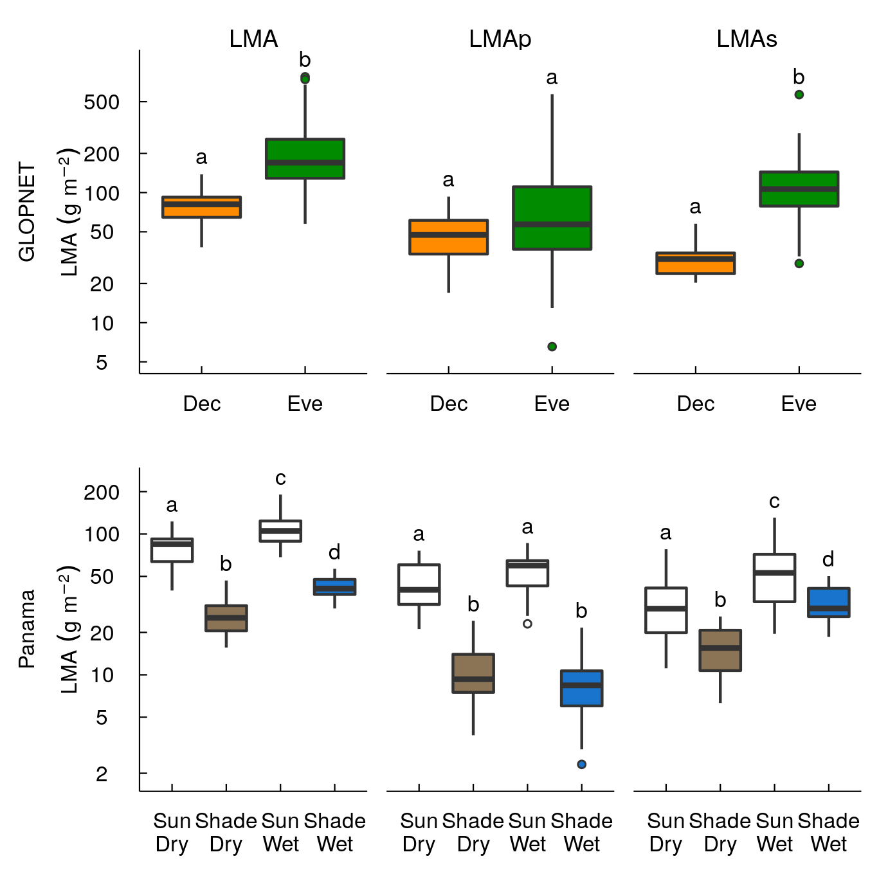

```{r global_options, include=FALSE}
knitr::opts_chunk$set(echo=TRUE,
                      warning=FALSE,
                      message=FALSE)
```


```{r, echo = T, message = F}
library(loo)
library(rstan)
library(dplyr)
library(scales)
library(cowplot)
library(ggrepel)
library(png)
library(grid)
library(lazyeval)

settings <- yaml::yaml.load_file("../settings.yml")
r_vals <- yaml::yaml.load_file("../r_val.yml")
p_letters <- yaml::yaml.load_file("../letters.yml")
source("../fig_theme.r")

```

# Load GL model result

```{r, cache=TRUE, comment=NA}

#load("./data/PA_latent_model_light_more_obs.rda")
load("../data/GL_latent_model_orderd_obs.rda")

GL_summary <- data.frame(summary(res)$summary) %>%
  round(3)
DT::datatable(GL_summary)
GL <- dat
P_vec <- paste("p[", 1:nrow(GL), "]" ,sep = "")

GL <- GL %>%
  mutate(DE = ifelse(GL$DE == "", "U", as.character(DE)))

temp_LMAp <- GL_summary[P_vec, "mean"] * GL$LMA
temp_LMAs <- GL$LMA - temp_LMAp

GL <- GL %>%
  mutate(LMAp = temp_LMAp) %>%
  mutate(LMAs = temp_LMAs)

```


# Scatter plot (Hypo)

## hypo GL ver.

This figure uses esimated LMAm and LMAs values from GL data.

```{r, cache=TRUE, comment=NA}

theme_set(theme_LES() +
          theme(axis.text.x = element_text(size = 6),
                axis.text.y = element_text(size = 6),
                axis.title = element_text(size = 6),
                axis.ticks.length = unit(-0.1, "cm"),
                axis.title.y = element_text(margin = margin(t = 0,
                                                            b = 0,
                                                            l = -5,
                                                            r = 0)),
                axis.title.x = element_text(margin = margin(t = 0,
                                                            b = -5,
                                                            l = -5,
                                                            r = -5)),
                ))

p1 <- ggplot(GL, aes(LMAp, LMAs)) +
  geom_point(alpha = 0.8) +
  scale_x_log10() +
  scale_y_log10() +
  xlab(expression(LMAm~(g~m^{-2}))) +
  ylab(expression(LMAs~(g~m^{-2})))

p2 <- ggplot(GL, aes(LMA, Aarea)) +
  geom_point(alpha = 0.8) +
  scale_x_log10() +
  scale_y_log10() +
  xlab(expression(Total~LMA~(g~m^{-2}))) +
  ylab(expression(italic(A)[area]~(~mu~mol~m^{-2}~s^{-1})))

p3 <- ggplot(GL, aes(LMA, y = Aarea / LMA)) +
  geom_point(alpha = 0.8) +
  scale_x_log10() +
  scale_y_log10() +
  xlab(expression(Total~LMA~(g~m^{-2}))) +
  ylab(expression(italic(A)[mass]~(~mu~mol~g^{-1}~s^{-1})))

p4 <- plot_grid(p1, p2, p3, ncol = 3,
          labels = c("A", "B", "C"),
          label_size = 9)

my_ggsave("../figs/fig_h.png", p4,
          height = 4)

cor.test(log(GL$LMAp), log(GL$LMAs))

```

##  hypo. ver.

This figure is based on a hypothetical data.  var(LMAs) >> var(LMAm) and Aarea is proportional to LMAm. Note that var(LMAm) needs to be very small to produce the above pattern.

```{r, cache=TRUE, comment=NA}

set.seed(12)
N <- 200
LMAp <- rlnorm(N, log(40), 0.1)
LMAs <- rlnorm(N, log(80), 0.8)
LMA <- LMAp + LMAs
#Aarea <- rlnorm(N, log(LMAp^0.8*LMAs^-0.2), 0.3)
Aarea <-  LMAp
tmp <- tibble(LMA, LMAp, LMAs, Aarea)

p1 <- ggplot(tmp, aes(LMAp, LMAs)) +
  geom_point(alpha = 0.8) +
  scale_x_log10() +
  scale_y_log10() +
  xlab(expression(LMAm~(g~m^{-2}))) +
  ylab(expression(LMAs~(g~m^{-2})))

p2 <- ggplot(tmp, aes(LMA, Aarea)) +
  geom_point(alpha = 0.8) +
  scale_x_log10() +
  scale_y_log10() +
  xlab(expression(Total~LMA~(g~m^{-2}))) +
  ylab(expression(italic(A)[area]~(~mu~mol~m^{-2}~s^{-1})))

p3 <- ggplot(tmp, aes(LMA, y = Aarea / LMA)) +
  geom_point(alpha = 0.8) +
  scale_x_log10() +
  scale_y_log10() +
  xlab(expression(Total~LMA~(g~m^{-2}))) +
  ylab(expression(italic(A)[mass]~(~mu~mol~g^{-1}~s^{-1})))

p4 <- plot_grid(p1, p2, p3, ncol = 3,
          labels = c("A", "B", "C"),
          label_size = 9)

my_ggsave("../figs/fig_h2.png", p4,
          height = 4)

```

##  hypo. ver.2

This figure is based on a hypothetical data.  var(LMAm) > var(LMAs), alpha_m > 0 and alpha_s < 0. This parameter setting mimics GLOPNET values. All the values were generated from the following parameter setting. No covariance between LMAm and LMAs


```{r, cache=TRUE, comment=NA}

set.seed(12)
N <- 200
LMAp <- rlnorm(N, log(80), 0.7)
LMAs <- rlnorm(N, log(80), 0.8)
LMA <- LMAp + LMAs
Aarea <- rlnorm(N, log(1.9 * LMAp^0.35*LMAs^-0.24), 0.3)
tmp <- tibble(LMA, LMAp, LMAs, Aarea)

p1 <- ggplot(tmp, aes(LMAp, LMAs)) +
  geom_point(alpha = 0.8) +
  scale_x_log10() +
  scale_y_log10() +
  xlab(expression(LMAm~(g~m^{-2}))) +
  ylab(expression(LMAs~(g~m^{-2})))

p2 <- ggplot(tmp, aes(LMA, Aarea)) +
  geom_point(alpha = 0.8) +
  scale_x_log10() +
  scale_y_log10() +
  xlab(expression(Total~LMA~(g~m^{-2}))) +
  ylab(expression(italic(A)[area]~(~mu~mol~m^{-2}~s^{-1})))

p3 <- ggplot(tmp, aes(LMA, y = Aarea / LMA)) +
  geom_point(alpha = 0.8) +
  scale_x_log10() +
  scale_y_log10() +
  xlab(expression(Total~LMA~(g~m^{-2}))) +
  ylab(expression(italic(A)[mass]~(~mu~mol~g^{-1}~s^{-1})))

p4 <- plot_grid(p1, p2, p3, ncol = 3,
          labels = c("A", "B", "C"),
          label_size = 9)

my_ggsave("../figs/fig_h3.png", p4,
          height = 4)

```

##  hypo. ver.3

This figure is based on a hypothetical data.  var(LMAm) > var(LMAs), alpha_m > 0 and alpha_s < 0. This parameter setting mimics GLOPNET values. All the values were generated from the following parameter setting. Positive covariance between LMAm and LMAs.

```{r, cache=TRUE, comment=NA}
set.seed(12)
N <- 200
LMAp <- rlnorm(N, log(80), 0.7)
LMAs <- rlnorm(N, 0.5 * log(LMAp) * 1.9, 0.8)
LMA <- LMAp + LMAs
Aarea <- rlnorm(N, log(1.9 * LMAp^0.35*LMAs^-0.24), 0.3)
tmp <- tibble(LMA, LMAp, LMAs, Aarea)

p1 <- ggplot(tmp, aes(LMAp, LMAs)) +
  geom_point(alpha = 0.8) +
  scale_x_log10() +
  scale_y_log10() +
  xlab(expression(LMAm~(g~m^{-2}))) +
  ylab(expression(LMAs~(g~m^{-2})))

p2 <- ggplot(tmp, aes(LMA, Aarea)) +
  geom_point(alpha = 0.8) +
  scale_x_log10() +
  scale_y_log10() +
  xlab(expression(Total~LMA~(g~m^{-2}))) +
  ylab(expression(italic(A)[area]~(~mu~mol~m^{-2}~s^{-1})))

p3 <- ggplot(tmp, aes(LMA, y = Aarea / LMA)) +
  geom_point(alpha = 0.8) +
  scale_x_log10() +
  scale_y_log10() +
  xlab(expression(Total~LMA~(g~m^{-2}))) +
  ylab(expression(italic(A)[mass]~(~mu~mol~g^{-1}~s^{-1})))

p4 <- plot_grid(p1, p2, p3, ncol = 3,
          labels = c("A", "B", "C"),
          label_size = 9)

my_ggsave("../figs/fig_h4.png", p4,
          height = 4)
```

# Scatter plots (estimated)

## GL

```{r, cache=TRUE, comment=NA}
before <- proc.time()
N <- 4000
pmat <- extract(res, "p")[[1]]
r_As <- numeric(N)
r_Am <- r_Rs <- r_Rm <- r_Lm <- r_Ls <- r_As
for (i in 1:N) {
  LMAp <- pmat[i,] * GL$LMA
  LMAs <- GL$LMA - LMAp

  fit_m <- lm(log(LMAs) ~ log(LMAp))
  fit_s <- lm(log(LMAp) ~ log(LMAs))
  fit_Am <- lm(log(GL$Aarea) ~ log(LMAp))
  fit_As <- lm(log(GL$Aarea) ~ log(LMAs))
  fit_Rm <- lm(log(GL$Rarea) ~ log(LMAp))
  fit_Rs <- lm(log(GL$Rarea) ~ log(LMAs))
  fit_Lm <- lm(log(GL$LL) ~ log(LMAp))
  fit_Ls <- lm(log(GL$LL) ~ log(LMAs))

  res_m  <- residuals(fit_m)
  res_s  <- residuals(fit_s)
  res_Am  <- residuals(fit_Am)
  res_As  <- residuals(fit_As)
  res_Rm  <- residuals(fit_Rm)
  res_Rs  <- residuals(fit_Rs)
  res_Lm  <- residuals(fit_Lm)
  res_Ls  <- residuals(fit_Ls)

  r_Am[i] <- cor(res_s, res_As) # Aarea-LMAm
  r_As[i] <- cor(res_m, res_Am) # Aarea-LMAs
  r_Rm[i] <- cor(res_s, res_Rs) #
  r_Rs[i] <- cor(res_m, res_Rm) #
  r_Lm[i] <- cor(res_s, res_Ls) #
  r_Ls[i] <- cor(res_m, res_Lm) #
}

after <- proc.time()
after - before

quant_fun <- function(x) c(quantile(x, 0.5), quantile(x, 0.025), quantile(x, 0.975))

GL_cor_tbl <- rbind(
  quant_fun(r_Am),
  quant_fun(r_As),
  quant_fun(r_Rm),
  quant_fun(r_Rs),
  quant_fun(r_Lm),
  quant_fun(r_Ls)) %>%
  as_tibble

```

```{r, cache=TRUE, comment=NA, eval = T}
N <- 4000

moge_fun <- function(i) {
  r_As <- numeric(N)
  for (i in 1:N) {
    LMAp <- pmat[i,] * GL$LMA
    LMAs <- GL$LMA - LMAp
    fit_m <- lm(log(LMAs) ~ log(LMAp))
    fit_Am <- lm(log(GL$Aarea) ~ log(LMAp))
    res_m  <- residuals(fit_m)
    res_Am  <- residuals(fit_Am)
    r_As[i] <- cor(res_m, res_Am) # Aarea-LMAs
  }
  r_As
}

system.time(aa <- moge_fun(N))

moge_fun2 <- function(i) {
    LMAp <- pmat[i,] * GL$LMA
    LMAs <- GL$LMA - LMAp
    fit_m <- lm(log(LMAs) ~ log(LMAp))
    fit_Am <- lm(log(GL$Aarea) ~ log(LMAp))
    res_m  <- residuals(fit_m)
    res_Am  <- residuals(fit_Am)
    cor(res_m, res_Am) # Aarea-LMAs
}

system.time(bb <- sapply(1:N, moge_fun2))


LMAp_mat <- apply(pmat, 1, function(x){GL$LMA * x}) %>% t
LMAs_mat <- apply(LMAp_mat, 1, function(x){GL$LMA - x}) %>% t

plot(LMAp_mat[i,], LMAp)
plot(LMAs_mat[i,], LMAs)

moge_fun3 <- function(i) {
    fit_m <- lm(log(LMAs_mat[i,]) ~ log(LMAp_mat[i,]))
    fit_Am <- lm(log(GL$Aarea) ~ log(LMAp_mat[i,]))
    res_m  <- residuals(fit_m)
    res_Am  <- residuals(fit_Am)
     cor(res_m, res_Am) # Aarea-LMAs
}

system.time(bb2 <- sapply(1:N, moge_fun3))

system.time(aa2 <- moge_fun3(N))


```{r, cache=TRUE, comment=NA}

LMA_m_fun <- function(i) {
    fit_m <- lm(log(LMAs_mat[i,]) ~ log(LMAp_mat[i,]))
    residuals(fit_m)
}

LMA_s_fun <- function(i) {
    fit_m <- lm(log(LMAp_mat[i,]) ~ log(LMAs_mat[i,]))
    residuals(fit_m)
}

res_fun <- function(i, LMA, trait) {
    fit_m <- lm(log(trait) ~ log(LMA[i,]))
    residuals(fit_m)
}

res_fun2 <- function(N, LMA, trait){
  sapply(1:N, res_fun, LMA, trait) %>%
    apply(., 1, median)
}

before <- proc.time()

GL2 <- GL %>%
  mutate(res_m = sapply(1:N, LMA_m_fun) %>% apply(., 1, median)) %>%
  mutate(res_s = sapply(1:N, LMA_s_fun) %>% apply(., 1, median)) %>%
  mutate(Aarea_s = res_fun2(N, LMAs_mat, GL$Aarea)) %>%
  mutate(Aarea_m = res_fun2(N, LMAp_mat, GL$Aarea)) %>%
  mutate(Rarea_s = res_fun2(N, LMAs_mat, GL$Rarea)) %>%
  mutate(Rarea_m = res_fun2(N, LMAp_mat, GL$Rarea)) %>%
  mutate(LL_s = res_fun2(N, LMAs_mat, GL$LL)) %>%
  mutate(LL_m = res_fun2(N, LMAp_mat, GL$LL))

after <- proc.time()
after - before


```{r, cache=TRUE, comment=NA}

fills <- c("Deciduous" = settings$fills$D,
          "Evergreen" = settings$fills$E,
          "Unclassified" = settings$fills$U)

cols <- c("Deciduous" = settings$colors$D,
          "Evergreen" = settings$colors$E,
          "Unclassified" = settings$colors$U)

GL_fig_dat <- GL %>%
  gather(Trait, val2, c(Aarea, Rarea, LL)) %>%
  mutate(DE = factor(DE,
          levels = c("D", "E", "U"))) %>%
  mutate(gr = factor(DE,
          labels = c("Deciduous", "Evergreen", "Unclassified"))) %>%
  mutate(Trait = factor(Trait,
    levels = c("Aarea", "Rarea", "LL"))) %>%
  mutate(Trait2 = factor(Trait,
    labels = c("italic(A)[area]~(~mu~mol~m^{-2}~s^{-1})",
               "italic(R)[area]~(~mu~mol~m^{-2}~s^{-1})",
               "LL~(months)"))) %>%
  mutate(LMA2 = "LMA~(~g~m^{-2})")

GL_fig_dat2 <- GL2 %>%
  gather(resLMA, val, c(res_m, res_s)) %>%
  gather(resTrait, val2, c(Aarea_s, Rarea_s, LL_s,
                           Aarea_m, Rarea_m, LL_m)) %>%
  mutate(tmp1 = str_split(resLMA, "_") %>% sapply(., "[[", 2)) %>%
  mutate(tmp2 = str_split(resTrait, "_") %>% sapply(., "[[", 2)) %>%
  mutate(resTrait2 = str_split(resTrait, "_") %>% sapply(., "[[", 1)) %>%
  filter(tmp1 == tmp2) %>%
  dplyr::select(resLMA, resTrait, resTrait2, val, val2, DE) %>%
  mutate(DE = factor(DE,
          levels = c("D", "E", "U"))) %>%
  mutate(gr = factor(DE,
          labels = c("Deciduous", "Evergreen", "Unclassified"))) %>%
  mutate(resLMA = factor(resLMA,
         levels = c("res_s", "res_m"))) %>%
  #mutate(resLMA = factor(resLMA,
  #  labels = c("LMAm~residuals", "LMAs~residuals~(~g~m^{-2})"))) %>%
  mutate(resLMA = factor(resLMA,
    labels = c("LMAm residuals", "LMAs residuals"))) %>%
  mutate(resTrait2 = factor(resTrait2,
                            levels = c("Aarea", "Rarea", "LL"))) %>%
  mutate(resTrait2 = factor(resTrait2,
    labels = c("italic(A)[area]~residuals",
               "italic(R)[area]~residuals",
               "LL~residuals")))


GL_figA <- ggplot(GL_fig_dat, aes(x = LMA, y = val2,
                                  col = gr,
                                  fill = gr)) +
  geom_point(shape = 21) +
  facet_grid(Trait2 ~ LMA2,
             scales = "free",
             switch = "both",
             labeller = labeller(Trait2 = label_parsed,
                                 LMA2 = label_parsed)) +
  scale_colour_manual(values = cols) +
  scale_fill_manual(values = fills) +
  scale_x_log10(breaks = my_breaks_x(), expand = c(0.1, 0)) +
  scale_y_log10(breaks = my_breaks(), expand = c(0.1, 0)) +
  xlab("") +
  ylab("") +
  theme_LES()

GL_figA2 <- GL_figA +
  theme(legend.position = "none")
  #theme(legend.text = element_blank(),
  #      legend.key = element_rect(fill = NULL, colour = NULL)
  #      )

GL_figA2

GL_figB <- ggplot(GL_fig_dat2, aes(x = val, y = val2,
                       color = gr, fill = gr)) +
  geom_point(shape = 21) +
  scale_fill_manual(values = fills) +
  scale_color_manual(values = cols) +
  facet_grid(resTrait2~resLMA,
             switch = "both",
             scale = "free",
             labeller = labeller(resTrait2 = label_parsed#,
                                 #resLMA = label_parsed
             )) +
  xlab("") +
  ylab("") +
  theme_LES() +
  theme(legend.position = "none")

legend2 <- get_legend(GL_figA)

fig2 <- ggdraw() +
  draw_plot(GL_figA, 0, 0, 0.33, 1) +
  draw_plot(GL_figB, 0.33, 0, 0.66, 1) +
  draw_plot_label(c("A", "B"), c(0, 0.33), c(1,1), size = 9)

fig2

fig3 <- plot_grid(GL_figA2, GL_figB,
                  labels = c("A", "B"),
                  label_size = 9,
                  rel_widths = c(0.59, 1))

fig4 <- plot_grid(legend2, fig3,  ncol = 1,
                  rel_heights = c(.1, 2))
fig4

my_ggsave("../figs/GL_2.png", fig4)


```

# Panama

```{r, cache=TRUE, comment=NA}
load("../data/PA_latent_replusive_model_light2_more_obs.rda")

summary_PA_LDL <- data.frame(summary(res)$summary)

PA <- dat %>%
  as_tibble %>%
  mutate(site2 = ifelse(site == "PNM", "DRY", "WET")) %>%
  mutate(sp_site_strata = paste(sp, site2, strata, sep = "_")) %>%
  mutate(site_strata = paste(site2, strata, sep = "_"))

P_vec <- paste("p[", 1:nrow(PA), "]", sep = "")
#mu2_vec <- paste("mu2[", 1:nrow(PA), "]", sep = "")
#Mu_vec <- paste("mu[", 1:nrow(PA), ",2]", sep = "")
temp_LMAp <- summary_PA_LDL[P_vec, "mean"] * PA$LMA
temp_LMAs <- PA$LMA - temp_LMAp
#temp_LL <- exp(summary_PA_LDL[mu2_vec, "mean"])

PA <- PA %>%
  mutate(LMAp = temp_LMAp) %>%
  mutate(LMAs = temp_LMAs)

```

```{r, cache=TRUE, comment=NA}
pmat <- extract(res, "p")[[1]]
before <- proc.time()
N <- 4000
r_As <- numeric(N)
r_Am <- r_Rs <- r_Rm <- r_Lm <- r_Ls <- r_As
for (i in 1:N) {
  LMAp <- pmat[i,] * PA$LMA
  LMAs <- PA$LMA - LMAp

  fit_sm <- lm(log(LMAs) ~ log(LMAp))
  fit_ms <- lm(log(LMAp) ~ log(LMAs))
  fit_Am <- lm(log(PA$Aarea) ~ log(LMAp))
  fit_As <- lm(log(PA$Aarea) ~ log(LMAs))
  fit_Rm <- lm(log(PA$Rarea) ~ log(LMAp))
  fit_Rs <- lm(log(PA$Rarea) ~ log(LMAs))
  fit_Lm <- lm(log(PA$LL) ~ log(LMAp))
  fit_Ls <- lm(log(PA$LL) ~ log(LMAs))

  res_sm  <- residuals(fit_sm)
  res_ms  <- residuals(fit_ms)
  res_Am  <- residuals(fit_Am)
  res_As  <- residuals(fit_As)
  res_Rm  <- residuals(fit_Rm)
  res_Rs  <- residuals(fit_Rs)
  res_Lm  <- residuals(fit_Lm)
  res_Ls  <- residuals(fit_Ls)

  r_Am[i] <- cor(res_ms, res_As) # Aarea-LMAm
  r_As[i] <- cor(res_sm, res_Am) # Aarea-LMAs
  r_Rm[i] <- cor(res_ms, res_Rs) #
  r_Rs[i] <- cor(res_sm, res_Rm) #
  r_Lm[i] <- cor(res_ms, res_Ls) #
  r_Ls[i] <- cor(res_sm, res_Lm) #
}

after <- proc.time()
after - before

rbind(
  quant_fun(r_Am),
  quant_fun(r_As),
  quant_fun(r_Rm),
  quant_fun(r_Rs),
  quant_fun(r_Lm),
  quant_fun(r_Ls)) %>%
  as_tibble

```


```{r, cache=TRUE, comment=NA}

LMAp_mat <- apply(pmat, 1, function(x){PA$LMA * x}) %>% t
LMAs_mat <- apply(LMAp_mat, 1, function(x){PA$LMA - x}) %>% t

LMA_m_fun <- function(i) {
    fit_m <- lm(log(LMAs_mat[i,]) ~ log(LMAp_mat[i,]) + PA$strata)
    residuals(fit_m)
}

LMA_s_fun <- function(i) {
    fit_m <- lm(log(LMAp_mat[i,]) ~ log(LMAs_mat[i,]) + PA$strata)
    #fit_m <- lm(log(LMAp_mat[i,]) ~ log(LMAs_mat[i,]))
    residuals(fit_m)
}

res_fun <- function(i, LMA, trait) {
    fit_m <- lm(log(trait) ~ log(LMA[i,]) + PA$strata)
    #fit_m <- lm(log(trait) ~ log(LMA[i,]))
    residuals(fit_m)
}

res_fun2 <- function(N, LMA, trait){
  sapply(1:N, res_fun, LMA, trait) %>%
    apply(., 1, median)
}

before <- proc.time()
PA2 <- PA %>%
  mutate(res_m = sapply(1:N, LMA_m_fun) %>% apply(., 1, median)) %>%
  mutate(res_s = sapply(1:N, LMA_s_fun) %>% apply(., 1, median)) %>%
  mutate(Aarea_s = res_fun2(N, LMAs_mat, PA$Aarea)) %>%
  mutate(Aarea_m = res_fun2(N, LMAp_mat, PA$Aarea)) %>%
  mutate(Rarea_s = res_fun2(N, LMAs_mat, PA$Rarea)) %>%
  mutate(Rarea_m = res_fun2(N, LMAp_mat, PA$Rarea)) %>%
  mutate(LL_s = res_fun2(N, LMAs_mat, PA$LL)) %>%
  mutate(LL_m = res_fun2(N, LMAp_mat, PA$LL))
after <- proc.time()
after - before

par(mfrow = c(2,2))
plot(LL_s ~ res_s, PA2)
plot(LL_m ~ res_m, PA2)
par(mfrow = c(1,1))

PA_fig_dat <- PA %>%
  gather(Trait, val2, c(Aarea, Rarea, LL)) %>%
  mutate(site_strata = factor(site_strata,
          levels = c("WET_CAN", "DRY_CAN", "WET_UNDER", "DRY_UNDER"))) %>%
  mutate(gr = factor(site_strata,
    labels = c("Sun-Wet",
               "Sun-Dry",
               "Shade-Wet",
               "Shade-Dry"
                      ))) %>%
  mutate(Trait = factor(Trait,
    levels = c("Aarea", "Rarea", "LL"))) %>%
  mutate(Trait2 = factor(Trait,
    labels = c("italic(A)[area]~(~mu~mol~m^{-2}~s^{-1})",
               "italic(R)[area]~(~mu~mol~m^{-2}~s^{-1})",
               "LL~(months)"))) %>%
  mutate(LMA2 = "LMA~(~g~m^{-2})")

PA_fig_dat2 <- PA2 %>%
  gather(resLMA, val, c(res_m, res_s)) %>%
  gather(resTrait, val2, c(Aarea_s, Rarea_s, LL_s,
                           Aarea_m, Rarea_m, LL_m)) %>%
  mutate(tmp1 = str_split(resLMA, "_") %>% sapply(., "[[", 2)) %>%
  mutate(tmp2 = str_split(resTrait, "_") %>% sapply(., "[[", 2)) %>%
  mutate(resTrait2 = str_split(resTrait, "_") %>% sapply(., "[[", 1)) %>%
  filter(tmp1 == tmp2) %>%
  mutate(site_strata = factor(site_strata,
          levels = c("WET_CAN", "DRY_CAN", "WET_UNDER", "DRY_UNDER"))) %>%
  mutate(gr = factor(site_strata,
    labels = c("Sun-Wet",
               "Sun-Dry",
               "Shade-Wet",
               "Shade-Dry"
                      ))) %>%
  mutate(resLMA = factor(resLMA,
         levels = c("res_s", "res_m"))) %>%
  mutate(resLMA = factor(resLMA,
    labels = c("LMAm~(~g~m^{-2})", "LMAs~(~g~m^{-2})"))) %>%
  mutate(resTrait2 = factor(resTrait2,
                            levels = c("Aarea", "Rarea", "LL"))) %>%
  mutate(resTrait2 = factor(resTrait2,
    labels = c("italic(A)[area]~(~mu~mol~m^{-2}~s^{-1})",
               "italic(R)[area]~(~mu~mol~m^{-2}~s^{-1})",
               "LL~(months)")))


fills <- c("Sun-Dry" = settings$fills$sun_dry,
          "Sun-Wet" = settings$fills$sun_wet,
          "Shade-Dry" = settings$fills$shade_dry,
          "Shade-Wet" = settings$fills$shade_wet)

cols <- c("Sun-Dry" = settings$colors$sun_dry,
          "Sun-Wet" = settings$colors$sun_wet,
          "Shade-Dry" = settings$colors$shade_dry,
          "Shade-Wet" = settings$colors$shade_wet)

PA_figA <- ggplot(PA_fig_dat, aes(x = LMA, y = val2,
                                  col = gr,
                                  fill = gr)) +
  geom_point(shape = 21) +
  facet_grid(Trait2 ~ LMA2,
             scales = "free",
             switch = "both",
             labeller = labeller(Trait2 = label_parsed,
                                 LMA2 = label_parsed)) +
  scale_colour_manual(values = cols) +
  scale_fill_manual(values = fills) +
  scale_x_log10(breaks = my_breaks_x(), expand = c(0.1, 0)) +
  scale_y_log10(breaks = my_breaks(), expand = c(0.1, 0)) +
  xlab("") +
  ylab("") +
  theme_LES()

PA_figA2 <- PA_figA +
  theme(legend.position = "none")
  #theme(legend.text = element_blank(),
  #      legend.key = element_rect(fill = NULL, colour = NULL)
  #      )

PA_figA2


PA_figB <- ggplot(PA_fig_dat2, aes(x = val, y = val2,
                       color = gr, fill = gr)) +
  geom_point(shape = 21) +
  scale_fill_manual(values = fills) +
  scale_color_manual(values = cols) +
  facet_grid(resTrait2~resLMA,
             switch = "both",
             scale = "free",
             labeller = labeller(resTrait2 = label_parsed,
                                 resLMA = label_parsed
             )) +
  xlab("") +
  ylab("") +
  theme_LES() +
  theme(legend.position = "none")

legend2 <- get_legend(PA_figA)

fig3 <- plot_grid(PA_figA2, PA_figB,
                  labels = c("A", "B"),
                  label_size = 9,
                  rel_widths = c(0.5, 1))

fig4 <- plot_grid(legend2, fig3,  ncol = 1,
                  rel_heights = c(.1, 2))
fig4

my_ggsave("../figs/PA_2.png", fig4)


A_res <- lm(log(Aarea) ~ strata, PA) %>%
  residuals()
R_res <- lm(log(Rarea) ~ strata, PA) %>%
  residuals()
LL_res <- lm(log(LL) ~ strata, PA) %>%
  residuals()
LMA_res <- lm(log(LMA) ~ strata, PA) %>%
  residuals()

PA3  <- PA %>%
  mutate(A_res) %>%
  mutate(R_res) %>%
  mutate(LMA_res) %>%
  mutate(LL_res)

PA_fig_dat3 <- PA3 %>%
  gather(resTrait, val2, c(A_res, R_res, LL_res)) %>%
  mutate(site_strata = factor(site_strata,
          levels = c("WET_CAN", "DRY_CAN", "WET_UNDER", "DRY_UNDER"))) %>%
  mutate(gr = factor(site_strata,
    labels = c("Sun-Wet",
               "Sun-Dry",
               "Shade-Wet",
               "Shade-Dry"
                      ))) %>%
  mutate(resTrait = factor(resTrait,
    levels = c("A_res", "R_res", "LL_res"))) %>%
  mutate(resTrait2 = factor(resTrait,
    labels = c("italic(A)[area]~(~mu~mol~m^{-2}~s^{-1})",
               "italic(R)[area]~(~mu~mol~m^{-2}~s^{-1})",
               "LL~(months)"))) %>%
  mutate(LMA2 = "LMA~(~g~m^{-2})")


PA_figA3 <- ggplot(PA_fig_dat3, aes(x = LMA_res, y = val2,
                                  col = gr,
                                  fill = gr)) +
  geom_point(shape = 21) +
  facet_grid(resTrait2 ~ LMA2,
             scales = "free",
             switch = "both",
             labeller = labeller(resTrait2 = label_parsed,
                                 LMA2 = label_parsed)) +
  scale_colour_manual(values = cols) +
  scale_fill_manual(values = fills) +
  scale_x_log10(breaks = my_breaks_x(), expand = c(0.1, 0)) +
  scale_y_log10(breaks = my_breaks(), expand = c(0.1, 0)) +
  xlab("") +
  ylab("") +
  theme_LES()

PA_figA3


```

## Panama NPCL

```{r, cache=TRUE, comment=NA, eval = TRUE}

PA_dat <- PA %>% 
  gather(LMA, Val, 
         c(LMA, LMAs, LMAp)) %>%
  gather(Trait, Val2, c(Aarea, Rarea, LL, 
                        Parea, Narea, cell_area)) %>%
  mutate(LMA = factor(LMA,
    labels = c("LMA", "LMAm", "LMAs"))) %>%
  mutate(LMA = factor(LMA,
    labels = c("LMA~(~g~m^{-2})", "LMAm~(~g~m^{-2})", "LMAs~(~g~m^{-2})"))) %>%
  mutate(site_strata = factor(site_strata,
          levels = c("WET_CAN", "DRY_CAN", "WET_UNDER", "DRY_UNDER"))) %>%
  mutate(Trait = factor(Trait,
    levels = c("Aarea", "Rarea", "LL", "Narea", "Parea", "cell_area"))) %>%
  mutate(Trait2 = factor(Trait,
    labels = c("italic(A)[area]~(~mu~mol~m^{-2}~s^{-1})",
               "italic(R)[area]~(~mu~mol~m^{-2}~s^{-1})",
               "LL~(months)",
               "italic(N)[area]~(~g~m^{-2})",
               "italic(P)[area]~(~g~m^{-2})",
               "italic(CL)[area]~(~g~m^{-2})"
               ))) %>% 
  mutate(gr = factor(site_strata,
    labels = c("Sun-Wet",
               "Sun-Dry",
               "Shade-Wet",
               "Shade-Dry"
                      ))) %>%
  #arrange(desc(gr))
  arrange(gr) 

PA_dat2 <- PA_dat %>%
  filter(Trait == "Narea" |
         Trait == "Parea" |
         Trait == "cell_area")

lim_PA <- lim_func(PA_dat2, trait = "Val")

lim_PA2 <- lim_func(PA_dat2,
                    trait = "Val2", LMA = FALSE)

lab1 <- tibble(lab = paste("(", letters[1:9], ")", sep = ""),
                   Val2 = lim_PA2$max_val %>% rep(each = 3),
                   Val = lim_PA$min_val %>% rep(3),
                   Val_max = lim_PA$max_val %>% rep(3),
                   gr = "Sun-Dry",
                   r_vals = r_vals$r_vals$PA_NP %>% unlist,
                   Trait2 = rep(lim_PA2$Trait2, each = 3),
                   LMA = rep(lim_PA$LMA, 3)
                   )

PA_NPC_plot <- scatter_plt(PA_dat2)

my_ggsave("../figs/PA_NPC.png", PA_NPC_plot)

```


# LL: Obs vs Pred

```{r, cache=TRUE, comment=NA, eval = T}

#LLpred_mat <- extract(res, "mu")[[1]]

LLpred_mat <- as.data.frame(res) %>%
  as_tibble %>%
  select(contains("Mu")) %>%
  select(contains(",2]")) %>%
  as.matrix

preLL <- apply(LLpred_mat, 2, function(x) median(exp(x)))

#for (i in 1:N) {
#  LLpred <- LLpred_mat[i,]
#}

LL_dat <- PA %>%
  mutate(preLL = preLL) %>%
  mutate(site_strata = factor(site_strata,
          levels = c("WET_CAN", "DRY_CAN", "WET_UNDER", "DRY_UNDER"))) %>%
  mutate(gr = factor(site_strata,
    labels = c("Sun-Wet",
               "Sun-Dry",
               "Shade-Wet",
               "Shade-Dry"
                      )))

labLL <- tibble(
                LL = Inf,
                Val = min(PA$LL),
                Val_max = max(PA$LL),
                gr = "Sun-Dry",
                r_vals = r_vals$r_vals$PA_LL$preLL_LL
)

LL_plot <- ggplot(LL_dat, aes(x = preLL, y = LL,
                              fill = gr, col = gr)) +
  geom_point(shape = 21) +
  scale_fill_manual(values = fills) +
  scale_colour_manual(values = cols) +
  scale_x_log10(breaks = my_breaks(), expand = c(0.1, 0),
                limits = c(min(labLL$Val), max(labLL$Val_max))) +
  scale_y_log10(breaks = my_breaks(), expand = c(0.1, 0),
                limits = c(min(labLL$Val), max(labLL$Val_max))) +
  xlab("Predicted LL (months)") +
  ylab("Observed LL (months)") +
  geom_abline(aes(slope = 1, intercept = 0),
              lty = 2,
              lwd = 0.25,
              col = "gray20") +
  geom_text(data = labLL, aes(label = r_vals, x = Val_max, y = 2.5),
            colour = "black",
            hjust = 1,
            vjust= 0,
            parse = TRUE,
            show.legend = FALSE) +
  coord_fixed() +
  theme_LES() +
  theme(
    legend.position = c(0.2, 0.85),
    axis.title.x = element_text(margin = margin(t = 1,
                                                b = 1,
                                                l = 0,
                                                r = 0)),
    axis.title.y = element_text(margin = margin(t = 1,
                                                b = 1,
                                                l = 1,
                                                r = 1))
        )

my_ggsave("../figs/LL_plot.png", LL_plot,
          width = 6.7,
          height = 6.7)

```


# Mass-proportionality

```{r}

set.seed(123)
am <- seq(0, 1, by = 0.05)
as <- seq(-1, 1, by = 0.05)

dat <- expand.grid(am = am, as = as)

N <- 100
mass_prop <- NULL
LMAs <- rlnorm(N, log(40), 1)
LMAp <- sample(LMAs, N)
LMAs2 <- rlnorm(N, log(40), 4)
LMAp2 <- rlnorm(N, log(40), 4)
#LMAp <- sample(LMAs, N)
var(LMAs)
var(LMAp2)
var(LMAs %>% log)
var(LMAp2 %>% log)

LMA <- LMAp + LMAs
LMA2p <- LMAp2 + LMAs
LMA2s <- LMAp + LMAs2
mass_prop <- NULL
mass_prop2p <- NULL
mass_prop2s <- NULL
for (i in 1:nrow(dat)) {
  A <- rlnorm(N, dat$am[i] * log(LMAp) + dat$as[i] * log(LMAs), 0)
  fit <- lm(log(A) ~ log(LMA))
  mass_prop[i] <- fit$coefficients[2]

  A <- rlnorm(N, dat$am[i] * log(LMAp2) + dat$as[i] * log(LMAs), 0)
  fit <- lm(log(A) ~ log(LMA2p))
  mass_prop2p[i] <- fit$coefficients[2]

  A <- rlnorm(N, dat$am[i] * log(LMAp) + dat$as[i] * log(LMAs2), 0)
  fit <- lm(log(A) ~ log(LMA2s))
  mass_prop2s[i] <- fit$coefficients[2]
}

dat2 <- dat %>%
  as_tibble %>%
  mutate('var(LMAm) = var(LMAs)' = mass_prop) %>%
  mutate('var(LMAm) >> var(LMAs)' = mass_prop2p) %>%
  mutate('var(LMAm) << var(LMAs)' = mass_prop2s) %>%
  filter(am >= as) %>%
  filter(am > 0 | as > 0)

dat3 <- dat2 %>%
  gather(type, val, 3:5) #%>%
#  filter(val > -0.2 & val < 1.2)

mass_plt <- ggplot(dat3, aes(x = am, y= as, fill = val)) +
  geom_raster() +
  facet_grid(~type) +
  scale_fill_gradient2(midpoint = 0.5,
                       name = "Mass \nproportionality") +
  xlab(expression(alpha[m])) +
  ylab(expression(alpha[s])) +
  theme(legend.position = "none")

print(mass_plt)

my_ggsave("../figs/mass_prop2.png", mass_plt,
          width = 20,
          height = 6)

```


## Based on the results

```{r}

GL <- read_csv("../data/GL_res.csv")
PA <- read_csv("../data/PA_res.csv")

Sun <- PA %>%
  filter(strata == "CAN")

Shade <- PA %>%
  filter(strata != "CAN")

GL_para <- read_csv("../data/GLpara.csv")
PA_para <- read_csv("../data/PApara.csv")

as1 <- GL_para %>%
  dplyr::filter(para == "amas[1]") %>%
  dplyr::select(X50., X2.5., X97.5.)

am1 <- GL_para %>%
  dplyr::filter(para == "amas[2]") %>%
  dplyr::select(X50., X2.5., X97.5.)

as2 <- PA_para %>%
  dplyr::filter(para == "as") %>%
  dplyr::select(X50., X2.5., X97.5.)

am2 <- PA_para %>%
  dplyr::filter(para == "am") %>%
  dplyr::select(X50., X2.5., X97.5.)

point_dat <- bind_rows(am1, am2, am2)
point_dat2 <- bind_rows(as1, as2, as2)

point_dat3 <- bind_cols(point_dat, point_dat2)
names(point_dat3) <- c("am_mid", "am_low", "am_upper",
                      "as_mid", "as_low", "as_upper"
                     )

point_dat4 <- point_dat3 %>%
  mutate(type = c("GLOPNET", "Panama Sun", "Panama Shade"))

b_GL <- lm(log(Aarea) ~ log(LMA), GL)$coefficients[2]
b_Sun <- lm(log(Aarea) ~ log(LMA), Sun)$coefficients[2]
b_Shade <- lm(log(Aarea) ~ log(LMA), Shade)$coefficients[2]

point_dat5 <- point_dat4 %>%
  mutate(b = c(b_GL, b_Sun, b_Shade) %>% round(2))


PA2 <- PA %>%
  group_by(site, strata) %>%
  nest() %>%
  mutate(n = map_dbl(data, function(x)nrow(x))) %>%
  mutate(LMAp_sd = map_dbl(data, function(x)sd(log(x$LMAp)))) %>%
  mutate(LMAs_sd = map_dbl(data, function(x)sd(log(x$LMAs)))) %>%
  mutate(LMAp_mu = map_dbl(data, function(x)mean(log(x$LMAp)))) %>%
  mutate(LMAs_mu = map_dbl(data, function(x)mean(log(x$LMAs))))

my_rlnorm <- function(n, mu, sigma)rlnorm(n, mu-0.5*sigma^2, sigma)

set.seed(123)
am <- seq(-1, 1, by = 0.1)
as <- seq(-1, 1, by = 0.1)
dat <- expand.grid(am = am, as = as)
N <- nrow(GL)
N2 <- nrow(Sun)
N3 <- nrow(Shade)
mass_prop <- NULL
mass_prop2 <- NULL
mass_prop3 <- NULL
mass_prop_ <- NULL
mass_prop2_ <- NULL
mass_prop3_ <- NULL

LMA_dat <- PA2 %>%
  mutate(LMAp2 = pmap(list(n, LMAp_mu, LMAp_sd), my_rlnorm)) %>%
  mutate(LMAs2 = pmap(list(n, LMAs_mu, LMAs_sd), my_rlnorm)) %>%
  select(-data) %>%
  unnest

LMA_dat


for (j in 1:1) {
  for (i in 1:nrow(dat)) {
    A <- rlnorm(N, dat$am[i] * log(GL$LMAp) + dat$as[i] * log(GL$LMAs), 0)
    fit <- lm(log(A) ~ log(GL$LMA))
    mass_prop[i] <- fit$coefficients[2]

    A <- rlnorm(N2, dat$am[i] * log(Sun$LMAp) + dat$as[i] * log(Sun$LMAs), 0)
    fit <- lm(log(A) ~ log(Sun$LMA))
    mass_prop2[i] <- fit$coefficients[2]

    A <- rlnorm(N3, dat$am[i] * log(Shade$LMAp) + dat$as[i] * log(Shade$LMAs), 0)
    fit <- lm(log(A) ~ log(Shade$LMA))
    mass_prop3[i] <- fit$coefficients[2]
  }
  mass_prop_ <- rbind(mass_prop_, mass_prop)
  mass_prop2_ <- rbind(mass_prop2_, mass_prop2)
  mass_prop3_ <- rbind(mass_prop3_, mass_prop3)
}

dat2 <- dat %>%
  as_tibble %>%
  mutate('GLOPNET' = mass_prop) %>%
  mutate('Panama Sun' = mass_prop2) %>%
  mutate('Panama Shade' = mass_prop3) %>%
  filter(am >= as) %>%
  filter(am > 0 | as > 0)

dat3 <- dat2 %>%
  gather(type, val, 3:5) #%>%
  #filter(val > -0.5 & val < 2)

theme_set(theme_LES() +
          theme(axis.text.x = element_text(size = 6),
                axis.text.y = element_text(size = 6),
                axis.title = element_text(size = 6),
                axis.ticks.length = unit(-0.1, "cm"),
                axis.title.y = element_text(margin = margin(t = 0,
                                                            b = 0,
                                                            l = -5,
                                                            r = 0)),
                axis.title.x = element_text(margin = margin(t = 0,
                                                            b = -5,
                                                            l = -5,
                                                            r = -5)),
                ))


# these do not look good
#legend_title <- bquote(atop("Value of scaling parameter ("*italic(b)*")",
#                   "in the equation "*italic(A)[area]*"="*italic(a)*"LMA"^italic(b)))
#
#legend_title <- expression(paste("Value of scaling parameter (", italic(b), ")",
#                                 "\n in the equation ", italic(A)[area], " = ", italic(a), LMA^b))
#
#legend_title <- expression("Value of scaling parameter ("*italic(b)*") in the equation "*italic(A)[area]*"="*italic(a)*"LMA"^italic(b))
#
#legend_title <- expression('Mean height of \n', atop(italic(Dicksonia~antarctica)*  ' (m)'))
#
#legend_title <- expression(atop(NA, atop(textstyle('Mean height of'),
#                               textstyle(italic(Dicksonia ~ antarctica) ~ (m)))))
#legend_title <- expression(atop(textstyle(Value~of~scaling~parameter ~ (italic(b))),
#                                         textstyle(In~the~equation~italic(A)[area]==LMA^italic(b))))

legend_title <- expression(atop(NA, atop(textstyle(Value~of~scaling~parameter ~ (italic(b))),
                                         textstyle(`in`~the~equation~italic(A)[area]==LMA^italic(b)))))

mass_plt2 <- ggplot(dat3) +
  geom_raster(aes(x = am, y = as, fill = val)) +
  facet_grid(~type) +
  geom_text_repel(data = point_dat5,
                  arrow = arrow(length = unit(0.03, "npc"),
                                type = "open",
                                ends = "last"),
                  nudge_y = 0.9,
                  nudge_x = -0.5,
                  point.padding = 0.5,
                  size = 3,
                  #direction = "x",
                  aes(x = am_mid,
                      y = as_mid,
                      label = b),
                  ) +
  geom_point(data = point_dat5, aes(x = am_mid, y = as_mid)) +
  geom_errorbar(data = point_dat5, aes(ymin = as_low, ymax = as_upper,
                                       x = am_mid), width = 0) +
  geom_errorbarh(data = point_dat5, aes(xmin = am_low, xmax = am_upper,
                                        y = as_mid,
                                        height = 0)) +
  scale_fill_gradientn(
                       name = legend_title,
                       # colors from http://colorbrewer2.org/#type=diverging&scheme=PuOr&n=5
                       colors = c("#e66101",
                                  "#fdb863",
                                  "#f7f7f7",
                                  "#b2abd2",
                                  "#5e3c99"),
                       breaks = c(min(dat3$val), 0, 0.5, 1, 2),
                      # labels = c("-1.5",
                      #            " 0.0 - Whole-leaf Amax\n         proportional to leaf area",
                      #            " ",
                      #            " 1.0 - Whole-leaf Amax\n         proportional to leaf mass",
                      #            " 2.0"))+
                       labels = c(
                                  expression((-1.5)),
                                  expression(atop((~0.0~Whole~leaf~italic(A)[max]),
                                                       (proportional~to~leaf~area))),
                                  expression((~0.5)),
                                  expression((~1.0~Whole~leaf~italic(A)[max])),
                                  expression((~2.0)))) +
  xlab(expression(alpha[m])) +
  ylab(expression(alpha[s])) +
  theme(legend.position = "right",
        legend.key.height = unit(0.5, "cm"),
        legend.text = element_text(size = 7),
        legend.title = element_text(hjust = 0, size = 7))

my_ggsave("../figs/mass_prop3.png", mass_plt2,
          height = 4)

```


# Boxplot

## Main plot

```{r, cache=TRUE, comment=NA}

fills <- c("D" = settings$fills$D,
          "E" = settings$fills$E)

cols <- c("D" = settings$colors$D,
          "E" = settings$colors$E)

GL_dat <- GL %>% 
  gather(LMA, Val, c(LMA, LMAs, LMAp)) %>%
  gather(Trait, Val2, c(Aarea, Rarea, LL, 
                        Parea, Narea)) %>%
  mutate(DE = factor(DE,
          levels = c("D", "E", "U"))) %>%
  mutate(LMA = factor(LMA,
    labels = c("LMA", "LMAm", "LMAs"))) %>%
#  mutate(LMA = factor(LMA,
#    labels = c("LMA~(~g~m^{-2})", "LMAm~(~g~m^{-2})", "LMAs~(~g~m^{-2})"))) %>%
  mutate(Trait = factor(Trait,
    levels = c("Aarea", "Rarea", "LL", "Narea", "Parea"))) %>%
  mutate(Trait2 = factor(Trait,
    labels = c("italic(A)[area]~(~mu~mol~m^{-2}~s^{-1})",
               "italic(R)[area]~(~mu~mol~m^{-2}~s^{-1})",
               "LL~(months)",
               "italic(N)[area]~(~g~m^{-2})",
               "italic(P)[area]~(~g~m^{-2})"))) 

GL_dat_box <- GL_dat %>%
  filter(gr != "Unclassified") %>%
  dplyr::select(DE, Val, LMA) %>%
  mutate(gr = factor(DE,
                     levels = c("D", "E"))) %>%
  unique


theme_box <- function(base_size = 9,
                      base_family = "sans") {
  ret <- theme_LES() %+replace%
  theme(
    panel.border = element_blank(),
    panel.spacing = unit(0.5, "lines"),
    #plot.margin = margin(1,10,1,1),
    axis.line = element_line(colour = "black", size = 0.25),
    axis.title.y = element_text(margin = margin(t = 0,
                                                b = 0,
                                                l = -4,
                                                r = 0),
                                angle = 90)
        )
}

lab1 <- GL_dat_box %>%
  group_by(gr, LMA) %>%
  summarize(Val = max(Val)) %>%
  ungroup %>%
  arrange(LMA) %>%
  mutate(lab = p_letters$GL 
         %>% unlist)

GL_box <- ggplot(GL_dat_box, aes(x = gr, y = Val, fill = gr)) +
  geom_boxplot(outlier.shape = 21, outlier.size = 1) +
  geom_text(data= lab1, aes(label = lab),
            vjust = -1,
            size = 8 * 5/14) +
  facet_grid(.~ LMA) +
  ylab(expression(atop("GLOPNET",
                LMA~(g~m^{-2})))) +
  xlab("") +
  scale_fill_manual(values = fills, guide = FALSE) +
  #guides(fill = FALSE, colour = FALSE) +
  #scale_x_log10(breaks = my_breaks(), expand = c(0.1, 0)) +
  scale_y_log10(breaks = my_breaks(), expand = c(0.1, 0)) +
  #scale_y_log10(breaks = trans_breaks("log10", function(x) 10^x),
  #              labels = trans_format("log10", math_format(10^.x))) +
  theme_box()

fills2 <- c("Sun\nDry" = settings$fills$sun_dry,
          "Sun\nWet" = settings$fills$sun_wet,
          "Shade\nDry" = settings$fills$shade_dry,
          "Shade\nWet" = settings$fills$shade_wet,
          "Rand" = settings$fills$R)

cols2 <- c("Sun\nDry" = settings$colors$sun_dry,
          "Sun\nWet" = settings$colors$sun_wet,
          "Shade\nDry" = settings$colors$shade_dry,
          "Shade\nWet" = settings$colors$shade_wet,
          "Rand" = settings$colors$R)

PA_dat <- PA %>% 
  gather(LMA, Val, 
         c(LMA, LMAs, LMAp)) %>%
  gather(Trait, Val2, c(Aarea, Rarea, LL, 
                        Parea, Narea, cell_area)) %>%
  mutate(LMA = factor(LMA,
    labels = c("LMA", "LMAm", "LMAs"))) %>%
  mutate(site_strata = factor(site_strata,
          levels = c("WET_CAN", "DRY_CAN", "WET_UNDER", "DRY_UNDER"))) %>%
  mutate(Trait = factor(Trait,
    levels = c("Aarea", "Rarea", "LL", "Narea", "Parea", "cell_area"))) %>%
  mutate(Trait2 = factor(Trait,
    labels = c("italic(A)[area]~(~mu~mol~m^{-2}~s^{-1})",
               "italic(R)[area]~(~mu~mol~m^{-2}~s^{-1})",
               "LL~(months)",
               "italic(N)[area]~(~g~m^{-2})",
               "italic(P)[area]~(~g~m^{-2})",
               "italic(CL)[area]~(~g~m^{-2})"
               ))) %>% 
  mutate(gr = factor(site_strata,
    labels = c("Sun-Wet",
               "Sun-Dry",
               "Shade-Wet",
               "Shade-Dry"
                      ))) %>%
  #arrange(desc(gr))
  arrange(gr) 

PA_trim_dat <- PA_dat %>% 
  count(sp) %>% 
  filter(n >= 2) %>%
  inner_join(., PA_dat, by = "sp") %>%
  dplyr::select(gr, Val, LMA) %>%
  mutate(gr = factor(gr,
    levels = c("Sun-Dry", "Shade-Dry", "Sun-Wet", "Shade-Wet"))) %>%
  mutate(gr = factor(gr,
    labels = c("Sun\nDry", "Shade\nDry", "Sun\nWet", "Shade\nWet"))) %>%
  unique

lab2 <- PA_trim_dat %>%
  group_by(gr, LMA) %>%
  summarize(Val = max(Val)) %>%
  ungroup %>%
  arrange(LMA) %>%
  mutate(lab = p_letters$PA 
         %>% unlist)

PA_box <- ggplot(PA_trim_dat, aes(x = gr, y = Val, fill = gr, col = gr)) +
  geom_boxplot(outlier.shape = 21, outlier.size = 1) +
  geom_text(data= lab2, aes(label = lab),
            colour = "black",
            vjust = -1,
            size = 8 * 5/14) +
  facet_grid(.~ LMA) +
  #ylab(expression(Panama\nLMA~(g~m^{-2}~))) +
 # ylab(as.list(expression("Panama", paste("LMA (g ",m^{-2},")")))) +
  ylab(expression(atop("Panama",
                LMA~(g~m^{-2})))) +
  xlab("") +
 # labs(title = "moge") +
  scale_fill_manual(values = fills2, guide = FALSE) +
  scale_colour_manual(values = cols2, guide = FALSE) +
  #scale_x_log10(breaks = my_breaks(), expand = c(0.1, 0)) +
  scale_y_log10(breaks = my_breaks(), expand = c(0.1, 0)) +
  #scale_y_log10(#breaks = trans_breaks("log10", function(x) 10^x),
  #              labels = trans_format("log10", math_format(10^.x))) +
  theme_box() +
  theme(
    strip.background = element_blank(),
    strip.text.x = element_text(colour = NA) # invinsible strip
        ) # +
 # annotation_logticks(size = 0.25,
 #   short = unit(0.1, "cm"), 
 #   mid = unit(0.0, "cm"), 
 #   long = unit(0.2, "cm")
 #                     )  
#boxplot(LMAs ~ site_strata, PA, log = "y", ylim = c(10,120))

box_main <- plot_grid(GL_box, PA_box,
          nrow = 2,
          #labels = c("(a)", "(b)"),
          label_size = 9)

my_ggsave("../figs/box_main.png", box_main,
          width = 11.7,
          height = 11.7)

img <- readPNG("../figs/box_main.png", native = TRUE, info = TRUE)

grid.raster(img, interpolate=F)

```




## All Panama

```{r, cache=TRUE, comment=NA}

# PA all =================================
PA_nontrim_dat <- PA_dat %>% 
  dplyr::select(gr, Val, LMA) %>%
  mutate(gr = factor(gr,
    levels = c("Sun-Dry", "Shade-Dry", "Sun-Wet", "Shade-Wet"))) %>%
  mutate(gr = factor(gr,
    labels = c("Sun\nDry", "Shade\nDry", "Sun\nWet", "Shade\nWet"))) %>%
  unique

lab2 <- PA_nontrim_dat %>%
  group_by(gr, LMA) %>%
  summarize(Val = max(Val)) %>%
  ungroup %>%
  arrange(LMA) %>%
  mutate(lab = p_letters$PA 
         %>% unlist)

PA_box2 <- ggplot(PA_nontrim_dat, aes(x = gr, y = Val, fill = gr, col = gr)) +
  geom_boxplot(outlier.shape = 21, outlier.size = 1) +
  geom_text(data= lab2, aes(label = lab),
            colour = "black",
            vjust = -1,
            size = 8 * 5/14) +
  facet_grid(.~ LMA) +
  ylab(expression(atop("Panama",
                LMA~(g~m^{-2})))) +
  xlab("") +
  scale_fill_manual(values = fills2, guide = FALSE) +
  scale_colour_manual(values = cols2, guide = FALSE) +
  scale_y_log10(breaks = my_breaks(), expand = c(0.1, 0)) +
  theme_box() +
  theme(
    strip.background = element_blank(),
    strip.text.x = element_text(colour = NA) # invinsible strip
        ) # +

my_ggsave("../figs/box_SI.png", PA_box2,
          width = 11.7,
          height = 6)
```


## Box fraction

```{r, cache=TRUE, comment=NA}

GLFracDat <- GL %>%
  mutate(LMAm_frac = LMAp / LMA) %>%
  filter(gr != "Unclassified") %>%
  mutate(gr = factor(DE,
                     levels = c("D", "E"))) %>%
  unique

GLboxFrac <- ggplot(GLFracDat, aes(x = gr, y = LMAm_frac, fill = gr)) +
  geom_boxplot(outlier.shape = 21, outlier.size = 1) +
  scale_fill_manual(values = fills, guide = FALSE) 
  #geom_text(data= lab1, aes(label = lab),
  #          vjust = -1,
  #          size = 8 * 5/14) 

print(GLboxFrac)

PAFracDat <- PA %>%
  count(sp) %>% 
  filter(n >= 2) %>%
  inner_join(., PA, by = "sp") %>%
  mutate(LMAm_frac = LMAp / LMA) %>%
  mutate(DE = ifelse(site == "PNSL", "E", "D")) %>%
  mutate(gr = factor(DE,
                     levels = c("D", "E"))) %>%
  unique

PAboxFrac <- ggplot(PAFracDat, aes(x = gr, y = LMAm_frac, fill = gr)) +
  geom_boxplot(outlier.shape = 21, outlier.size = 1) +
  scale_fill_manual(values = fills, guide = FALSE) 

print(PAboxFrac)

GLFracDat2 <- GLFracDat %>%
  dplyr::select(sp, gr, LMAm_frac) %>%
  mutate(data = "(a) GLOPNET")


PAFracDat2 <- PAFracDat %>%
  dplyr::select(sp, gr, LMAm_frac) %>%
  mutate(data = "(b) Panama")


FracDat <- bind_rows(GLFracDat2, PAFracDat2)

my_y_title <- bquote(atop("The fraction of total LMA",
                           "comprised by LMAm ("*italic(f)*")"))

lab3 <- FracDat %>%
  group_by(gr, data) %>%
  summarize(LMAm_frac = max(LMAm_frac)) %>%
  ungroup %>%
  arrange(data) %>%
  mutate(lab = p_letters$Frac %>% unlist)

FracBox <- ggplot(FracDat, aes(x = gr, y = LMAm_frac, fill = gr, col = gr)) +
  geom_boxplot(outlier.shape = 21, outlier.size = 1) +
  geom_text(data= lab3, aes(label = lab),
            colour = "black",
            vjust = -1,
            size = 8 * 5/14) +
  facet_grid(.~ data) +
  #ylab("The fraction of total LMA\n
  #     comprised by LMAm (f)") +
  ylab(my_y_title) +
  #ylab(expression(atop("Panama",
  #              LMA~(g~m^{-2})))) +
  xlab("") +
  scale_fill_manual(values = fills, guide = FALSE) +
  scale_colour_manual(values = cols, guide = FALSE) +
  scale_y_log10(breaks = my_breaks(), expand = c(0.1, 0)) +
  theme_box() +
  theme(
    strip.background = element_blank()
   # strip.text.x = element_text(colour = NA) # invinsible strip
        ) # +

my_ggsave("../figs/box_frac.png", FracBox,
          width = 6,
          height = 6)

```


# LMAm vs LMAs 

```{r, cache=TRUE, comment=NA}

fills1 <- c("Deciduous" = settings$fills$D,
          "Evergreen" = settings$fills$E,
          "Unclassified" = settings$fills$U)

cols1 <- c("Deciduous" = settings$colors$D,
          "Evergreen" = settings$colors$E,
          "Unclassified" = settings$colors$U)

fills2 <- c("Sun-Dry" = settings$fills$sun_dry,
          "Sun-Wet" = settings$fills$sun_wet,
          "Shade-Dry" = settings$fills$shade_dry,
          "Shade-Wet" = settings$fills$shade_wet)

cols2 <- c("Sun-Dry" = settings$colors$sun_dry,
          "Sun-Wet" = settings$colors$sun_wet,
          "Shade-Dry" = settings$colors$shade_dry,
          "Shade-Wet" = settings$colors$shade_wet)

GL_LMAms <- ggplot(GL, aes(x = LMAp, y = LMAs, 
                               fill = gr, 
                               col = gr)) +
  geom_point(shape = 21) +
  scale_fill_manual(values = fills1, guide = FALSE) +
  scale_colour_manual(values = cols1, guide = FALSE) +
  scale_x_log10(breaks = my_breaks_x(), expand = c(0.1, 0)) +
  scale_y_log10(breaks = my_breaks(), expand = c(0.1, 0)) +
  xlab(expression(atop(
                LMAm~(g~m^{-2})))) +
  ylab(expression(atop(
                LMAs~(g~m^{-2})))) +
 labs(title = "GLOPNET \n",
       subtitle = bquote(italic("r")~"="~.(r_vals$r_vals$GL_LMAms$LMAs_LMAm)
                         ~", "~italic("p")~"="~.(r_vals$r_vals$GL_LMAms$p_val))) +
  theme_LES() +
  theme(
          plot.title = element_text(margin=margin(b = -2, unit = "pt")),
          axis.title.y = element_text(margin = margin(t = 0,
                                                      b = 0,
                                                      l = 5,
                                                      r = -15),
                                      angle = 90),
          axis.title.x = element_text(margin = margin(t = 0,
                                                      b = -10,
                                                      l = -5,
                                                      r = -5)))

PA_tmp <- PA %>%
  mutate(gr = factor(site_strata,
    labels = c("Sun-Wet",
               "Sun-Dry",
               "Shade-Wet",
               "Shade-Dry"
                      ))) 

PA_LMAms <- ggplot(PA_tmp,
                   aes(x = LMAp, y = LMAs, 
                               fill = gr, 
                               col = gr)) +
  geom_point(shape = 21) +
  scale_fill_manual(values = fills2, guide = FALSE) +
  scale_colour_manual(values = cols2, guide = FALSE) +
  scale_x_log10(breaks = my_breaks_x(), expand = c(0.1, 0)) +
  scale_y_log10(breaks = my_breaks(), expand = c(0.1, 0)) +
  #labs(title = "Panama \n",
  #     subtitle = expression(italic("r")~"= 0.06,"~
  #                           italic("p")~"= 0.6",
  #                           )) +
 labs(title = "Panama \n",
       subtitle = bquote(italic("r")~"="~.(r_vals$r_vals$PA_LMAms$LMAs_LMAm)~", "~italic("p")~"="~.(r_vals$r_vals$PA_LMAms$p_val))) +
  xlab(expression(atop(
                LMAm~(g~m^{-2})))) +
  ylab(expression(atop(
                LMAs~(g~m^{-2})))) +
  theme_LES() +
  theme(
        plot.title = element_text(margin=margin(b = -2, unit = "pt")),
        axis.title.y = element_text(margin = margin(t = 0,
                                                    b = 0,
                                                    l = 5,
                                                    r = -15),
                                    angle = 90),
        axis.title.x = element_text(margin = margin(t = 0,
                                                    b = -10,
                                                    l = -5,
                                                    r = -5)))


PA_LMAms

LMAms_plt <- plot_grid(GL_LMAms, PA_LMAms,
          labels = c("A", "B"))

my_ggsave("../figs/LMAms.png", LMAms_plt,
          width = 11.7,
          height = 7)

```


