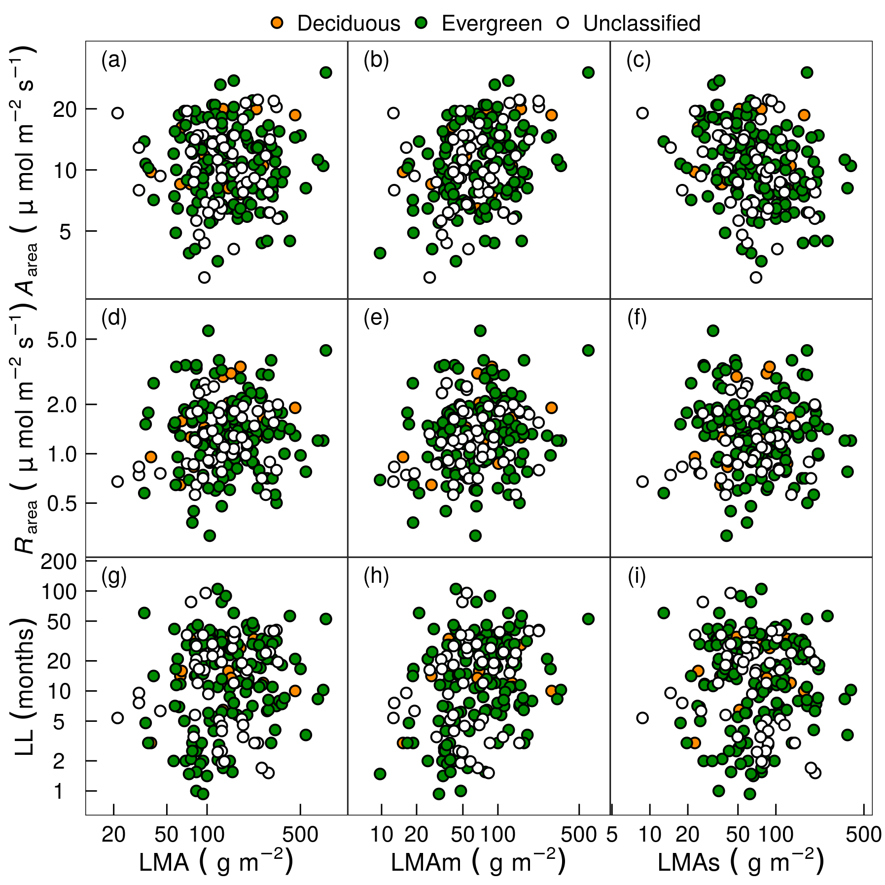
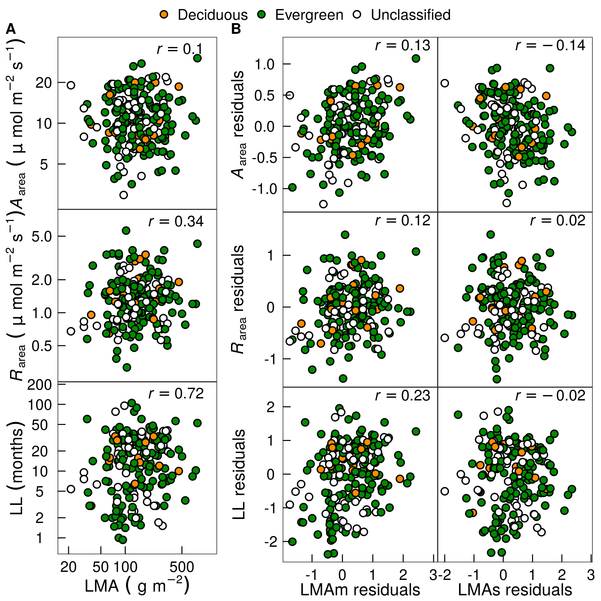
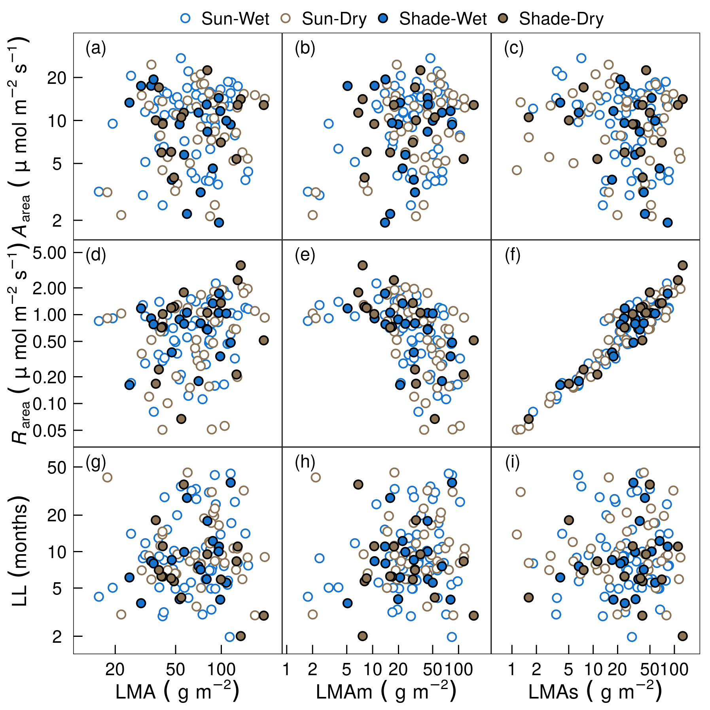
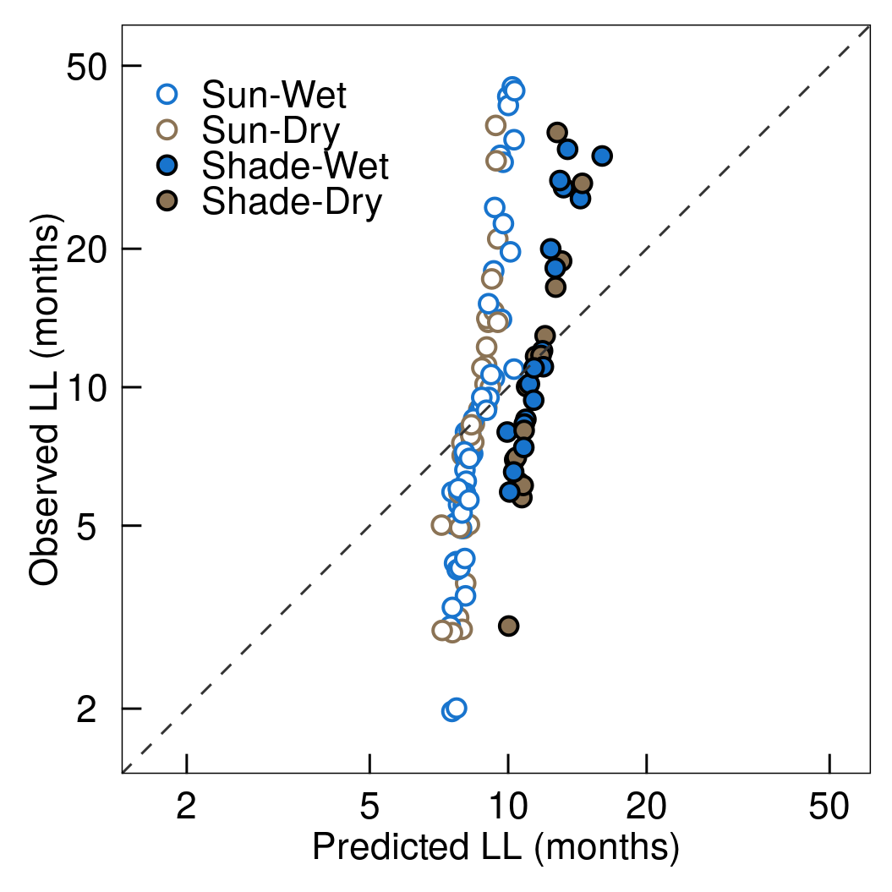

```{r global_options, include=FALSE}
knitr::opts_chunk$set(echo=TRUE,
                      warning=FALSE,
                      cache=FALSE,
                      message=FALSE)
```

```{r}
library(tidyverse)
library(stringr)
library(lazyeval)
library(scales)
library(cowplot)
library(ggrepel)
library(ggthemes)
library(rstan)
library(bayesplot)

settings <- yaml::yaml.load_file("../settings.yml")
r_vals <- yaml::yaml.load_file("../r_val.yml")
p_letters <- yaml::yaml.load_file("../letters.yml")
source("../fig_theme.r")

```

```{r}

scatter_plt <- function(data) {
  ggplot(data, aes(x = Val, y = Val2, 
                               fill = gr, 
                               col = gr)) +
  geom_point(shape = 21) +
  facet_grid(Trait2 ~ LMA,
             scales = "free",
             switch = "both", 
             labeller = labeller(Trait2 = label_parsed,
                                 LMA = label_parsed
                                 )) +
  geom_text(data = lab1, aes(label = lab), 
            hjust = 0.25,
            vjust = 0.25,
            size = 8 * 5/14,
            show.legend = FALSE,
            color = "black") +
  #geom_text(data = lab1, aes(label = r_vals, x = Val_max), 
  #          hjust = 1,
  #          vjust= 0.25,
  #          size = 8 * 5/14,
  #          parse = TRUE,
  #          color = "black",
  #          show.legend = FALSE) +
  scale_fill_manual(values = fills) +
  scale_colour_manual(values = cols) +
  scale_x_log10(breaks = my_breaks_x(), expand = c(0.1, 0)) +
  scale_y_log10(breaks = my_breaks(), expand = c(0.1, 0)) +
  xlab("") +
  ylab("") +
  theme_LES()
}

```

# GL

```{r}
load("../rda/GL_LMAms_more_rand.rda")

# 3 and 8 didn't show divergence `check_rand.html`
n <- 3
GL_summary <- rand_res$summary[[n]]
dat_r <- rand_res$data[[n]]

tmp <- rand_res$model[[n]]
mcmc_trace(tmp, pars = c("amas[1]",  "amas[2]", "lp__"))

mcmc_trace(tmp, pars = c("p[68]", "p[5]", "p[3]", "p[4]"))

DT::datatable(GL_summary %>% round(2))

GL <- dat %>%
  mutate(LMA = dat_r$LMA,
         LL = dat_r$LL,
         Aarea = dat_r$A,
         Rarea = dat_r$R) %>%
  as_tibble %>%
  mutate(LMAp = GL_summary[str_detect(rownames(GL_summary),
                            "log_LMAp"), "X50."] %>%  exp) %>%
  mutate(LMAs = GL_summary[str_detect(rownames(GL_summary),
                            "log_LMAs\\["), "X50."] %>%  exp)

GL_dat <- GL %>%
  gather(LMA, Val,
         c(LMA, LMAs, LMAp)) %>%
  gather(Trait, Val2, c(Aarea, Rarea, LL)) %>%
  as.data.frame %>%
  mutate(LMA = factor(LMA,
    labels = c("LMA", "LMAm", "LMAs"))) %>%
  mutate(LMA = factor(LMA,
    labels = c("LMA~(~g~m^{-2})", "LMAm~(~g~m^{-2})", "LMAs~(~g~m^{-2})"))) %>%
  mutate(DE = factor(DE,
          levels = c("D", "E", "U"))) %>%
  mutate(gr = factor(DE,
          labels = c("Deciduous", "Evergreen", "Unclassified"))) %>%
  mutate(Trait = factor(Trait,
    levels = c("Aarea", "Rarea", "LL"))) %>%
  mutate(Trait2 = factor(Trait,
    labels = c("italic(A)[area]~(~mu~mol~m^{-2}~s^{-1})",
               "italic(R)[area]~(~mu~mol~m^{-2}~s^{-1})",
               "LL~(months)"
               ))) %>%
  #arrange(desc(gr))
  arrange(gr) %>% as_tibble


hist(GL$LMAp / GL$LMA)

fit_m <- lm(log(LMAs) ~ log(LMAp), GL)
fit_s <- lm(log(LMAp) ~ log(LMAs), GL)
fit_Rm <- lm(log(Rarea) ~ log(LMAp), GL)
fit_Rs <- lm(log(Rarea) ~ log(LMAs), GL)
fit_Am <- lm(log(Aarea) ~ log(LMAp), GL)
fit_As <- lm(log(Aarea) ~ log(LMAs), GL)

res_m  <- residuals(fit_m)
res_s  <- residuals(fit_s)
res_Rm  <- residuals(fit_Rm)
res_Rs  <- residuals(fit_Rs)
res_Am  <- residuals(fit_Am)
res_As  <- residuals(fit_As)

par(mfrow=c(1,2))
plot(res_m, res_Rm)
plot(res_s, res_Rs)
par(mfrow=c(1,1))

par(mfrow=c(1,2))
plot(res_m, res_Am)
plot(res_s, res_As)
par(mfrow=c(1,1))


# GL LES plot ----------------------------------------------------------------0
GL_dat1 <- GL_dat %>%
  filter(Trait == "LL" |
         Trait == "Aarea" |
         Trait == "Rarea")

lim_GL <- lim_func(GL_dat1 %>% filter(gr != "Rand"), 
                   trait = "Val")
lim_GL2 <- lim_func(GL_dat1 %>% filter(gr != "Rand"),
                    trait = "Val2", LMA = FALSE)

lab1 <- tibble(lab = paste("(", letters[1:9], ")", sep = ""),
                   Val2 = lim_GL2$max_val %>% rep(each = 3),
                   Val = lim_GL$min_val %>% rep(3),
                   Val_max = lim_GL$max_val %>% rep(3),
                   gr = "Evergreen",
                   r_vals = r_vals$r_vals$GL %>% unlist,
                   Trait2 = rep(lim_GL2$Trait2, each = 3),
                   LMA = rep(lim_GL$LMA, 3)
                   )

fills <- c("Deciduous" = settings$fills$D,
          "Evergreen" = settings$fills$E,
          "Unclassified" = settings$fills$U)

cols <- c("Deciduous" = settings$colors$D,
          "Evergreen" = settings$colors$E,
          "Unclassified" = settings$colors$U)

GL_plot <- scatter_plt(GL_dat1)

summary(GL_dat1)
summary(lab1)

my_ggsave("../figs/GL_rand.png", GL_plot)
```



## partial

```{r GL-scatter, cache=FALSE, comment=NA}
before <- proc.time()
N <- 4000
res <- rand_res$model[[n]]
pmat <- extract(res, "p")[[1]]
r_As <- numeric(N)
r_Am <- r_Rs <- r_Rm <- r_Lm <- r_Ls <- r_As
for (i in 1:N) {
  LMAp <- pmat[i,] * GL$LMA
  LMAs <- GL$LMA - LMAp

  fit_m <- lm(log(LMAs) ~ log(LMAp))
  fit_s <- lm(log(LMAp) ~ log(LMAs))
  fit_Am <- lm(log(GL$Aarea) ~ log(LMAp))
  fit_As <- lm(log(GL$Aarea) ~ log(LMAs))
  fit_Rm <- lm(log(GL$Rarea) ~ log(LMAp))
  fit_Rs <- lm(log(GL$Rarea) ~ log(LMAs))
  fit_Lm <- lm(log(GL$LL) ~ log(LMAp))
  fit_Ls <- lm(log(GL$LL) ~ log(LMAs))

  res_m  <- residuals(fit_m)
  res_s  <- residuals(fit_s)
  res_Am  <- residuals(fit_Am)
  res_As  <- residuals(fit_As)
  res_Rm  <- residuals(fit_Rm)
  res_Rs  <- residuals(fit_Rs)
  res_Lm  <- residuals(fit_Lm)
  res_Ls  <- residuals(fit_Ls)

  r_Am[i] <- cor(res_s, res_As) # Aarea-LMAm
  r_As[i] <- cor(res_m, res_Am) # Aarea-LMAs
  r_Rm[i] <- cor(res_s, res_Rs) #
  r_Rs[i] <- cor(res_m, res_Rm) #
  r_Lm[i] <- cor(res_s, res_Ls) #
  r_Ls[i] <- cor(res_m, res_Lm) #
}

after <- proc.time()
after - before

quant_fun <- function(x) c(quantile(x, 0.5), quantile(x, 0.025), quantile(x, 0.975))

GL_cor_tbl <- rbind(
  quant_fun(r_As),
  quant_fun(r_Am),
  quant_fun(r_Ls),
  quant_fun(r_Lm),
  quant_fun(r_Rs),
  quant_fun(r_Rm)
  ) %>%
  as_tibble 

```

```{r, cache=FALSE, comment=NA, eval = T}
N <- 4000

moge_fun <- function(i) {
  r_As <- numeric(N)
  for (i in 1:N) {
    LMAp <- pmat[i,] * GL$LMA
    LMAs <- GL$LMA - LMAp
    fit_m <- lm(log(LMAs) ~ log(LMAp))
    fit_Am <- lm(log(GL$Aarea) ~ log(LMAp))
    res_m  <- residuals(fit_m)
    res_Am  <- residuals(fit_Am)
    r_As[i] <- cor(res_m, res_Am) # Aarea-LMAs
  }
  r_As
}

system.time(aa <- moge_fun(N))

moge_fun2 <- function(i) {
    LMAp <- pmat[i,] * GL$LMA
    LMAs <- GL$LMA - LMAp
    fit_m <- lm(log(LMAs) ~ log(LMAp))
    fit_Am <- lm(log(GL$Aarea) ~ log(LMAp))
    res_m  <- residuals(fit_m)
    res_Am  <- residuals(fit_Am)
    cor(res_m, res_Am) # Aarea-LMAs
}

system.time(bb <- sapply(1:N, moge_fun2))


LMAp_mat <- apply(pmat, 1, function(x){GL$LMA * x}) %>% t
LMAs_mat <- apply(LMAp_mat, 1, function(x){GL$LMA - x}) %>% t

plot(LMAp_mat[i,], LMAp)
plot(LMAs_mat[i,], LMAs)

moge_fun3 <- function(i) {
    fit_m <- lm(log(LMAs_mat[i,]) ~ log(LMAp_mat[i,]))
    fit_Am <- lm(log(GL$Aarea) ~ log(LMAp_mat[i,]))
    res_m  <- residuals(fit_m)
    res_Am  <- residuals(fit_Am)
     cor(res_m, res_Am) # Aarea-LMAs
}

system.time(bb2 <- sapply(1:N, moge_fun3))

system.time(aa2 <- moge_fun3(N))
```


```{r, cache=FALSE, comment=NA}

LMA_m_fun <- function(i) {
    fit_m <- lm(log(LMAs_mat[i,]) ~ log(LMAp_mat[i,]))
    residuals(fit_m)
}

LMA_s_fun <- function(i) {
    fit_m <- lm(log(LMAp_mat[i,]) ~ log(LMAs_mat[i,]))
    residuals(fit_m)
}

res_fun <- function(i, LMA, trait) {
    fit_m <- lm(log(trait) ~ log(LMA[i,]))
    residuals(fit_m)
}

res_fun2 <- function(N, LMA, trait){
  sapply(1:N, res_fun, LMA, trait) %>%
    apply(., 1, median)
}

before <- proc.time()

GL2 <- GL %>%
  mutate(res_m = sapply(1:N, LMA_m_fun) %>% apply(., 1, median)) %>%
  mutate(res_s = sapply(1:N, LMA_s_fun) %>% apply(., 1, median)) %>%
  mutate(Aarea_s = res_fun2(N, LMAs_mat, GL$Aarea)) %>%
  mutate(Aarea_m = res_fun2(N, LMAp_mat, GL$Aarea)) %>%
  mutate(Rarea_s = res_fun2(N, LMAs_mat, GL$Rarea)) %>%
  mutate(Rarea_m = res_fun2(N, LMAp_mat, GL$Rarea)) %>%
  mutate(LL_s = res_fun2(N, LMAs_mat, GL$LL)) %>%
  mutate(LL_m = res_fun2(N, LMAp_mat, GL$LL))

after <- proc.time()
after - before
```

```{r, cache=FALSE, comment=NA}

fills <- c("Deciduous" = settings$fills$D,
          "Evergreen" = settings$fills$E,
          "Unclassified" = settings$fills$U)

cols <- c("Deciduous" = settings$colors$D,
          "Evergreen" = settings$colors$E,
          "Unclassified" = settings$colors$U)

GL_fig_dat <- GL %>%
  gather(LMA, val0, c(LMA, LMAs, LMAp)) %>%
  gather(Trait, val2, c(Aarea, Rarea, LL)) %>%
  mutate(DE = factor(DE,
          levels = c("D", "E", "U"))) %>%
  mutate(gr = factor(DE,
          labels = c("Deciduous", "Evergreen", "Unclassified"))) %>%
  mutate(Trait = factor(Trait,
    levels = c("Aarea", "Rarea", "LL"))) %>%
  mutate(Trait2 = factor(Trait,
    labels = c("italic(A)[area]~(~mu~mol~m^{-2}~s^{-1})",
               "italic(R)[area]~(~mu~mol~m^{-2}~s^{-1})",
               "LL~(months)"))) %>%
  mutate(LMA = factor(LMA,
                      levels = c("LMA", "LMAp", "LMAs"))) %>%
  mutate(LMA2 = factor(LMA,
          labels = c("LMA~(~g~m^{-2})",
                     "LMAm~(~g~m^{-2})",
                     "LMAs~(~g~m^{-2})")))

GL_fig_dat2 <- GL2 %>%
  gather(resLMA, val, c(res_m, res_s)) %>%
  gather(resTrait, val2, c(Aarea_s, Rarea_s, LL_s,
                           Aarea_m, Rarea_m, LL_m)) %>%
  mutate(tmp1 = str_split(resLMA, "_") %>% sapply(., "[[", 2)) %>%
  mutate(tmp2 = str_split(resTrait, "_") %>% sapply(., "[[", 2)) %>%
  mutate(resTrait2 = str_split(resTrait, "_") %>% sapply(., "[[", 1)) %>%
  filter(tmp1 == tmp2) %>%
  dplyr::select(resLMA, resTrait, resTrait2, val, val2, DE) %>%
  mutate(DE = factor(DE,
          levels = c("D", "E", "U"))) %>%
  mutate(gr = factor(DE,
          labels = c("Deciduous", "Evergreen", "Unclassified"))) %>%
  mutate(resLMA = factor(resLMA,
         levels = c("res_s", "res_m"))) %>%
  #mutate(resLMA = factor(resLMA,
  #  labels = c("LMAm~residuals", "LMAs~residuals~(~g~m^{-2})"))) %>%
  mutate(resLMA = factor(resLMA,
    labels = c("LMAm residuals", "LMAs residuals"))) %>%
  mutate(resTrait2 = factor(resTrait2,
                            levels = c("Aarea", "Rarea", "LL"))) %>%
  mutate(resTrait2 = factor(resTrait2,
    labels = c("italic(A)[area]~residuals",
               "italic(R)[area]~residuals",
               "LL~residuals")))

lim_GL <- lim_func(GL_fig_dat,
                    trait = "val0")

lim_GL2 <- lim_func(GL_fig_dat,
                    trait = "val2", LMA = FALSE)

lab1 <- tibble(lab = paste("(", letters[1:9], ")", sep = ""),
                   val2 = lim_GL2$max_val %>% rep(each = 3),
                  # Val2 = Inf,
                   Val = lim_GL$min_val %>% rep(3),
                   Val_max = lim_GL$max_val %>% rep(3),
                   gr = "Evergreen",
                   r_vals = r_vals$r_vals$GL %>% unlist,
                   Trait2 = rep(lim_GL2$Trait2, each = 3),
                   LMA = rep(lim_GL$LMA, 3)
                   ) %>%
  filter(LMA == "LMA")


GL_figA <- ggplot(GL_fig_dat %>% filter(LMA == "LMA"), aes(x = val0, y = val2,
                                  col = gr,
                                  fill = gr)) +
  geom_point(shape = 21) +
  facet_grid(Trait2 ~ LMA2,
             scales = "free",
             switch = "both",
             labeller = labeller(Trait2 = label_parsed,
                                 LMA2 = label_parsed)) +
  scale_colour_manual(values = cols) +
  scale_fill_manual(values = fills) +
  scale_x_log10(breaks = my_breaks_x(), expand = c(0.1, 0)) +
  scale_y_log10(breaks = my_breaks(), expand = c(0.1, 0)) +
  xlab("") +
  ylab("") +
  geom_text(data = lab1, aes(label = r_vals, x = Val_max), 
            hjust = 1,
            vjust= 0.25,
            size = 8 * 5/14,
            parse = TRUE,
            color = "black",
            show.legend = FALSE) +
  theme_LES() #+
#  theme(
#          axis.title.y = element_text(margin = margin(t = 0,
#                                                      b = 0,
#                                                      l = -10,
#                                                      r = 5),
#                                      angle = 90))
#
GL_figA2 <- GL_figA +
  theme(legend.position = "none")
#  geom_text(data = lab1, aes(label = r_vals, x = Val_max), 
#            hjust = 1,
#            vjust= 0.25,
#            size = 8 * 5/14,
#            parse = TRUE,
#            color = "black",
#            show.legend = FALSE) +
#  theme_LES() +
#  theme(legend.position = "none")
  #theme(legend.text = element_blank(),
  #      legend.key = element_rect(fill = NULL, colour = NULL)
  #      )

GL_figA2


labGL0 <- GL_fig_dat2 %>%
  group_by(resLMA, resTrait, resTrait2) %>%
 # group_by(resTrait, resTrait2) %>%
  summarize(x_max = max(val),
            y_max = max(val2),
            x_min = min(val),
            y_min = min(val2),
            ) %>%
  ungroup %>%
  # check line307-313
  arrange(resTrait, desc(resLMA)) %>%
  mutate(r_vals = GL_cor_tbl$`50%`) %>%
  mutate(r_vals = paste0("italic(r) == ", round(r_vals, 2))) %>%
  mutate(val = 1) %>%
  mutate(val2 = 1) %>%
  mutate(gr = "Evergreen") %>%
  mutate(resTrait3 = sapply(str_split(resTrait, "_"), "[[", 1)) 

tmp <- labGL0 %>%
  group_by(resTrait3) %>%
  summarize(x_max2 = max(x_max),
            y_max2 = max(y_max),
            x_min2 = min(x_min),
            y_min2 = min(y_min))

labGL <- full_join(labGL0, tmp, by = "resTrait3")

GL_figB <- ggplot(GL_fig_dat2, aes(x = val, y = val2,
                       color = gr, fill = gr)) +
  geom_point(shape = 21) +
  scale_fill_manual(values = fills) +
  scale_color_manual(values = cols) +
  facet_grid(resTrait2~resLMA,
             switch = "both",
             scale = "free",
             labeller = labeller(resTrait2 = label_parsed#,
                                 #resLMA = label_parsed
             )) +
  xlab("") +
  ylab("") +
  theme_LES() +
  theme(legend.position = "none")

GL_figB2 <- GL_figB +
#  geom_text(data = labGL , aes(label = lab), 
#            hjust = 0.25,
#            vjust = 0.25,
#            size = 8 * 5/14,
#            show.legend = FALSE,
#            color = "black") +
  geom_text(data = labGL, aes(label = r_vals,
                              x = x_max * 1.2,
                              y = y_max2 * 1.2),
            hjust = 1,
            vjust= 0.5,
            size = 8 * 5/14,
            parse = TRUE,
            color = "black",
            show.legend = FALSE) +
  theme_LES() +
  theme(legend.position = "none"
        )

legend2 <- get_legend(GL_figA)

fig2 <- ggdraw() +
  draw_plot(GL_figA, 0, 0, 0.33, 1) +
  draw_plot(GL_figB, 0.33, 0, 0.66, 1) +
  draw_plot_label(c("A", "B"), c(0, 0.33), c(1, 1), size = 9)

fig2

fig3 <- plot_grid(GL_figA2, GL_figB2,
                  labels = c("A", "B"),
                  label_size = 8,
                  vjust = 0.5,
                  rel_widths = c(0.6, 1))

fig4 <- plot_grid(legend2, fig3,  ncol = 1,
                  rel_heights = c(.1, 2))

my_ggsave("../figs/GL_rand2.png", fig4)

```



# PA

```{r}
load("../rda/PA_LMAms_L0_more_rand.rda")

# all the modle looks bad
# 6th randomaization still produces divergence
n <- 6
PAres <- rand_res$model[[n]]
PA_summary <- rand_res$summary[[n]]
dat_r <- rand_res$data[[n]]

tmp <- rand_res$model[[n]]
mcmc_trace(tmp, pars = c("am", "as", "lp__"))
mcmc_trace(tmp, pars = c("p[68]", "p[5]", "p[3]", "p[4]"))

DT::datatable(PA_summary %>% round(2))

PA_p_mat <- rstan::extract(PAres, "p")[[1]] 
PA_p_vec <- apply(PA_p_mat, 2, median)
PA_p_vec_lo <- apply(PA_p_mat, 2, function(x)quantile(x, 0.025))
PA_p_vec_up <- apply(PA_p_mat, 2, function(x)quantile(x, 0.975))


LLpred_mat <- as.data.frame(PAres) %>%
  as_tibble %>%
  select(contains("Mu")) %>%
  select(contains(",2]")) %>%
  as.matrix

preLL <- apply(LLpred_mat, 2, function(x) median(exp(x)))

PA <- dat %>%
  mutate(LMA = dat_r$LMA,
         LL = dat_r$LL,
         Aarea = dat_r$A,
         Rarea = dat_r$R) %>%
  as_data_frame %>%
  mutate(LMAp = LMA * PA_p_vec) %>%
  mutate(LMAs = LMA - LMAp)  %>%
  #mutate(preLL = preLL) %>%
  mutate(site2 = ifelse(site == "PNM", "DRY", "WET")) %>%
  mutate(sp_site_strata = paste(sp, site2, strata, sep = "_")) %>%
  mutate(site_strata = paste(site2, strata, sep = "_"))

PA_dat <- PA %>%
  gather(LMA, Val,
         c(LMA, LMAs, LMAp)) %>%
  gather(Trait, Val2, c(Aarea, Rarea, LL)) %>%
  as.data.frame %>%
  mutate(LMA = factor(LMA,
    labels = c("LMA", "LMAm", "LMAs"))) %>%
  mutate(LMA = factor(LMA,
    labels = c("LMA~(~g~m^{-2})", "LMAm~(~g~m^{-2})", "LMAs~(~g~m^{-2})"))) %>%
  mutate(site_strata = factor(site_strata,
          levels = c("WET_CAN", "DRY_CAN", "WET_UNDER", "DRY_UNDER"))) %>%
  mutate(Trait = factor(Trait,
    levels = c("Aarea", "Rarea", "LL"))) %>%
  mutate(Trait2 = factor(Trait,
    labels = c("italic(A)[area]~(~mu~mol~m^{-2}~s^{-1})",
               "italic(R)[area]~(~mu~mol~m^{-2}~s^{-1})",
               "LL~(months)"
               ))) %>%
  mutate(gr = factor(site_strata,
    labels = c("Sun-Wet",
               "Sun-Dry",
               "Shade-Wet",
               "Shade-Dry"
                      ))) %>%
  #arrange(desc(gr))
  arrange(gr) %>% as_tibble

hist(PA$LMAp / PA$LMA)

fit_m <- lm(log(LMAs) ~ log(LMAp), PA)
fit_s <- lm(log(LMAp) ~ log(LMAs), PA)
fit_Rm <- lm(log(Rarea) ~ log(LMAp), PA)
fit_Rs <- lm(log(Rarea) ~ log(LMAs), PA)
fit_Am <- lm(log(Aarea) ~ log(LMAp), PA)
fit_As <- lm(log(Aarea) ~ log(LMAs), PA)

res_m  <- residuals(fit_m)
res_s  <- residuals(fit_s)
res_Rm  <- residuals(fit_Rm)
res_Rs  <- residuals(fit_Rs)
res_Am  <- residuals(fit_Am)
res_As  <- residuals(fit_As)

par(mfrow=c(1,2))
plot(res_m, res_Rm)
plot(res_s, res_Rs)
par(mfrow=c(1,1))

par(mfrow=c(1,2))
plot(res_m, res_Am)
plot(res_s, res_As)
par(mfrow=c(1,1))


# PA LES plot ----------------------------------------------------------------0
PA_dat1 <- PA_dat %>%
  filter(Trait == "LL" |
         Trait == "Aarea" |
         Trait == "Rarea")

lim_PA <- lim_func(PA_dat1 %>% filter(site_strata != "Rand"), 
                   trait = "Val")
lim_PA2 <- lim_func(PA_dat1 %>% filter(site_strata != "Rand"),
                    trait = "Val2", LMA = FALSE)

lab1 <- tibble(lab = paste("(", letters[1:9], ")", sep = ""),
                   Val2 = lim_PA2$max_val %>% rep(each = 3),
                   Val = lim_PA$min_val %>% rep(3),
                   Val_max = lim_PA$max_val %>% rep(3),
                   gr = "Sun-Dry",
                   r_vals = r_vals$r_vals$PA %>% unlist,
                   Trait2 = rep(lim_PA2$Trait2, each = 3),
                   LMA = rep(lim_PA$LMA, 3)
                   )

fills <- c("Sun-Dry" = settings$fills$sun_dry,
          "Sun-Wet" = settings$fills$sun_wet,
          "Shade-Dry" = settings$fills$shade_dry,
          "Shade-Wet" = settings$fills$shade_wet)

cols <- c("Sun-Dry" = settings$colors$sun_dry,
          "Sun-Wet" = settings$colors$sun_wet,
          "Shade-Dry" = settings$colors$shade_dry,
          "Shade-Wet" = settings$colors$shade_wet)

PA_plot <- scatter_plt(PA_dat1)

my_ggsave("../figs/PA_rand.png", PA_plot)
```



```{r, eval = F}

# LL plot ---------------------------------------------------------------------

LL_dat <- PA %>%
  as.data.frame %>%
  mutate(site_strata = factor(site_strata,
          levels = c("WET_CAN", "DRY_CAN", "WET_UNDER", "DRY_UNDER"))) %>%
  mutate(gr = factor(site_strata,
    labels = c("Sun-Wet",
               "Sun-Dry",
               "Shade-Wet",
               "Shade-Dry"
                      )))

labLL <- tibble(
                   LL = Inf,
                   Val = min(PA$LL),
                   Val_max = max(PA$LL),
                   gr = "Sun-Dry",
                   r_vals = r_vals$r_vals$PA_LL$preLL_LL
                   )

LL_plot <- ggplot(LL_dat, aes(x = preLL, y = LL, 
                              fill = gr, col = gr)) + 
  geom_point(shape = 21) +
  scale_fill_manual(values = fills) +
  scale_colour_manual(values = cols) +
  scale_x_log10(breaks = my_breaks(), expand = c(0.1, 0),
                limits = c(min(labLL$Val), max(labLL$Val_max))) +
  scale_y_log10(breaks = my_breaks(), expand = c(0.1, 0), 
                limits = c(min(labLL$Val), max(labLL$Val_max))) +
  xlab("Predicted LL (months)") +
  ylab("Observed LL (months)") +
  geom_abline(aes(slope = 1, intercept = 0), 
              lty = 2, 
              lwd = 0.25, 
              col = "gray20") +
 # geom_text(data = labLL, aes(label = r_vals, x = Val_max, y = 2.5), 
 #           colour = "black",
 #           hjust = 1,
 #           vjust= 0,
 #           parse = TRUE,
 #           show.legend = FALSE) +
  coord_fixed() +
  theme_LES() +
  theme(
    legend.position = c(0.2, 0.85),
    axis.title.x = element_text(margin = margin(t = 1,
                                                b = 1,
                                                l = 0,
                                                r = 0)),
    axis.title.y = element_text(margin = margin(t = 1,
                                                b = 1,
                                                l = 1,
                                                r = 1))
        )

my_ggsave("../figs/LL_rand.png", LL_plot,
          width = 6.7,
          height = 6.7)

## LMAm vs LMAs

```


