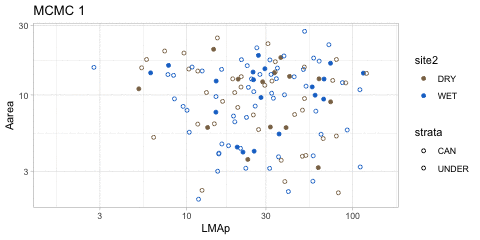
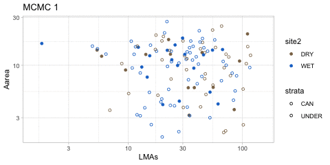

```{r global_options, include=FALSE}
knitr::opts_chunk$set(echo=TRUE,
                      warning=FALSE,
                      message=FALSE)
```


```{r, echo = F, message = F}
library(loo)
library(rstan)
library(dplyr)
library(scales)
library(memisc)
library(gganimate)
library(gapminder)
theme_set(theme_light())

```


```{r, echo = T, message = F}

#load("./data/PA_latent_model_light_more_obs.rda")
#load("../data/PA_latent_replusive_model_light2_more_obs.rda")
load("../data/PA_latent_replusive_model_light2_more_rand.rda")
res <-rand_res$model[[3]]
p_mcmc <- extract(res, "p")
PA2 <- NULL

for (i in 1:3) {
  p_est <- p_mcmc[[1]][i,] 
  PA <- dat %>%
    as_data_frame %>%
    mutate(site2 = ifelse(site == "PNM", "DRY", "WET")) %>%
    mutate(sp_site_strata = paste(sp, site2, strata, sep = "_")) %>%
    mutate(site_strata = paste(site2, strata, sep = "_")) %>%
    mutate(LMAp = p_est * LMA) %>%
    mutate(LMAs = (1 - p_est) * LMA) %>%
    dplyr::select(sp, site2, strata,site_strata, LMA, Aarea, Rarea, LL, LMAp, LMAs) %>%
    mutate(mcmc_no = i)

  PA2 <- rbind(PA2, PA)
}


```

```{r, eval = F}

p <- ggplot(PA2, aes(y = log(Aarea), x = log(LMAp), col = site_strata))  +
  geom_point() +
  transition_time(mcmc_no)

p

```

```{r, eval = F}

p_est <- p_mcmc[[1]][,4] 
hist(p_est)

```


```{r, eval = T}

p <- ggplot(PA, aes(y = Rarea, x = LMAp, 
                    fill = site2, col = site2, shape = strata))  +
  geom_point() +
  scale_shape_manual(values = c("CAN" = 1, "UNDER" = 21)) +
  scale_fill_manual(values = c("DRY" = "#8B7355", "WET" = "#1874CD")) +
  scale_colour_manual(values = c("DRY" = "#8B7355", "WET" = "#1874CD")) +
  scale_x_log10() +
  scale_y_log10() 
p

tmp <- NULL
for (i in 1:100) {
  p_est <- p_mcmc[[1]][i,] 
  PA <- dat %>%
    as_data_frame %>%
    mutate(site2 = ifelse(site == "PNM", "DRY", "WET")) %>%
    mutate(sp_site_strata = paste(sp, site2, strata, sep = "_")) %>%
    mutate(site_strata = paste(site2, strata, sep = "_")) %>%
    mutate(LMAp = p_est * LMA) %>%
    mutate(LMAs = (1 - p_est) * LMA) %>%
    dplyr::select(sp, site, strata,site_strata, LMA, Aarea, Rarea, LL, LMAp, LMAs) %>%
    mutate(mcmc_no = i)

  tmp[i] <- cor.test(log(PA$Aarea), log(PA$LMAp))$p.value
}

hist(tmp %>% log10)

```


```{r}
library(animation)

plt_frame <- function(x){
  p_est <- p_mcmc[[1]][x,] 

  PA <- dat %>%
    as_data_frame %>%
    mutate(LMA = rand_res$data[[3]]$LMA) %>%
    mutate(Aarea = rand_res$data[[3]]$A) %>%
    mutate(Rarea = rand_res$data[[3]]$R) %>%
    mutate(site2 = ifelse(site == "PNM", "DRY", "WET")) %>%
    mutate(sp_site_strata = paste(sp, site2, strata, sep = "_")) %>%
    mutate(site_strata = paste(site2, strata, sep = "_")) %>%
    mutate(LMAp = p_est * LMA) %>%
    mutate(LMAs = (1 - p_est) * LMA) %>%
    dplyr::select(sp, site2, strata,site_strata, LMA, Aarea, Rarea, LL, LMAp, LMAs) %>%
    mutate(mcmc_no = x)

  p <- ggplot(PA, aes(y = Aarea, x = LMAp, 
                      fill = site2, col = site2, shape = strata))  +
    geom_point() +
    scale_shape_manual(values = c("CAN" = 1, "UNDER" = 21)) +
    scale_fill_manual(values = c("DRY" = "#8B7355", "WET" = "#1874CD")) +
    scale_colour_manual(values = c("DRY" = "#8B7355", "WET" = "#1874CD")) +
    scale_x_log10(limits = c(1.5, 150)) +
    scale_y_log10() +
    labs(title = paste0("MCMC ", x))
    

  print(p)
}

system.time(saveGIF(
       lapply(1:10, function(x) plt_frame(x)),
       interval = 0.5,
       ani.width = 480,
       ani.height = 240,
       movie.name = "./moge.gif"
        ))

```


```{r}

plt_frame2 <- function(x){
  p_est <- p_mcmc[[1]][x,] 

  PA <- dat %>%
    as_data_frame %>%
    mutate(LMA = rand_res$data[[3]]$LMA) %>%
    mutate(Aarea = rand_res$data[[3]]$A) %>%
    mutate(Rarea = rand_res$data[[3]]$R) %>%
    mutate(site2 = ifelse(site == "PNM", "DRY", "WET")) %>%
    mutate(sp_site_strata = paste(sp, site2, strata, sep = "_")) %>%
    mutate(site_strata = paste(site2, strata, sep = "_")) %>%
    mutate(LMAp = p_est * LMA) %>%
    mutate(LMAs = (1 - p_est) * LMA) %>%
    dplyr::select(sp, site2, strata,site_strata, LMA, Aarea, Rarea, LL, LMAp, LMAs) %>%
    mutate(mcmc_no = x)

  p <- ggplot(PA, aes(y = Aarea, x = LMAs, 
                      fill = site2, col = site2, shape = strata))  +
    geom_point() +
    scale_shape_manual(values = c("CAN" = 1, "UNDER" = 21)) +
    scale_fill_manual(values = c("DRY" = "#8B7355", "WET" = "#1874CD")) +
    scale_colour_manual(values = c("DRY" = "#8B7355", "WET" = "#1874CD")) +
    scale_x_log10(limits = c(1.5, 150)) +
    scale_y_log10() +
    labs(title = paste0("MCMC ", x))
    

  print(p)
}

system.time(saveGIF(
       lapply(1:10, function(x) plt_frame2(x)),
       interval = 0.5,
       ani.width = 480,
       ani.height = 240,
       movie.name = "./moge2.gif"
        ))

```




