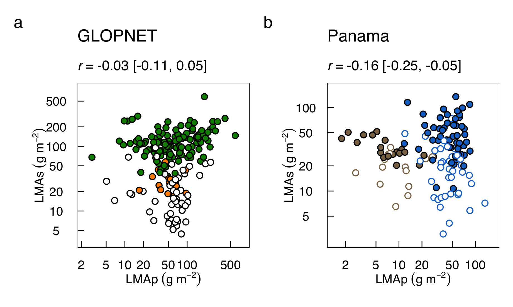

```{r global_options, include=FALSE}
knitr::opts_chunk$set(echo=FALSE, warning=FALSE, message=FALSE)
```

```{r caching, include=FALSE}
library(methods)
library(knitr)
library(kableExtra)
library(png)
library(grid)
library(pander)
source("rmd_func.r")
```


## SX:


{#fig:hoge}

\newpage

## SX:

Posterior means of LMAp vs LMAs in the (a) GLOPNET and (b) Panama datasets.
The *r* values were calucalted for each MCMC step and the means [95% credible interval] are shown. 
Correlations between LMAm and LMAs are significantly negative for Panama, but the small absoulte *r* value indicate that a single axis could not accurately represent the two-dimensional space.
Symbols as in Main Text Figs. 2-3.



\newpage


## SX:

Boxplots comparing posterior means of the latent variable f (the fraction of total LMA comprised by LMAm) across deciduous (D) and evergreen (E) leaves in GLOPNET and Panama, and across sites (wet and dry) and canopy strata (sun and shade) in Panama.
Note that LMAm = f $\times$ LMA, and LMAs = (1 – f) $\times$ LMA. 
(a) Deciduous and evergreen leaves in the GLOPNET dataset; 
(b) deciduous and evergreen leaves for Panama species for which both sun and shade leaves were available; 
(c) leaves for Panama species for which both sun and shade leaves were available; and 
(d) all leaves for Panama.
GLOPNET results are for the Model 2b, and Panama results are for the Model 4a.
The center line in each box indicates the median, upper and lower box edges indicate the interquartile range, whiskers show 1.5 times the interquartile range, and points are outliers.
Groups sharing the same letters are not significantly different (P > 0.05; t-tests).


\newpage
