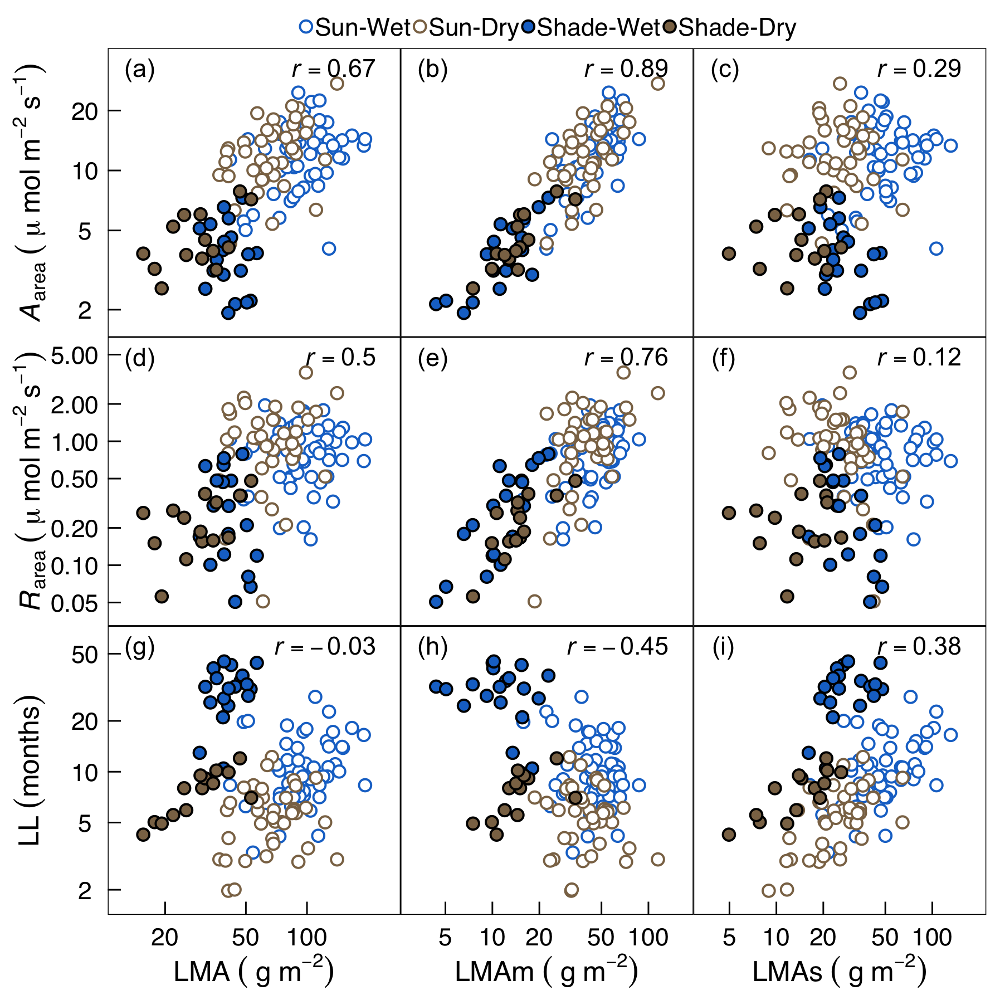

---
output:
  bookdown::pdf_book:
    fig_caption: true
    keep_tex: yes
    toc: no
    number_sections: no
    includes:
        in_header: format.sty
    pandoc_args:
      - "--filter"
      - "pandoc-crossref"
  bookdown::word_document2:
    fig_width: 6
    fig_caption: true
    reference_docx: rmd_style.docx
    #pandoc_args:
    #- "--filter"
    #- "pandoc-crossref"
    #- "--mathml"
fontsize: 12pt
geometry: margin=1in
link-citations: yes
csl: je.csl
bibliography: ref.bib
---

```{r, echo = FALSE}
library(tidyverse)
library(methods)
library(knitr)
```


```{r setup, include=FALSE}
knitr::opts_chunk$set(message=FALSE, warning=FALSE)

getOutputFormat <- function() {
  output <- rmarkdown:::parse_yaml_front_matter(
    readLines(knitr::current_input())
    )$output
  if (is.list(output)){
    return(names(output)[1])
  } else {
    return(output[1])
  }
}

if(getOutputFormat() == 'pdf_document') {
  library(Cairo)
  knitr::opts_chunk$set(dev="cairo_pdf")
}
```

<!--chapter:end:index.rmd-->

---
title: "LMAp-LMAs intro"
output:
  bookdown::word_document2:
       fig_width: 6
       #reference_docx: rmd_style.docx
       pandoc_args:
         - "--filter"
         - "pandoc-crossref"
         - "--mathml"
---

Each section corresponds to each potential paragraph.

## Problem of one-dimensional LES

The LES captures tight relationships among leaf mass per area (LMA), leaf lifespan (LL), and mass-normalized leaf traits related to carbon fixation and nutrient use ranging from short-lived leaves with high photosynthetic potential and fast returns on investment to long-lived leaves with low photosynthetic potential and slow returns (Wright et al., 2004; Westoby & Wright, 2006; Reich, 2014). The strong correlations suggest the presence of a single dominant axis of leaf functional variation (Wright et al. 2004). However, recent analyses suggest that the strong correlations are largely the result of high interspecific variation in LMA combined with mass-normalization of area-dependent traits (Osnas et al. 2013; Lloyd et al. 2013). Thus, although mass-normalization and the LES can be justified based on economic principles (Westoby et al. 2013), the evidence for a single dominant axis is questionable.

## Multiple dimensions in trait variation

Furthermore, different leaf assemblages exhibit different patterns of trait variation with respect to leaf mass and leaf area. For example, across global species, whole-leaf values of traits related to photosynthesis and metabolism (e.g., the photosynthetic capacity of an entire leaf, units = moles CO~2~ fixed per-unit time; or the total amount of N or P in an entire leaf, units = grams  of nitrogen or phosphorus) tend to be roughly proportional to leaf area; whereas across intraspecific light gradients these same whole-leaf trait values tend to be roughly proportional to leaf mass. Functional groups (e.g., deciduous vs. evergreen angiosperms) also differ from each other in terms of how interspecific trait variation (within a given functional group) depends on leaf mass vs. area.These divergent patterns in leaf trait variation suggest the presence of multiple drivers of trait variation, which may be difficult to capture with a single axis.

## One promising (possible) approach for understanding cause and consequence of leaf trait variation is to understand mass vs area (or photosynthetic vs structural components)

One promising approach for understanding cause and consequence of leaf trait variation is to conceptualize LMA as the sum of  photosynthetic and structural components (Osnas et al. in press). Although this two-dimensional model of trait variation is simplistic (e.g., there is no explicit treatment of leaf hydraulics), it provides qualitative insights into the causes of the above divergent trait patterns, because variation in LMAp leads to mass-dependence of photosynthetic and metabolic traits, whereas variation in LMAs leads to area-dependence of these same traits (supplement ?).


For example, …[perhaps explain how LMAp-LMAs can explain area-dependence of global flora and mass-dependence within species


However, the above conceptual model has not been translated into a quantitative model that predicts trait values, which limits our capacity to test and apply the model. One approach to developing a quantitative framework would be to directly measure LMAp and LMAs, and then to estimate relationships between these traits and other traits of interest (e.g., Amax, Rdark, and LL). However, although certain leaf mass components can be neatly partitioned to either LMAp or LMAs (e.g., chloroplasts contribute to photosynthesis, but not structure), other leaf mass components cannot. For example, thick cell walls contribute to structural toughness, but at least some cell wall mass is required for the biomechanical support that enables photosynthesis. An alternative approach to implementing a quantitative form of the LMAp-LMAs model, and the one we explore in this paper, is to specify hypotheses for how LMAp and LMAs relate to measured traits (e.g., Amax, Rdark, and LL) in the form of a quantitative model, and to evaluate the model using statistical methods.

## Objectives

- We show more a realistic (or concrete) version of the above conceptual model than the previous study (Osnas et al. in press) using leaf trait data from two tropical forest sites and GLOPNE.
- The goal of our analysis is to evaluate if the inferred LMAp and LMAs values can explain divergent patterns in leaf trait data, and if so, to use the model to elucidate the causes of these divergent patterns.
- First, we describe the framework.
- Questions:
    1. What is the relative importance of LMAp vs. LMAs in explaining variation in LMA within and among species?
    1. Do LMAp and LMAs differ between evergreen and deciduous species, and between sun and shade leaves?
    1. How are measurable leaf photosynthetic and structural traits (e.g., concentrations of nitrogen and cellulose) related to LMAp and LMAs?

<!--chapter:end:intro.rmd-->

---
output:
  bookdown::pdf_book:
    fig_caption: true
    keep_tex: yes
    toc: no
    number_sections: no
    includes:
        in_header: format.sty
    pandoc_args:
      - "--filter"
      - "pandoc-crossref"
  bookdown::word_document2:
    fig_width: 6
    fig_caption: true
    reference_docx: rmd_style.docx
    #pandoc_args:
    #- "--filter"
    #- "pandoc-crossref"
    #- "--mathml"
fontsize: 12pt
geometry: margin=1in
link-citations: yes
csl: je.csl
bibliography: ref.bib
---

```{r, echo = FALSE}
library(tidyverse)
library(methods)
library(knitr)
```

**Running title**: Photosynthetic and structural leaf mass

**Decomposing leaf mass into photosynthetic and structural components explains divergent patterns of trait variation within and among plant species**

Masatoshi Katabuchi^1,2,6^, Kaoru Kitajima^1,3,4^, S. Joseph Wright^4^, Sunshine A. Van Bael^4,5^, Jeanne L. D. Osnas^1^ and Jeremy W. Lichstein^1^


^1^ Department of Biology, University of Florida, Gainesville, FL 32611, USA

^2^ Kellogg Biological Station, Michigan State University, Hickory Corners, MI 49060, USA

^3^ Graduate School of Agriculture, Kyoto University, Kitashirakawa Oiwake-Cho, Kyoto 606-8502 Japan

^4^ Smithsonian Tropical Research Institute, 9100 Panama City Pl., Washington, DC 20521

^5^ Department of Ecology and Evolutionary Biology, Tulane University, New Orleans, LA 70118 USA

^6^**Corresponding Author**: E-mail: mattocci27@gmail.com

#####

\newpage


# Abstract

- Across the global flora, photosynthetic and metabolic rates depend more strongly on leaf area than leaf mass. In contrast, intraspecific variation in these rates is strongly mass-dependent. These contrasting patterns suggest that the causes of variation in leaf mass per area (LMA) may be fundamentally different within vs. among species.

- We used statistical methods to decompose LMA into two conceptual components – ‘photosynthetic’ LMAp (which determines photosynthetic capacity and metabolic rates, and also affects optimal leaf lifespan) and ‘structural’ LMAs (which determines leaf toughness and potential leaf lifespan) using leaf trait data from tropical forest sites in Panama and a global leaf-trait database.

- Statistically decomposing LMA into LMAp and LMAs provides improved predictions of trait variation (photosynthesis, respiration, and lifespan) across the global flora, and within and among tropical plant species in Panama. Our analysis shows that most interspecific LMA variation is due to LMAs (which explains why photosynthetic and metabolic traits are area-dependent across species) and that intraspecific LMA variation is due to changes in both LMAp and LMAs (which explains why photosynthetic and metabolic traits are mass-dependent within species).

- Our results suggest that leaf trait variation is multi-dimensional and is not well-represented by the one-dimensional leaf economics spectrum.

# Introduction

The LES captures tight relationships among leaf mass per area (LMA), leaf lifespan (LL), and mass-normalized leaf traits related to carbon fixation and nutrient use ranging from short-lived leaves with high photosynthetic potential and fast returns on investment to long-lived leaves with low photosynthetic potential and slow returns (@wright_2004; @westoby_2006; @reich_2014). The strong correlations suggest the presence of a single dominant axis of leaf functional variation (@wright_2004). However, recent analyses suggest that the strong correlations are largely the result of high interspecific variation in LMA combined with mass-normalization of area-dependent traits (@osnas_2013; @lloyd_2013). Thus, although mass-normalization and the LES can be justified based on economic principles (@westoby_2013), the evidence for a single dominant axis is questionable.

Furthermore, different leaf assemblages exhibit different patterns of trait variation with respect to leaf mass and leaf area. For example, across global species, whole-leaf values of traits related to photosynthesis and metabolism (e.g., the photosynthetic capacity of an entire leaf, units = moles CO~2~ fixed per-unit time; or the total amount of N or P in an entire leaf, units = grams  of nitrogen or phosphorus) tend to be roughly proportional to leaf area; whereas across intraspecific light gradients these same whole-leaf trait values tend to be roughly proportional to leaf mass. Functional groups (e.g., deciduous vs. evergreen angiosperms) also differ from each other in terms of how interspecific trait variation (within a given functional group) depends on leaf mass vs. area. These divergent patterns in leaf trait variation suggest the presence of multiple drivers of trait variation, which may be difficult to capture with a single axis.

One promising approach for understanding cause and consequence of leaf trait variation is to conceptualize LMA as the sum of photosynthetic and structural components (Osnas et al. in press). Although this two-dimensional model of trait variation is simplistic (e.g., there is no explicit treatment of leaf hydraulics), it provides qualitative insights into the causes of the above divergent trait patterns, because variation in LMAp leads to mass-dependence of photosynthetic and metabolic traits, whereas variation in LMAs leads to area-dependence of these same traits (supplement X). For example, large difference in photosynthetic rate between canopy and understory leaves (REF?) would imply large variance in LMAp, which would lead  mass-dependence in intraspecific variation across vertical canopy (light) gradients. On the other hand, large variation in LL in the global flora (@wright_2004) would suggest large variation in LMAs, which would lead area-dependence of leaf traits.

However, the above conceptual model has not been translated into a quantitative model that predicts trait values, which limits our capacity to test and apply the model. One approach to developing a quantitative framework would be to directly measure LMAp and LMAs, and then to estimate relationships between these traits and other traits of interest (e.g., *A*~max~, *R*~dark~, and LL). However, although certain leaf mass components can be neatly partitioned to either LMAp or LMAs (e.g., chloroplasts contribute to photosynthesis, but not structure), other leaf mass components cannot. For example, thick cell walls contribute to structural toughness, but at least some cell wall mass is required for the biomechanical support that enables photosynthesis. An alternative approach to implementing a quantitative form of the LMAp-LMAs model, and the one we explore in this paper, is to specify hypotheses for how LMAp and LMAs relate to measured traits (e.g., *A*~max~, *R*~dark~, and LL) in the form of a quantitative model, and to evaluate the model using statistical methods.

In this paper, we show quantitative version of the above conceptual model using leaf trait data from two tropical forest sites (sun and shade leaves from wet and dry sites in Panama) and the GLOPNET global leaf traits database [@wright_2004]. The goal of our analysis is to evaluate if the inferred LMAp and LMAs values can explain divergent patterns in leaf trait data, and if so, to use the model to elucidate the causes of these divergent patterns. First, we describe a statistical modeling framework to estimate LMAp and LMAs those show better correlations with metabolic rates and leaf lifespan than LMA does. Then, we ask the following questions: (1) What is the relative importance of LMAp vs. LMAs in explaining variation in LMA within and among species? (2) Do LMAp and LMAs differ between evergreen and deciduous species, and between sun and shade leaves? and (3) How are measurable leaf photosynthetic and structural traits (e.g., concentrations of nitrogen and cellulose) related to LMAp and LMAs?

# Material and Methods

## Model overview

We developed a statistical modeling framework to partition LMA into additive LMAs and LMAp components (see below and Notes S3). For sample *i* (where ‘sample’ refers to a species, or a species × canopy position combination; see Datasets below), we partition LMA~*i*~ into LMAp~*i*~ = f~*i*~ × LMA~*i*~ and LMAs~*i*~ = (1 – *f~i~*) × LMA~*i*~ by estimating a latent variable *f~i~*. The latent variables *f~i~* are not directly observed, but they can be constrained by available data using Bayesian methods [@Bishop-2006; @gelman_2006]. For example, posterior distributions for LMAp~*i*~ should tend to converge on high values for leaves with high *A*~area~, and posterior distributions for LMAs~*i*~ should tend to converge on high values for leaves with high LL. Given the large number of free parameters (i.e., one latent variable per leaf sample), it is possible for the model to over-fit the data, which could lead to spurious inferences. Therefore, we performed tests with randomized data (see below) and with simulated data to evaluate model performance under a range of conditions (Notes S4). Tests with simulated data suggest that our modeling approach is robust and not prone to producing artefactual results.

Modeling leaf lifespan, photosynthetic capacity, and dark respiration in relation to photosynthetic and structural leaf mass components
We assume that the sum of photosynthetic leaf mass per area (LMAp) and structural leaf mass per area (LMAs) is equal to total observed LMA for leaf sample *i* (where a ‘sample’ is a species in the GLOPNET dataset, or a species × canopy position combination in the Panama dataset):

\begin{align}
  &\mathrm{LMA}_{i} =\mathrm{LMAp}_{i} + \mathrm{LMAs}_{i} (\#eq:LMA)\\
  &\mathrm{LMAp}_{i} = f_{i} \mathrm{LMA}_{i} (\#eq:LMAp)\\
  &\mathrm{LMAs}_{i} = (1 - f_{i})  \mathrm{LMA}_{i}(\#eq:LMAs)
\end{align}

where, *f~i~* is the fraction of LMA~*i*~ that is comprised of LMAp~*i*~. The *f~i~* terms are not directly observed but can be estimated as latent variables in a Bayesian modeling framework (see details below). In our model, gross photosynthetic capacity (approximated here as the sum of *A*~area~ and *R*~area~) is determined by LMAp, LL is determined by LMAs, and total leaf dark respiration is the sum of respiration components due to photosynthetic and structural tissues:

\begin{align}
  &E[\mathrm{gross \; photosynthesis}]
  = E[A_{\mathrm{area} \; i} + R_{\mathrm{area} \; i}]
  = \alpha_1\mathrm{LMAp}^{\alpha_2}_{i}
  = \alpha_1 (f_{i} \mathrm{LMA}_{i})^{\alpha_2}(\#eq:E-AR)\\
  &E[\mathrm{LL}_{i}] = \beta_{1} \mathrm{LMAs}^{\beta_2}_{i}
  = \beta_{1} [(1 - f_{i}) \mathrm{LMA}_{i}]^{\beta_2} (\#eq:E-LL)\\
  &E[R_{\mathrm{area} \; i}] = r_1 \mathrm{LMAp}^{r_p}_{i} \mathrm{LMAs}^{r_s}_{i}
  = r_1 (f_{i} \mathrm{LMA}_{i})^{r_p}[(1 - f_{i}) \mathrm{LMA}_{i}]^{r_s} (\#eq:E-R)
\end{align}

where, E[$\cdot$] is the expected value of the variable in brackets, *A*~area~ ~*i*~, *R*~area~ ~*i*~, and LL~*i*~, are, respectively, the net photosynthetic rate (*A*~max~) per unit area, dark respiration rate (*R*~dark~) per unit area, and leaf life span of leaf *i*; $\alpha_1$, $\beta_1$, *r~1~* are constants;
$\alpha_2$ and $\beta_2$, are, respectively, scaling exponents that determine net photosynthetic rate per unit photosynthetic mass and leaf lifespan per unit structural mass; and *r~p~* and *r~s~* quantify how respiration rates depends on photosynthetic and structural leaf mass, respectively. Eq. \@ref(eq:E-LL) is labeled “Potential LL Model”, because this model assumes that LL is affected only by structural toughness (which we assume is proportional to LMAs), in contrast to an alternative model based on optimal LL theory (see Eqs. \@ref(eq:kikuzawa) - \@ref(eq:optLLmu) below). The logarithms of gross photosynthesis, LL, and *R*~area~ are assumed to have a multivariate normal distribution (MVN):

\begin{align}
  &\left(\begin{array}{ccc}
    \mathrm{ln}[A_{\mathrm{area} \; i} + R_{\mathrm{area} \; i}] \\
    \mathrm{ln}[\mathrm{LL}_{i}] \\
    \mathrm{ln}[R_{\mathrm{area} \; i}] \\
  \end{array}\right)
  = \mathrm{MVN}
  \left(
    \begin{array}{cc}
      \mu_{1i} \\
      \mu_{2i} \\
      \mu_{3i} \\
    \end{array}
   ,\mathbf{\Sigma}\right)
  (\#eq:MVN)\\
  &\mu_{1i} = \mathrm{ln}\alpha_1 + \alpha_2(\mathrm{ln}f_{i} + \mathrm{lnLMA}_{i})
    - \frac{\sigma^{2}_{1}}{2}
  (\#eq:mu1)\\
  &\mu_{2i} = \mathrm{ln}\beta_{1} + \beta_2[\mathrm{ln}(1-f_{i}) + \mathrm{lnLMA}_{i}]
    - \frac{\sigma^{2}_{2}}{2}
  (\#eq:mu2)\\
  &\mu_{3i} = \mathrm{ln}r_1 + r_p(\mathrm{ln}f_{i} + \mathrm{lnLMA}_{i}) + r_s[\mathrm{ln}(1-f_{i}) + \mathrm{lnLMA}_{i}]
    - \frac{\sigma^{2}_{3}}{2}
  (\#eq:mu3)\\
  &{\mathbf\Sigma} =
    \left(\begin{array}{ccc}
      \sigma^{2}_{1} & \rho_{12}\sigma_{1}\sigma_{2} & \rho_{13}\sigma_{1}\sigma_{3} \\
      \rho_{12}\sigma_{1}\sigma_{2} & \sigma^{2}_{2} & \rho_{23}\sigma_{2}\sigma_{3} \\
      \rho_{13}\sigma_{1}\sigma_{3} & \rho_{23}\sigma_{2}\sigma_{3} & \sigma^{2}_{3}
    \end{array}\right)
  (\#eq:sigma)
\end{align}

where $\mu_{1-3}$ are, respectively, the expected values of ln[*A*~area~ ~*i*~  + *R*~area~ ~*i*~], ln[LL~*i*~], and ln[*R*~area~ ~*i*~] (from Eqs. \@ref(eq:E-AR) - \@ref(eq:E-R)); $\mathbf{\Sigma}$ is the covariance matrix; $\sigma_{1}$, $\sigma_{2}$, and $\sigma_{3}$ are standard deviations of $\mu_{1-3}$; and $\rho_{12}$, $\rho_{13}$, and $\rho_{23}$ are correlation coefficients among $\mu_{1-3}$ (e.g., we expect positive covariance between $\mu_{1}$ and $\mu_{3}$ because both include *R*~area~ ~*i*~).

In addition to Eq. \@ref(eq:E-LL) (Potential LL Model), we considered an alternative assumption for the relationship between LL and other traits based on optimal LL theory [@kikuzawa_1991; @kikuzawa_2004; @kikuzawa_2013; @Xu_2017]. According to this theory, the optimal leaf lifespan (LL~opt~) maximizes a leaf’s lifetime carbon gain per-unit time, which is determined by potential LL, net photosynthetic rate, and construction cost per unit leaf area:

\begin{align}
  &\mathrm{LL_{opt}} =\sqrt{2bC/(a-m)}(\#eq:kikuzawa)
\end{align}

where *a* is the realized (i.e., light-dependent) gross photosynthetic rate per unit leaf area, *m* is the realized daily respiration rate per unit leaf area, *b* is the rate of decline in photosynthetic capacity with leaf age (which determines potential LL in the Kikuzawa model), and *C* is the construction cost per unit leaf area. To implement this Optimal LL Model, we assumed that (i) potential LL is proportional to LMAs; and (ii) leaf construction cost per unit area (g glucose per unit leaf area) is proportional to LMA. Assumption (ii) is justified because leaf construction cost per unit mass (g glucose per unit leaf mass) is strongly conserved [@williams_1989; @villar_2001]. Thus, Eq. \@ref(eq:kikuzawa) can be written in terms of the traits considered in our analysis as:

\begin{align}
  \mathrm{E[LL}_{i}] &=\beta_{2} \sqrt{\mathrm{LMAs}_{i}\mathrm{LMA}_{i}
  / (\theta_{\mathrm{L}} A_{\mathrm{area} \; i} - R_{\mathrm{area} \; i})} \\
  &=\beta_{2} \sqrt{(1-f_{i})\mathrm{LMA}^{2}_{i}
  / (\theta_{\mathrm{L}} A_{\mathrm{area} \; i} - R_{\mathrm{area} \; i})}
  (\#eq:optLL)
\end{align}

where $\beta_{2}$ is a constant, and $\theta_\mathrm{L} (0 < \theta_\mathrm{L} < 1)$ is a scaling parameter that accounts for the effects of light availability on the realized photosynthetic rate [@kikuzawa_2004] (see Notes S3). The expected value of the logarithm of LL ( in Eq. \@ref(eq:MVN)) for the Optimal LL Model is:

\begin{align}
  &\mu\prime_{2i}=\mathrm{ln}\beta_{2} + \mathrm{lnLMA}_{i} + \frac{1}{2}[\mathrm{ln}(1-f_{i}) - \mathrm{ln}(\theta_\mathrm{L} A_{\mathrm{area} \; i} - R_{\mathrm{area \; i}})]
  (\#eq:optLLmu)
\end{align}

We fit the Optimal LL Model to the Panama data (see Methods/Datasets in main text), which includes both sun and shade leaves for 26 out of 106 total species. We set $\theta_\mathrm{L} = 1$ for sun leaves, and we fit $\theta_\mathrm{L}$ as a single free parameter assigned to all shade leaves. We considered versions of the Optimal LL Model both with and without an additional parameter to account for differences in LL between the dry and wet sites due to mechanisms not included in the model (Notes S3).

## Datasets

To fit the models described above, we used LMA (g m^-2^), net photosynthetic capacity per unit leaf area (*A*~area~; mol s^-1^ m^-2^), dark respiration rate per unit leaf area (*R*~area~; mol s^-1^ m^-2^) and LL (months) from the GLOPNET global leaf traits database [@wright_2004] and from two tropical forest sites in Panama: Monumental Natural Metropolitano (MNM, “dry site”) and Bosque Protector San Lorenzo (SL, “wet site”). The Panama data include leaves sampled at two canopy positions (“sun”: full sun at the top of the canopy; and “shade”: well shaded, sampled within 2 m of the forest floor) from trees within reach of a canopy crane at each site. The dry MNM site is a semi-deciduous coastal Pacific forest with a 5-month dry season from December-April and 1740 mm of annual rainfall [@wright_2003]. The MNM crane is 40 m tall with a 51 m long boom. The wet SL site is an evergreen Caribbean coastal forest with 3100 mm of annual rainfall [@wright_2003]. The SL crane is 52 m tall with a 54 m long boom.

After deleting leaf samplen-informative prior distributions for all parameters, including latent variables *f~i~* for each leaf sample. All priors were non-informative. The covariance matrix in Eq.\@ref(eq:MVN) in main text was decomposed as ${\mathbf \Sigma} = \mathrm{diag}({\mathbf \sigma}){\mathbf \Omega}\mathrm{diag}({\mathbf \sigma}) = \mathrm{diag}({\mathbf \sigma})\mathbf{LL}\prime \mathrm{diag}({\mathbf \sigma})$ using a Cholesky decomposition, where ${\mathbf \sigma}$ is a vector of $\sigma_{1}$, $\sigma_{2}$, and $\sigma_{3}$;  ${\mathbf \Omega}$ is a correlation matrix of $\rho_{12}$, $\rho_{13}$, and $\rho_{23}$; and **L** is a lower triangular matrix. Instead of assigning prior distributions on  directly, priors were assigned on  and **L** to avoid a strong dependence between  and  [@lewandowski_2009; @alvarez_2016]. A prior for **L** was specified as a so-called LKJ distribution with shape parameter 1 [@lewandowski_2009], which is identical to a uniform distribution on the space of correlation matrices. Priors for  were specified as uniform distributions with range (0, 10,000). Priors for $\alpha, \beta_{1}, \beta_{2}$, *r~p~* and *r~s~* in Eqs. \@ref(eq:E-AR)-\@ref(eq:E-R), \@ref(eq:mu1)-\@ref(eq:mu3), and \@ref(eq:optLL)-\@ref(eq:optLLmu) were specified as normal distributions with mean 0 and variance 10,000. Priors for *f~i~* in Eqs. \@ref(eq:LMAp)-\@ref(eq:LMAs), \@ref(eq:mu1)-\@ref(eq:mu3), \@ref(eq:optLLmu), and $\theta_L$ in Eqs. \@ref(eq:optLL)-\@ref(eq:optLLmu) were specified as uniform distributions with range (0, 1).

Alternative priors for *f~i~* were considered, but none were presented as main results, because the alternative priors produced statistical artifacts (Notes S4). In order to constrain the latent variables in our model, a natural choice is to implement hyper-parameters to describe prior means of the latent variables (e.g., different prior means of *f~i~* for deciduous vs evergreen leaves). However, analyses of simulated data suggest that using hyper-parameters in our model results in biased inference for *f~i~* as well as regression parameters (Notes S4).

Models were fit using the Hamiltonian Monte Carlo algorithm (HMC) implemented in Stan [@carpenter_2017]. Posterior estimates were obtained from three independent chains of 20,000 iterations after a burn-in of 10,000 iterations, thinning at intervals of 20. The Stan code use to fit models are available from Github at: [https://github.com/mattocci27/LMApLMAs](https://github.com/mattocci27/LMApLMAs). Convergence of the posterior distribution was assessed with the Gelman-Rubin statistic with a convergence threshold of 1.1 for all diagnostics [@gelman_2014].

## Model selection

Alternative LL models (Eqs. \@ref(eq:E-LL) and \@ref(eq:optLL); see also Notes S3) fit to Panama data were compared using the WAIC (Watanabe-Akaike information criterion) [@watanabe_2010; @gelman_2014]. WAIC is a predictive information criterion for Bayesian models, with lower values indicating a more parsimonious model [@gelman_2014]. Compared to AIC [@akaike_1973] and DIC [@spiegelhalter_2002], WAIC has the desirable property of averaging over the posterior distribution rather than conditioning on a point estimate [@gelman_2014].

## Variance partitioning

We used the following identity to estimate the relative contributions of LMAp and LMAs to LMA variance, where again LMA = LMAp + LMAs:

\begin{align}
  \mathrm{Var}(Y = X1 + X2) = \mathrm{Cov}(Y, X1+X2) =
  \mathrm{Cov}(Y,X1) + \mathrm{Cov}(Y,X2)
  (\#eq:var)
\end{align}

Thus, the fractions of total LMA variance due to variance in LMAp and LMAs were determined by the covariances Cov(LMA, LMAp) and Cov(LMA, LMAs), respectively, taken as proportions of the total variance Var(LMA). Tests with simulated data confirm that our modeling approach can effectively partition LMA variance into LMAp and LMAs components (Notes S4).

## Randomized LMA datasets

Because our statistical approach includes one latent variable *f~i~* to partition LMA into LMAp and LMAs for each leaf sample, one might expect a good match between predictions and observations simply due to the large number of free parameters, whether or not the model captured important biological mechanisms. To evaluate model performance while controlling for the number of free parameters, we compared the fit of our model to observed and randomized datasets. Specifically, we generated randomized datasets by randomizing LMA , *A*~area~, *R*~area~ and LL values across species. Thus, the randomized datasets had zero expected covariance among traits, and are suitable to test if covariance structure (i.e., underlying trade-offs among traits) can generate patterns that can be explained by LMAp and LMAs. If the fit between model and data depended primarily on the number of parameters or other model assumptions, then we would expect similar fits for the original (non-randomized) and randomized datasets. We generated 10 randomized datasets for each analysis. Analyzing a larger number of randomized datasets (e.g., 1000) was impractical given our computationally intensive Bayesian modeling approach.

To compare model results obtained from the observed (non-randomized) dataset to those obtained from the randomized datasets, we calculated the standardized effect size (SES) for correlations of interest (e.g., between LMAp and *A*~area~, or between LMAs and LL) as SES = (*r*~obs~ – *r*~rand~)/SD~rand~, where *r*~obs~ is the Pearson correlation coefficient of interest for the observed dataset, and *r*~rand~ and SD~rand~ are the mean and standard deviation, respectively, of the corresponding correlation coefficients for the randomized datasets. Under the null hypothesis of equal correlations for the observed and randomized data, the distribution of SES is approximately standard normal [@gotelli_2002], which we assumed when calculating P-values. A significant difference (P < 0.05) indicates that the correlation inferred from the observed dataset is different from what would be expected to emerge from model assumptions and free parameters.

# Results

**1. Photosynthetic and structural LMA components (LMAp and LMAs, respectively) can be accurately estimated.** Tests with simulated data show that our modeling approach can accurately partition LMA into LMAp and LMAs, except in cases where the assumed relationships (e.g., between LMAp and Aarea, and between LMAs and LL) are weak (Notes S4). However, tests with simulated data also show that the LMA-randomization test we implemented can effectively diagnose these weak-correlation cases (Notes S4). Therefore, in all cases presented below where results based on observed data are significantly different (P < 0.05) than results based on randomized data, we assume that estimates of LMAp and LMAs (Eqs. \@ref(eq:LMA)-\@ref(eq:LMAs)) are accurate and that the results reflect meaningful patterns in the data.

**2. Nearly all leaf dark respiration is associated with photosynthetic leaf mass.** Photosynthetic mass (LMAp) accounted for nearly all leaf dark respiration; i.e., estimated dark respiration rate per-unit structural mass (*r~s~*) was close to zero in analyses of both GLOPNET and Panama data (Table S1). Thus, although building costs are likely similar for different leaf chemical components and tissues [@williams_1989; @villar_2001], our results suggest that leaf mass associated with photosynthetic function accounts for nearly all leaf maintenance respiration.

**3. Decomposing LMA into photosynthetic and structural components leads to improved predictions of Aarea, Rarea and LL.** For the GLOPNET global dataset, Aarea had a strong positive correlation with LMAp, a weak negative correlation with LMAs, and a non-significant correlation with total LMA (Figs. 1a-c; Table S2). Aarea was also positively correlated with LMAp in the randomized datasets (in which LMA was randomized among leaves in GLOPNET; see gray symbols in Fig. 1), but these correlations were weaker than those obtained from the observed data (P < 0.001 for the null hypothesis of equal correlation in observed and randomized datasets). Rarea in GLOPNET also had a strong positive correlation with LMAp, which was stronger than the correlation between Rarea and LMAp in the randomized datasets (P < 0.001), or between Rarea and either LMA or LMAs (Figs. 1d-f). Finally, LL in GLOPNET had a strong positive correlation with LMAs, which was stronger than the correlation between LL and LMAs from the randomized datasets (P < 0.001) or between LL and either LMA or LMAp (Figs. 1g-i).


**4. Most interspecific LMA variation is due to variation in structural leaf mass, not photosynthetic leaf mass.** LMAs accounted for the majority of interspecific variation in LMA among all leaves in GLOPNET (74.7%), among sun leaves in Panama (57.8%), and among shade leaves in Panama (86.0%) (Fig. 4).

**5. Evergreen leaves have greater LMAs than deciduous leaves, and sun leaves have both greater LMAp and LMAs than shade leaves.** In the GLOPNET dataset, evergreen leaves had significantly higher LMAs than deciduous leaves, but the two groups had similar LMAp (Fig. 5). Thus, the higher total LMA in evergreen leaves in GLOPNET was primarily due to differences in LMAs (which comprised a greater fraction of LMA in evergreen than in deciduous leaves; Fig. S1a). Similar results were obtained for the Panama dataset (evergreen leaves have higher LMAs but similar LMAp compared to deciduous leaves; Fig. S1b). In the Panama dataset, both LMAp and LMAs were significantly higher in sun leaves than in shade leaves (Fig. 5). Thus, in contrast to interspecific variation in LMA (which is primarily driven by variation in LMAs; Fig. 4), intraspecific variation in LMA reflects changes in both LMAs and LMAp.

**6. Nitrogen and phosphorus per-unit leaf area are strongly correlated with LMAp, and cellulose per-unit leaf area is strongly correlated with LMAs.** In the GLOPNET dataset, *N*~area~ and *P*~area~ had strong positive correlations with LMAp, but only weak correlations with LMAs (Fig. S3). Similarly, in the Panama dataset, *N*~area~ and *P*~area~ had strong positive correlations with LMAp, but were not correlated with LMAs (Fig. 6). In contrast, cellulose per-unit leaf area (*CL*~area~), which was available for the Panama dataset but not for GLOPNET, had a strong positive correlation with LMAs, and a weak positive correlation with LMAp (Fig. 6). *CL*~area~ was more strongly correlated with LMA than with LMAp or LMAs, but sun and shade leaves aligned along a common *CL*~area~-LMAs relationship, as opposed to being offset for LMA and LMAp (Figs. 6g-i). The above correlations (*N*~area~ and *P*~area~ with LMAp, and *CL*~area~ with LMAs) were stronger than those based on randomized datasets (P < 0.001 in all cases, Fig. 6 and Fig. S3).

# Discussion

Our analyses demonstrate that decomposing LMA variation into separate photosynthetic and structural components (LMAp and LMAs, respectively) leads to improved predictions of photosynthetic capacity (*A*~max~), dark respiration rate (*R*~dark~), and leaf lifespan (LL), as well as clear relationships with traits used for independent model evaluation (nitrogen, phosphorus, and cellulose concentrations). Tests with simulated data suggest that our results are robust and reflect meaningful, previously unreported patterns in leaf trait data. Below, we elaborate on the insights gained from our analysis and the implications of our results for the representation of leaf functional diversity in global ecosystem models.

Decomposing LMA into LMAp and LMAs provides insights into why interspecific variation in leaf traits related to photosynthesis and metabolism are primarily area-dependent (i.e., primarily independent of LMA when expressed per-unit area) rather than mass-dependent (see Notes S1-2 and Osnas et al. 2013 for explanation of trait mass- vs. area-dependence). Specifically, our results suggest that most interspecific LMA variation across the global flora and across tropical tree species in Panama is due to variation in leaf mass components that contribute to LL but not to *A*~max~ (Fig. 4). An illustrative case is the comparison of evergreen and deciduous leaves in the global flora: according to our model results, evergreen leaves have greater LMAs (and thus greater LL) but similar LMAp (and thus similar Aarea) compared to deciduous leaves (Figs. 1 and 5). This comparison illustrates why interspecific LMA variation is largely unrelated to area-based *A*~max~, which in turn explains trait area-dependence (Notes S1-2). Consistent with this explanation, the assemblage we examined where LMAs accounted for the highest fraction of total LMA variation (86% for Panama shade leaves; Fig. 4) is also the assemblage with the highest degree of trait area-dependence (Osnas et al. in review).

Decomposing LMA also provides insights as to why intraspecific patterns of trait variation differ from those observed across species. In contrast to interspecific LMA variation, our analysis suggests that LMAp contributes half or more of the intraspecific increase in LMA from shade to sun (Figs. 5 and S1). The increase in LMAp from shade to sun – which likely reflects an increase in the size and number of palisade mesophyll cells with increasing light availability [@onoda_2008; @terashima_2011] – is also associated with an increase in LMAs from shade to sun (Fig. 5). This positive covariance between LMAp and LMAs within species means that per-area values of LMAp-dependent traits (e.g., *A*~area~) have a strong, positive relationship with total LMA, which implies trait mass-dependence (Notes S1-2). In contrast, because interspecific variation in LMA is due primarily to variation in LMAs rather than LMAp, LMAp-dependent traits (when expressed per-unit area) are largely independent of LMA across species, which implies trait area-dependence (Notes S1-2).

The improved predictions and understanding provided by decomposing LMA into photosynthetic and structural components challenge the view that leaf functional diversity can be accurately represented by a single leaf economics spectrum (LES) axis [@wright_2004]. @lloyd_2013 argued that the apparent dominance of a single LES axis is an artifact of expressing area-dependent leaf traits on a per-mass basis, and @osnas_2013 demonstrated that across the global flora, traits related to photosynthesis and metabolism are indeed area-dependent. Intraspecific patterns in trait variation, which contrast with interspecific patterns, pose additional challenges for a one-dimensional view of leaf functional diversity. Our analysis shows that considering two primary axes of leaf trait variation (photosynthesis and structure) provides improved quantitative predictions and insights compared to a single LES. Our results point to a simple two-dimensional framework for representing leaf functional diversity in global ecosystem models: a LMAp axis that determines *A*~max~, accounts for nearly all *R*~dark~ (see rp and rs estimates in Table S1), and affects LL as predicted by optimality theory (Kikuzawa 1991); and a LMAs axis that determines potential LL through its effects on leaf toughness [@kitajima_2012]. In the datasets we analyzed (the global flora and tropical trees in Panama), these two axes are only weakly correlated with each other (Fig. S5), which suggests that trait-based approaches to global ecosystem modeling [@scheiter_2013; @wullschleger_2014] could consider these as independent axes.

Our statistical decomposition of LMA into photosynthetic and structural components provides important insights (summarized above), but additional insights and accuracy could be gained by a more mechanistic modeling approach. For example, @john_2017 decomposed interspecific LMA variation into anatomical components such as the size, number of layers, and mass density of cells in different leaf tissues. If such detailed information became available for a large number of leaves, representing both intra- and interspecific variation, it should be possible to quantify how these anatomical traits scale up to leaf-level *A*~max~ , *R*~dark~, and LL. A simpler alternative would be to modify our model (see methods) to account for variation in cell wall thickness (TCW): for a given cell size, increasing TCW would lead to an increase in lamina density, cellulose per volume, toughness, and LL [@kitajima_2010; @kitajima_2012; @kitajima_2016], and a decrease in mesophyll conductance and *A*~max~ [@evans_2009; @terashima_2011; @onoda_2017].

# Conclusions

It is widely recognized that LMA variation is associated with multiple tissues and functions, including metabolically active mesophyll that largely determines photosynthetic capacity, as well as structural and chemical components that contribute primarily to leaf toughness and defense [@roderick_1999; @shipley_2006; @lusk_2010]. It should not be surprising then, that partitioning LMA into photosynthetic and structural components yields enhanced predictions and improved understanding of patterns of leaf trait variation both within and among species. Yet for over a decade, the vast literature on leaf traits has been strongly influenced by the view that leaf trait variation can usefully be represented by a single LES axis. Our results provide quantitative evidence that this one-dimensional view of leaf trait variation is insufficient, and our model provides a biological explanation for previous statistical analyses that have demonstrated area-dependence of leaf traits across species [@osnas_2013], while also explaining mass-dependence within species. Our results suggest that most of the interspecific variation in LMA concerns structural mass that contributes to LL but not to photosynthetic capacity, and that structural and photosynthetic LMA components are only weakly correlated across species. Thus, strong interspecific correlations between LMA and mass-normalized photosynthetic capacity (and related traits, such as respiration rate, and nitrogen and phosphorus concentrations) are likely driven by mass-normalization itself, rather than any functional dependence of these photosynthetic and metabolic traits on LMA [@lloyd_2013; @osnas_2013]. In contrast, intraspecific variation in LMA is driven by coordinated changes in structural and photosynthetic mass components, which explains why mass-normalized photosynthetic and metabolic traits vary little from sun to shade within species [@aranda_2004; @poorter_2006; @niinemets_2015].


# Acknowledgments

We thank Jonathan Dushoff for statistical advice and Martijn Slot for helpful comments that improved the paper. Mirna Samaniego and Milton Garica provided indispensable assistance in data collection. We thank the Smithsonian Tropical Research Institute (STRI), the Tropical Canopy Biology Program at STRI and the Andrew W. Mellon Foundation for supporting this work. MK was supported by a Postdoctoral Fellowship for Research Abroad from the Japan Society for the Promotion of Science.

# Author contributions

MK, JWL and JLDO conceived of the study; KK, SJW and SAVB contributed data; MK devised the analytical approach and performed analyses; MK and JWL wrote the first draft of the manuscript, and all authors contributed to revisions.


\newpage{}

#####

\section{Figures}


#####

\newpage{}


![Observed and estimated leaf-trait relationships in the global GLOPNET dataset. Leaf life span (LL), net photosynthetic rate per unit leaf area (*A*~area~), and dark respiration rate per unit leaf area (*R*~area~) are plotted against observed LMA and estimates (posterior means) of photosynthetic and structural LMA components (LMAp and LMAs, respectively). Gray symbols show 1 of 10 randomized datasets, in which LMA was randomized among all leaves in the GLOPNET dataset we analyzed (which includes all leaves for which LMA, *A*~area~, *R*~area~, and LL were available). Pearson correlation coefficients are for observed LMA (left column) and posterior means of LMAp (middle column) and LMAs (right column). Signs of inequality indicates *r~obs~* are significant (against null hypothesis of zero correlation) and they do not overlap *r~rand~* (see Fig. 1).](../figs/GL.png)

#####

\newpage{}



#####

\newpage

![Observed vs. predicted leaf lifespan (LL) in the (a) Potential LL Model (Eq. 5) and (b) Optimal LL Model with site effects (Eq. 13 and Notes S3). Predicted LL values are posterior means. The dashed line indicates the 1:1 relationship. Gray symbols show predicted LL values from 1 of 10 randomized LMA datasets for each model. Pearson correlation coefficients are for predictions derived from the observed datasets, and tested against the null hypothesis of equal correlation in observed and randomized datasets (see Fig. 1). Results for other LL models are reported in Table S4.](../figs/LL_plot.png)


#####

\newpage


#####

\newpage

![Boxplots comparing leaf mass per area (LMA) and posterior means of photosynthetic and structural LMA components (LMAp and LMAs, respectively) across deciduous (D) and evergreen (E) leaves in the GLOPNET dataset (top), and across sites (wet and dry) and canopy strata (sun and shade) in the Panama dataset (bottom). The center line in each box indicates the median, upper and lower box edges indicate the interquartile range, whiskers show 1.5 times the interquartile range, and points are outliers. Groups sharing the same letters are not significantly different (P > 0.05; t-tests). To isolate the effects of intraspecific variation (i.e., plastic responses to light), the Panama results shown here only include species for which both sun and shade leaves were available. Qualitatively similar results were obtained when all Panama species were included (Fig. S2). Note that the vertical axis is on a log~10~ scale.](../figs/box_main.png)


#####

\newpage

![Measured traits related to photosynthesis and metabolism traits (nitrogen and phosphorus per-unit leaf area; *N*~area~ and *P*~area~) are strongly correlated with estimates (posterior means) of the photosynthetic LMA component (LMAp), and a measured structural trait (cellulose per-unit leaf area; *CL*~area~) is strongly correlated with estimates of the structural LMA component (LMAs) for the Panama dataset. Note that sun and shade leaves align along a single relationship for *CL*~area~ vs. LMAs, but not for *CL*~area~ vs. LMA or LMAp. *N*~area~, *P*~area~, and *CL*~area~ data were not used to fit the models, and are presented here as independent support for the model results. Analogous results were obtained for *N*~area~ and *P*~area~ vs. LMAp for GLOPNET (Fig. S3). Gray symbols show 1 of 10 datasets in which LMA was randomized within sites (wet and dry) across canopy strata (sun and shade). Others details as in Fig. GL. Results for other LL models are reported in Table S3.](../figs/PA_NPC.png)

#####

\newpage

# Reference

<!--chapter:end:LMAps_main_re.rmd-->

---
# title: "Decomposing leaf mass into photosynthetic and structural components explains divergent patterns of trait variation within and among plant species"
# author: "Masatoshi Katabuchi"
# date: '`r format(Sys.time())`'

# keywords: "moge, hoge"
output:
  bookdown::pdf_book:
    fig_caption: true
    keep_tex: yes
    toc: no
    number_sections: no
    includes:
        in_header: format.sty
    pandoc_args:
      - "--filter"
      - "pandoc-crossref"
  bookdown::word_document2:
       fig_width: 6
       reference_docx: rmd_style.docx
       pandoc_args:
         - "--filter"
         - "pandoc-crossref"
fontsize: 12pt
sansfont: Times New Roman
geometry: margin=1in
link-citations: yes
csl: ecology.csl
bibliography: ref_LES.bib
---
```{r caching, include=FALSE}
library(methods)
library(knitr)
basename <- "LMAps_main"
opts_chunk$set(fig.path = paste("figs/", sep=""),
               cache.path = paste("cache/", sep=""))
opts_chunk$set(cache = 2)
opts_chunk$set(tidy=FALSE, warning=FALSE, message=FALSE,
               comment = NA, verbose = TRUE, echo=FALSE)

# PDF-based figures
opts_chunk$set(dev='pdf')
```

**Running title**: Photosynthetic and structural leaf mass

$$ $$

**Decomposing leaf mass into photosynthetic and structural components explains divergent patterns of trait variation within and among plant species**

$$ $$

Masatoshi Katabuchi^1,2,6^, Kaoru Kitajima^1,3,4^, S. Joseph Wright^4^, Sunshine A. Van Bael^4,5^, Jeanne L. D. Osnas^1^ and Jeremy W. Lichstein^1^

$$ $$

^1^ Department of Biology, University of Florida, Gainesville, FL 32611, USA

^2^ Kellogg Biological Station, Michigan State University, Hickory Corners, MI 49060, USA

^3^ Graduate School of Agriculture, Kyoto University, Kitashirakawa Oiwake-Cho, Kyoto 606-8502 Japan

^4^ Smithsonian Tropical Research Institute, 9100 Panama City Pl., Washington, DC 20521

^5^ Department of Ecology and Evolutionary Biology, Tulane University, New Orleans, LA 70118 USA

^7^**Corresponding Author**: E-mail: mattocci27@gmail.com

#####

# Abstract
•	Across the global flora, photosynthetic and metabolic rates depend more strongly on leaf area than leaf mass. In contrast, intraspecific variation in these rates is strongly mass-dependent. These contrasting patterns suggest that the causes of variation in leaf mass per area (LMA) may be fundamentally different within vs. among species.

•	We used statistical methods to decompose LMA into two conceptual components – ‘photosynthetic’ LMAp (which determines photosynthetic capacity and metabolic rates, and also affects optimal leaf lifespan) and ‘structural’ LMAs (which determines leaf toughness and potential leaf lifespan) using leaf trait data from tropical forest sites in Panama and a global leaf-trait database.

•	Statistically decomposing LMA into LMAp and LMAs provides improved predictions of trait variation (photosynthesis, respiration, and lifespan) across the global flora, and within and among tropical plant species in Panama. Our analysis shows that most interspecific LMA variation is due to LMAs (which explains why photosynthetic and metabolic traits are area-dependent across species) and that intraspecific LMA variation is due to changes in both LMAp and LMAs (which explains why photosynthetic and metabolic traits are mass-dependent within species).

•	Our results suggest that leaf trait variation is multi-dimensional and is not well-represented by the one-dimensional leaf economics spectrum.

# Introduction
Over the past two decades, the ‘leaf economics spectrum’ (LES) [@reich_1997-IV; @wright_2004-4P; @reich_2014-vT] has become a cornerstone of plant ecology. The LES captures tight relationships among leaf mass per area (LMA), leaf lifespan (LL), and mass-normalized leaf traits related to carbon fixation and nutrient use, suggesting the presence of a single dominant axis of leaf functional variation, ranging from short-lived leaves with high photosynthetic potential and fast returns on investment to long-lived leaves with low photosynthetic potential and slow returns [@wright_2004-4P; @westoby_2006-v2; @reich_2014-vT]. Because the mass-based LES constrains variation in green leaf traits to a single axis, it has been proposed as a simple framework for incorporating more realistic levels of leaf trait diversity in global carbon-climate models [@bonan_2002-AX; @wright_2004-4P]. However, recent analyses suggest that the one-dimensional LES is largely the result of high interspecific variation in LMA combined with mass-normalization of area-dependent traits [@osnas_2013-YO; @lloyd_2013-lT].


The essence of the problem follows (see @osnas_2013-YO and Notes S1 for details). Let X represent the whole-leaf value of a purely area-dependent trait; i.e., X is proportional to leaf area, where X could be the photosynthetic capacity of the entire leaf (units = moles CO~2~ fixed per-unit time), the amount of nitrogen in the entire leaf (units = grams of nitrogen), etc. The mass-normalized trait value would then be X/Mass, which (assuming X is proportional to leaf area) is proportional to Area/Mass = LMA^-1^. This simplistic example shows that if traits are actually area-dependent, mass normalization can introduce spurious correlations; i.e., in this example, X/Mass is proportional to LMA^-1^, even though X is assumed to depend only on leaf area. Thus, the strong correlations observed among LMA and mass-normalized traits [@reich_1997-IV; @wright_2004-4P] should not be taken as evidence for a single dominant axis of leaf functional variation [@osnas_2013-YO; @lloyd_2013-lT].

An important observation suggesting the presence of multiple axes of leaf functional variation is that trait relationships across species are sometimes inconsistent with those observed within species. For example, across species in the global flora, LMA has a strong, positive relationship with LL but a weak relationship with net photosynthetic capacity per-unit leaf area (*A*~area~) [@wright_2004-4P]. In contrast, intraspecific variation in these traits across vertical canopy (light) gradients shows the opposite pattern: within species, LMA has a weak and/or negative relationship with LL [@osada_2001-HI; @lusk_2008-bo; @russo_2016-Ee] but a strong, positive relationship with *A*~area~ [@ellsworth_1993-hp; @kenzo_2006-X5; @niinemets_2015-iZ]. These contrasting patterns suggest that the causes of LMA variation may be fundamentally different within vs. among species. Furthermore, variation in four traits related to photosynthesis and metabolism – net photosynthetic capacity, dark respiration rate, and concentrations of nitrogen and phosphorus – are primarily mass-dependent among species within some plant functional groups, and primarily area-dependent within others (Osnas et al., in review). Thus, leaf trait relationships diverge in a number of intra- and interspecific comparisons, suggesting the presence of multiple axes of functional variation that can combine in different ways to create a variety of patterns.

A conceptual model that might explain these divergent patterns is to view LMA as being comprised of two primary components – ‘photosynthetic’ leaf mass (LMAp, which determines photosynthetic capacity and associated metabolic activity, such as phloem-loading) and structural leaf mass (LMAs, which determines toughness and thus potential LL) (Osnas et al., in review). This conceptual model can potentially explain the above divergent trait patterns, because variation in LMAp leads to mass-dependence of photosynthetic and metabolic traits, whereas variation in LMAs leads to area-dependence of these same traits (Notes S2). Thus, the degree of area- vs. mass-dependence in a given leaf assemblage should, according to this conceptual model, depend on the relative contributions of LMAp and LMAs to total LMA variation in the assemblage.

A challenge to implementing the above conceptual model is the absence of direct measurements of LMAp and LMAs. Although some leaf mass components are clearly associated with certain functions (e.g., chloroplasts perform photosynthesis), it is difficult to neatly partition some leaf mass components to specific functions. For example, thick cell walls provide structural toughness and allow for long LL [@kitajima_2012-xU], but a leaf without any cell wall mass would lack the biomechanical support needed to intercept light and perform photosynthesis. Thus, it is difficult to determine how much of the cell wall mass present in a leaf was constructed for photosynthesis and associated metabolic functions, vs. how much additional cell wall mass was constructed for the purpose of prolonging LL. Despite this challenge, it should be possible to use multivariate trait datasets to statistically partition LMA into LMAp and LMAs, because statistical relationships among net photosynthetic capacity (*A*~max~), dark respiration rate (*R*~dark~), LMA, and LL should hold clues regarding the allocation of leaf mass to photosynthetic vs. structural functions.

In this paper, we explore the above conceptual model using leaf trait data from two tropical forest sites (sun and shade leaves from wet and dry sites in Panama) and the GLOPNET global leaf traits database [@wright_2004-4P]. For simplicity, our analysis assume that LMA is equal to the sum of separate additive components, LMAp and LMAs. The goal of our analysis is to evaluate if the conceptual model described above can explain divergent patterns in leaf trait data, and if so, to use the model to elucidate the causes of these divergent patterns. First, we describe a statistical modeling framework to estimate LMAp and LMAs, and we use simulations to show that the model yields robust results that are not prone to statistical artifacts. Then, we ask the following questions: (1) Does decomposing LMA into photosynthetic and structural components lead to improved predictions of *A*~max~, *R*~dark~, and LL? (2) What is the relative importance of LMAp vs. LMAs in explaining variation in LMA within and among species? (3) Do LMAp and LMAs differ between evergreen and deciduous species, and between sun and shade leaves? and (4) How are measurable leaf photosynthetic and structural traits (e.g., concentrations of nitrogen and cellulose) related to LMAp and LMAs?

Our model is conceptually similar to that of @shipley_2006-lW, which explained the LES in terms of a tradeoff between the volume of a leaf allocated to cell wall vs. protoplasm. An important difference between our analysis and that of Shipley et al. (2006) is that our goal is to understand divergent trait patterns within vs. among species, whereas @shipley_2006-lW focused only on interspecific variation. Because we treat LMA as the sum of LMAp and LMAs without considering how these mass components are packaged within a leaf, our model ignores the effects of leaf anatomy. For example, a given cell wall mass per leaf area may be packaged into a large surface area with thin walls (high mesophyll conductance and *A*~max~, but low structural toughness) or a small surface area with thick walls (low mesophyll conductance and *A*~max~, but high structural toughness) [@onoda_2017-EG]. Despite its lack of anatomical detail, our model explains much of the inter- and intraspecific variation in *A*~max~, *R*~dark~, and LL (see Results) and provides novel insights into the causes of divergent patterns of trait variation within vs. among species (see Discussion).

# Material and Methods
## Model overview
We developed a statistical modeling framework to partition LMA into additive LMAs and LMAp components (see below and Notes S3). For sample *i* (where ‘sample’ refers to a species, or a species × canopy position combination; see Datasets below), we partition LMA~*i*~ into LMAp~*i*~ = f~*i*~ × LMA~*i*~ and LMAs~*i*~ = (1 – *f~i~*) × LMA~*i*~ by estimating a latent variable *f~i~*. The latent variables *f~i~* are not directly observed, but they can be constrained by available data using Bayesian methods [@Bishop-2006; @gelman_2006-O4]. For example, posterior distributions for LMAp~*i*~ should tend to converge on high values for leaves with high *A*~area~, and posterior distributions for LMAs~*i*~ should tend to converge on high values for leaves with high LL. Given the large number of free parameters (i.e., one latent variable per leaf sample), it is possible for the model to over-fit the data, which could lead to spurious inferences. Therefore, we performed tests with randomized data (see below) and with simulated data to evaluate model performance under a range of conditions (Notes S4). Tests with simulated data suggest that our modeling approach is robust and not prone to producing artefactual results.

Modeling leaf lifespan, photosynthetic capacity, and dark respiration in relation to photosynthetic and structural leaf mass components
We assume that the sum of photosynthetic leaf mass per area (LMAp) and structural leaf mass per area (LMAs) is equal to total observed LMA for leaf sample *i* (where a ‘sample’ is a species in the GLOPNET dataset, or a species × canopy position combination in the Panama dataset):

\begin{align}
  &\mathrm{LMA}_{i} =\mathrm{LMAp}_{i} + \mathrm{LMAs}_{i} (\#eq:LMA)\\
  &\mathrm{LMAp}_{i} = f_{i} \mathrm{LMA}_{i} (\#eq:LMAp)\\
  &\mathrm{LMAs}_{i} = (1 - f_{i})  \mathrm{LMA}_{i}(\#eq:LMAs)
\end{align}

where, *f~i~* is the fraction of LMA~*i*~ that is comprised of LMAp~*i*~. The *f~i~* terms are not directly observed but can be estimated as latent variables in a Bayesian modeling framework (see details below). In our model, gross photosynthetic capacity (approximated here as the sum of *A*~area~ and *R*~area~) is determined by LMAp, LL is determined by LMAs, and total leaf dark respiration is the sum of respiration components due to photosynthetic and structural tissues:

\begin{align}
  &E[\mathrm{gross \; photosynthesis}]
  = E[A_{\mathrm{area} \; i} + R_{\mathrm{area} \; i}]
  = \alpha\mathrm{LMAp}_{i}
  = \alpha f_{i}\mathrm{LMA}_{i} (\#eq:E-AR)\\
  &E[\mathrm{LL}_{i}] = \beta_{1} \mathrm{LMAs}_{i}
  = \beta_{1} (1 - f_{i}) \mathrm{LMA}_{i} (\#eq:E-LL)\\
  &E[R_{\mathrm{area} \; i}] = r_{p}\mathrm{LMAp}_{i} + r_{s} \mathrm{LMAs}_{i}
  = r_{p} f_{i}\mathrm{LMA}_{i} + r_{s} (1 - f_{i}) \mathrm{LMA}_{i}
  (\#eq:E-R)
\end{align}

where, E[$\cdot$] is the expected value of the variable in brackets, *A*~area~ ~*i*~, *R*~area~ ~*i*~, and LL~*i*~, are, respectively, the net photosynthetic rate (*A*~max~) per unit area, dark respiration rate (*R*~dark~) per unit area, and leaf life span of leaf *i*;  is net photosynthetic rate per unit photosynthetic mass; 1 is leaf lifespan per unit structural mass; and rp and rs, are, respiration rates per unit photosynthetic and structural leaf mass, respectively. Eq. \@ref(eq:E-LL) is labeled “Potential LL Model”, because this model assumes that LL is affected only by structural toughness (which we assume is proportional to LMAs), in contrast to an alternative model based on optimal LL theory (see Eqs. \@ref(eq:kikuzawa) - \@ref(eq:optLLmu) below). The logarithms of gross photosynthesis, LL, and *R*~area~ are assumed to have a multivariate normal distribution (MVN):

\begin{align}
  &\left(\begin{array}{ccc}
    \mathrm{ln}[A_{\mathrm{area} \; i} + R_{\mathrm{area} \; i}] \\
    \mathrm{ln}[\mathrm{LL}_{i}] \\
    \mathrm{ln}[R_{\mathrm{area} \; i}] \\
  \end{array}\right)
  = \mathrm{MVN}
  \left(
    \begin{array}{cc}
      \mu_{1i} \\
      \mu_{2i} \\
      \mu_{3i} \\
    \end{array}
    ,\mathbf{\Sigma}\right)
  (\#eq:MVN)\\
  &\mu_{1i} = \mathrm{ln}\alpha + \mathrm{ln}f_{i} + \mathrm{lnLMA}_{i}
    - \frac{\sigma^{2}_{1}}{2}
  (\#eq:mu1)\\
  &\mu_{2i} = \mathrm{ln}\beta_{1} + \mathrm{ln}(1-f_{i}) + \mathrm{lnLMA}_{i}
    - \frac{\sigma^{2}_{2}}{2}
  (\#eq:mu2)\\
  &\mu_{3i} = \mathrm{ln}[r_{p} f_{i} \mathrm{LMA}_{i} + r_{s} (1 - f_{i}) \mathrm{LMA}_{i}]
    - \frac{\sigma^{2}_{3}}{2}
  (\#eq:mu3)\\
  &{\mathbf\Sigma} =
    \left(\begin{array}{ccc}
      \sigma^{2}_{1} & \rho_{12}\sigma_{1}\sigma_{2} & \rho_{13}\sigma_{1}\sigma_{3} \\
      \rho_{12}\sigma_{1}\sigma_{2} & \sigma^{2}_{2} & \rho_{23}\sigma_{2}\sigma_{3} \\
      \rho_{13}\sigma_{1}\sigma_{3} & \rho_{23}\sigma_{2}\sigma_{3} & \sigma^{2}_{3}
    \end{array}\right)
  (\#eq:sigma)
\end{align}

where $\mu_{1-3}$ are, respectively, the expected values of ln[*A*~area~~*i*~  + *R*~area~~*i*~], ln[LL~*i*~], and ln[*R*~area~~*i*~] (from Eqs. \@ref(eq:E-AR) - \@ref(eq:E-R)); ${\bf \Sigma}$ is the covariance matrix; $\sigma_{1}$, $\sigma_{2}$, and $\sigma_{3}$ are standard deviations of $\mu_{1-3}$; and $\rho_{12}$, $\rho_{13}$, and $\rho_{23}$ are correlation coefficients among $\mu_{1-3}$ (e.g., we expect positive covariance between $\mu_{1}$ and $\mu_{3}$ because both include *R*~area~~*i*~).

In addition to Eq. \@ref(eq:E-LL) (Potential LL Model), we considered an alternative assumption for the relationship between LL and other traits based on optimal LL theory [@kikuzawa_1991-EE; @kikuzawa_2004-6D; @kikuzawa_2013-K0]. According to this theory, the optimal leaf lifespan (LL~opt~) maximizes a leaf’s lifetime carbon gain per-unit time, which is determined by potential LL, net photosynthetic rate, and construction cost per unit leaf area:


\begin{align}
  &{\rm LL_{opt}} =\sqrt{2bC/(a-m)}(\#eq:kikuzawa)
\end{align}

where *a* is the realized (i.e., light-dependent) gross photosynthetic rate per unit leaf area, *m* is the realized daily respiration rate per unit leaf area, *b* is the rate of decline in photosynthetic capacity with leaf age (which determines potential LL in the Kikuzawa model), and *C* is the construction cost per unit leaf area. To implement this Optimal LL Model, we assumed that (i) potential LL is proportional to LMAs; and (ii) leaf construction cost per unit area (g glucose per unit leaf area) is proportional to LMA. Assumption (ii) is justified because leaf construction cost per unit mass (g glucose per unit leaf mass) is strongly conserved [@williams_1989-gQ; @villar_2001-O5]. Thus, Eq. \@ref(eq:kikuzawa) can be written in terms of the traits considered in our analysis as:

\begin{align}
  {\rm E[LL}_{i}] &=\beta_{2} \sqrt{{\rm LMAs}_{i}{\rm LMA}_{i}
  / (\theta_{\rm L} A_{{\rm area} \; i} - R_{{\rm area} \; i})} \notag \\
  &=\beta_{2} \sqrt{(1-f_{i}){\rm LMA}^{2}_{i}
  / (\theta_{\rm L} A_{{\rm area} \; i} - R_{{\rm area} \; i})}
  (\#eq:optLL)
\end{align}

where $\beta_{2}$ is a constant, and $\theta_{\rm L} (0 < \theta_{\rm L} < 1)$ is a scaling parameter that accounts for the effects of light availability on the realized photosynthetic rate [@kikuzawa_2004-6D] (see Notes S3). The expected value of the logarithm of LL ( in Eq. \@ref(eq:MVN)) for the Optimal LL Model is:

\begin{align}
  &\mu\prime_{2i}={\rm ln}\beta_{2} + {\rm lnLMA}_{i} + \frac{1}{2}[{\rm ln}(1-f_{i}) - {\rm ln}(\theta_{\rm L} A_{{\rm area} \; i} - R_{{\rm area \; i}})]
  (\#eq:optLLmu)
\end{align}

We fit the Optimal LL Model to the Panama data (see Methods/Datasets in main text), which includes both sun and shade leaves for 26 out of 106 total species. We set $\theta_{\rm L} = 1$ for sun leaves, and we fit $\theta_{\rm L}$ as a single free parameter assigned to all shade leaves. We considered versions of the Optimal LL Model both with and without an additional parameter to account for differences in LL between the dry and wet sites due to mechanisms not included in the model (Notes S3).

## Datasets
To fit the models described above, we used LMA (g m^-2^), net photosynthetic capacity per unit leaf area (*A*~area~; mol s^-1^ m^-2^), dark respiration rate per unit leaf area (*R*~area~; mol s^-1^ m^-2^) and LL (months) from the GLOPNET global leaf traits database [@wright_2004-4P] and from two tropical forest sites in Panama: Monumental Natural Metropolitano (MNM, “dry site”) and Bosque Protector San Lorenzo (SL, “wet site”). The Panama data include leaves sampled at two canopy positions (“sun”: full sun at the top of the canopy; and “shade”: well shaded, sampled within 2 m of the forest floor) from trees within reach of a canopy crane at each site. The dry MNM site is a semi-deciduous coastal Pacific forest with a 5-month dry season from December-April and 1740 mm of annual rainfall [@wright_2003-rD]. The MNM crane is 40 m tall with a 51 m long boom. The wet SL site is an evergreen Caribbean coastal forest with 3100 mm of annual rainfall [@wright_2003-rD]. The SL crane is 52 m tall with a 54 m long boom.

After deleting leaf samples (i.e., database records, which typically average over multiple individual leaves) that lacked one of the four traits (LMA, *A*~area~, *R*~area~, or LL), 198 samples for 198 unique species were available for GLOPNET, and 132 samples for 106 unique species were available for Panama (dry and wet sites combined; 26 species sampled in both sun and shade; no species with all four traits available at both sites). Both datasets include additional traits that we used to interpret model results, but which were not used to fit models. These traits include nitrogen and phosphorus content per leaf unit area (*N*~area~ and *P*~area~; g m^-2^) in both datasets, leaf habit in GLOPNET (deciduous or evergreen), and cellulose content per unit area (*CL*~area~; g m^-2^) in Panama.

We fit the Potential LL Model (Eq. \@ref(eq:E-LL)) to both GLOPNET and Panama data. We fit the Optimal LL Model (Eq. \@ref(eq:optLL); Notes S3) only to the Panama data because GLOPNET primarily represents interspecific variation among sun leaves, whereas the Optimal LL Model was motivated by the negative intraspecific LL-LMA relationship observed in Panama (Osnas et al. in review) and elsewhere [@lusk_2008-bo].

## Parameter estimation
We used independent and non-informative prior distributions for all parameters, including latent variables *f~i~* for each leaf sample. All priors were non-informative. The covariance matrix in Eq.\@ref(eq:MVN) in main text was decomposed as ${\bf \Sigma} = {\rm diag}({\bf \sigma}){\bf \Omega}{\rm diag}({\bf \sigma}) = {\rm diag}({\bf \sigma}){\bf LL}\prime {\rm diag}({\bf \sigma})$ using a Cholesky decomposition, where ${\bf \sigma}$ is a vector of $\sigma_{1}$, $\sigma_{2}$, and $\sigma_{3}$;  ${\bf \Omega}$ is a correlation matrix of $\rho_{12}$, $\rho_{13}$, and $\rho_{23}$; and **L** is a lower triangular matrix. Instead of assigning prior distributions on  directly, priors were assigned on  and **L** to avoid a strong dependence between  and  [@lewandowski_2009-ji; @alvarez_2016-J7]. A prior for **L** was specified as a so-called LKJ distribution with shape parameter 1 [@lewandowski_2009-ji], which is identical to a uniform distribution on the space of correlation matrices. Priors for  were specified as uniform distributions with range (0, 10,000). Priors for $\alpha, \beta_{1}, \beta_{2}$, *r~p~* and *r~s~* in Eqs. 4-6, 8-10, and 13-14 were specified as normal distributions with mean 0 and variance 10,000. Priors for fi in Eqs. (2, 3, 8-10, 14), and L in Eqs. (13-14) were specified as uniform distributions with range (0, 1).

Alternative priors for *f~i~* were considered, but none were presented as main results, because the alternative priors produced statistical artifacts (Notes S4). In order to constrain the latent variables in our model, a natural choice is to implement hyper-parameters to describe prior means of the latent variables (e.g., different prior means of *f~i~* for deciduous vs evergreen leaves). However, analyses of simulated data suggest that using hyper-parameters in our model results in biased inference for *f~i~* as well as regression parameters (Notes S4).

Models were fit using the Hamiltonian Monte Carlo algorithm (HMC) implemented in Stan [@carpenter_2017-nV]. Posterior estimates were obtained from three independent chains of 20,000 iterations after a burn-in of 10,000 iterations, thinning at intervals of 20. The Stan code use to fit models are available from Github at: https://github.com/mattocci27/LMApLMAs. Convergence of the posterior distribution was assessed with the Gelman-Rubin statistic with a convergence threshold of 1.1 for all diagnostics [@gelman_2014-Qs].

## Model selection
Alternative LL models (Eqs. \@ref(eq:E-LL) and \@ref(eq:optLL); see also Notes S3) fit to Panama data were compared using the WAIC (Watanabe-Akaike information criterion) [@watanabe_2010-AY; @gelman_2014-Lp]. WAIC is a predictive information criterion for Bayesian models, with lower values indicating a more parsimonious model [@gelman_2014-Lp]. Compared to AIC [@akaike] and DIC [@spiegelhalter_2002-G0], WAIC has the desirable property of averaging over the posterior distribution rather than conditioning on a point estimate [@gelman_2014-Lp].

## Variance partitioning
We used the following identity to estimate the relative contributions of LMAp and LMAs to LMA variance, where again LMA = LMAp + LMAs:
\begin{align}
  {\rm Var}(Y = X1 + X2) = {\rm Cov}(Y, X1+X2) =
  {\rm Cov}(Y,X1) + {\rm Cov}(Y,X2)
  (\#eq:var)
\end{align}

Thus, the fractions of total LMA variance due to variance in LMAp and LMAs were determined by the covariances Cov(LMA, LMAp) and Cov(LMA, LMAs), respectively, taken as proportions of the total variance Var(LMA). Tests with simulated data confirm that our modeling approach can effectively partition LMA variance into LMAp and LMAs components (Notes S4).

## Randomized LMA datasets
Because our statistical approach includes one latent variable *f~i~* to partition LMA into LMAp and LMAs for each leaf sample, one might expect a good match between predictions and observations simply due to the large number of free parameters, whether or not the model captured important biological mechanisms. To evaluate model performance while controlling for the number of free parameters, we compared the fit of our model to observed and randomized datasets. Specifically, we generated randomized datasets by randomizing LMA values across species, while maintaining the original (non-randomized) data for *A*~area~, *R*~area~ and LL. Thus, the randomized LMA datasets had zero expected covariance between LMA and other traits, but maintained the observed covariances among *A*~area~, *R*~area~ and LL. If the fit between model and data depended primarily on the number of parameters or other model assumptions, then we would expect similar fits for the original (non-randomized) and randomized LMA datasets. For the Panama dataset, which includes two sites (wet and dry) and two canopy strata (sun and shade), we also considered constrained randomizations in which LMA was randomized across canopy strata within each site. We generated 10 randomized datasets for each analysis. Analyzing a larger number of randomized datasets (e.g., 1000) was impractical given our computationally intensive Bayesian modeling approach.

To compare model results obtained from the observed (non-randomized) dataset to those obtained from the randomized datasets, we calculated the standardized effect size (SES) for correlations of interest (e.g., between LMAp and *A*~area~, or between LMAs and LL) as SES = (*r*~obs~ – *r*~rand~)/SD~rand~, where *r*~obs~ is the Pearson correlation coefficient of interest for the observed dataset, and *r*~rand~ and SD~rand~ are the mean and standard deviation, respectively, of the corresponding correlation coefficients for the randomized datasets. Under the null hypothesis of equal correlations for the observed and randomized data, the distribution of SES is approximately standard normal [@gotelli_2002-Ca], which we assumed when calculating P-values. A significant difference (P < 0.05) indicates that the correlation inferred from the observed dataset is different from what would be expected to emerge from model assumptions and free parameters.

# Results
**1. Photosynthetic and structural LMA components (LMAp and LMAs, respectively) can be accurately estimated.** Tests with simulated data show that our modeling approach can accurately partition LMA into LMAp and LMAs, except in cases where the assumed relationships (e.g., between LMAp and Aarea, and between LMAs and LL) are weak (Notes S4). However, tests with simulated data also show that the LMA-randomization test we implemented can effectively diagnose these weak-correlation cases (Notes S4). Therefore, in all cases presented below where results based on observed data are significantly different (P < 0.05) than results based on randomized data, we assume that estimates of LMAp and LMAs (Eqs. \@ref(eq:LMA)-\@ref(eq:LMAs)) are accurate and that the results reflect meaningful patterns in the data.

**2. Nearly all leaf dark respiration is associated with photosynthetic leaf mass.** Photosynthetic mass (LMAp) accounted for nearly all leaf dark respiration; i.e., estimated dark respiration rate per-unit structural mass (*r~s~*) was close to zero in analyses of both GLOPNET and Panama data (Table S1). Thus, although building costs are likely similar for different leaf chemical components and tissues [@williams_1989-gQ; @villar_2001-O5], our results suggest that leaf mass associated with photosynthetic function accounts for nearly all leaf maintenance respiration.

**3. Decomposing LMA into photosynthetic and structural components leads to improved predictions of Aarea, Rarea and LL.** For the GLOPNET global dataset, Aarea had a strong positive correlation with LMAp, a weak negative correlation with LMAs, and a non-significant correlation with total LMA (Figs. 1a-c; Table S2). Aarea was also positively correlated with LMAp in the randomized datasets (in which LMA was randomized among leaves in GLOPNET; see gray symbols in Fig. 1), but these correlations were weaker than those obtained from the observed data (P < 0.001 for the null hypothesis of equal correlation in observed and randomized datasets). Rarea in GLOPNET also had a strong positive correlation with LMAp, which was stronger than the correlation between Rarea and LMAp in the randomized datasets (P < 0.001), or between Rarea and either LMA or LMAs (Figs. 1d-f). Finally, LL in GLOPNET had a strong positive correlation with LMAs, which was stronger than the correlation between LL and LMAs from the randomized datasets (P < 0.001) or between LL and either LMA or LMAp (Figs. 1g-i).

For the Panama dataset, we evaluated multiple models due to the availability of both sun and shade leaves. The Optimal LL Model \@ref(eq:optLL) fit the data better than the Potential LL Model \@ref(eq:E-LL) according to the Watanabe-Akaike information criterion (WAIC; Table S1). Including site effects in the Optimal LL Model further improved the WAIC but led to similar parameter estimates and inferences (Table S1-3). All Panama results we report are for the Optimal LL Model with site effects unless stated otherwise. Aarea and Rarea had stronger and more positive correlations with LMAp than with LMA or LMAs (Figs. 2a-f and Table S3). LL was not significantly correlated with LMA when all leaves were combined, but was strongly correlated with LMA for shade leaves at the dry site (Fig. 2g). The correlation between LL and LMAp was similar for observed and randomized datasets (Fig. 2h; Table S3), implying a lack of meaningful correlation between LL and LMAp in the Panama data. The correlation between LL and LMAs was weaker in observed than in randomized data (Fig. 2i) because the LL vs. LMAs relationship ignores important factors in the Optimal LL Model (e.g., effects of light on realized photosynthetic rates and thus optimal LL). The correlation between predicted and observed LL was higher in the Optimal LL Model (r = 0.81) than for randomized datasets (P < 0.001), and also stronger than for the Potential LL Model (r = 0.38) (Fig. 3; Table S4).

**4. Most interspecific LMA variation is due to variation in structural leaf mass, not photosynthetic leaf mass.** LMAs accounted for the majority of interspecific variation in LMA among all leaves in GLOPNET (74.7%), among sun leaves in Panama (57.8%), and among shade leaves in Panama (86.0%) (Fig. 4).

**5. Evergreen leaves have greater LMAs than deciduous leaves, and sun leaves have both greater LMAp and LMAs than shade leaves.** In the GLOPNET dataset, evergreen leaves had significantly higher LMAs than deciduous leaves, but the two groups had similar LMAp (Fig. 5). Thus, the higher total LMA in evergreen leaves in GLOPNET was primarily due to differences in LMAs (which comprised a greater fraction of LMA in evergreen than in deciduous leaves; Fig. S1a). Similar results were obtained for the Panama dataset (evergreen leaves have higher LMAs but similar LMAp compared to deciduous leaves; Fig. S1b). In the Panama dataset, both LMAp and LMAs were significantly higher in sun leaves than in shade leaves (Fig. 5). Thus, in contrast to interspecific variation in LMA (which is primarily driven by variation in LMAs; Fig. 4), intraspecific variation in LMA reflects changes in both LMAs and LMAp.

**6. Nitrogen and phosphorus per-unit leaf area are strongly correlated with LMAp, and cellulose per-unit leaf area is strongly correlated with LMAs.** In the GLOPNET dataset, *N*~area~ and *P*~area~ had strong positive correlations with LMAp, but only weak correlations with LMAs (Fig. S3). Similarly, in the Panama dataset, *N*~area~ and *P*~area~ had strong positive correlations with LMAp, but were not correlated with LMAs (Fig. 6). In contrast, cellulose per-unit leaf area (*CL*~area~), which was available for the Panama dataset but not for GLOPNET, had a strong positive correlation with LMAs, and a weak positive correlation with LMAp (Fig. 6). *CL*~area~ was more strongly correlated with LMA than with LMAp or LMAs, but sun and shade leaves aligned along a common *CL*~area~-LMAs relationship, as opposed to being offset for LMA and LMAp (Figs. 6g-i). The above correlations (*N*~area~ and *P*~area~ with LMAp, and *CL*~area~ with LMAs) were stronger than those based on randomized datasets (P < 0.001 in all cases, Fig. 6 and Fig. S3).

# Discussion
Our analyses demonstrate that decomposing LMA variation into separate photosynthetic and structural components (LMAp and LMAs, respectively) leads to improved predictions of photosynthetic capacity (*A*~max~), dark respiration rate (*R*~dark~), and leaf lifespan (LL), as well as clear relationships with traits used for independent model evaluation (nitrogen, phosphorus, and cellulose concentrations). Tests with simulated data suggest that our results are robust and reflect meaningful, previously unreported patterns in leaf trait data. Below, we elaborate on the insights gained from our analysis and the implications of our results for the representation of leaf functional diversity in global ecosystem models.

Decomposing LMA into LMAp and LMAs provides insights into why interspecific variation in leaf traits related to photosynthesis and metabolism are primarily area-dependent (i.e., primarily independent of LMA when expressed per-unit area) rather than mass-dependent (see Notes S1-2 and Osnas et al. 2013 for explanation of trait mass- vs. area-dependence). Specifically, our results suggest that most interspecific LMA variation across the global flora and across tropical tree species in Panama is due to variation in leaf mass components that contribute to LL but not to *A*~max~ (Fig. 4). An illustrative case is the comparison of evergreen and deciduous leaves in the global flora: according to our model results, evergreen leaves have greater LMAs (and thus greater LL) but similar LMAp (and thus similar Aarea) compared to deciduous leaves (Figs. 1 and 5). This comparison illustrates why interspecific LMA variation is largely unrelated to area-based *A*~max~, which in turn explains trait area-dependence (Notes S1-2). Consistent with this explanation, the assemblage we examined where LMAs accounted for the highest fraction of total LMA variation (86% for Panama shade leaves; Fig. 4) is also the assemblage with the highest degree of trait area-dependence (Osnas et al. in review).

Decomposing LMA also provides insights as to why intraspecific patterns of trait variation differ from those observed across species. In contrast to interspecific LMA variation, our analysis suggests that LMAp contributes half or more of the intraspecific increase in LMA from shade to sun (Figs. 5 and S1). The increase in LMAp from shade to sun – which likely reflects an increase in the size and number of palisade mesophyll cells with increasing light availability [@onoda_2008-ji; @terashima_2011] – is also associated with an increase in LMAs from shade to sun (Fig. 5). This positive covariance between LMAp and LMAs within species means that per-area values of LMAp-dependent traits (e.g., *A*~area~) have a strong, positive relationship with total LMA, which implies trait mass-dependence (Notes S1-2). In contrast, because interspecific variation in LMA is due primarily to variation in LMAs rather than LMAp, LMAp-dependent traits (when expressed per-unit area) are largely independent of LMA across species, which implies trait area-dependence (Notes S1-2).

Finally, decomposing LMA provides insights into the intraspecific LL ‘counter-gradient’ [@osada_2001-HI; @lusk_2008-bo; @russo_2016-Ee], whereby LL decreases as LMA increases from shade to sun within species, which contrasts with positive interspecific LL-LMA relationships within a single light environment. Decomposing LMA into LMAp and LMAs suggests that the decline in photosynthetic rate from sun to shade (which increases optimal LL from a carbon-gain perspective; @kikuzawa_1991-EE) is sufficient to produce an intraspecific counter-gradient, because a counter-gradient occurs at the dry Panama site (6 vs. 8 months for sun vs. shade LL means) despite no change in the structural leaf mass fraction (LMAs/LMA) from sun to shade (see LMAp/LMA values in Fig. S1c, with LMAs/LMA = 1 – LMAp/LMA). However, the counter-gradient is stronger at the wet Panama site (11 vs. 31 months for sun vs. shade LL means), where LMAs/LMA is significantly higher for shade leaves than for sun leaves (see LMAp/LMA in Fig. S1c). Thus, at the wet Panama site, changes in LMAs/LMA from sun to shade appear to strengthen the counter-gradient. The potential for LMAs/LMA to enhance the counter-gradient is corroborated by data on cellulose percent mass, which is similar in shade and sun at the Panama dry site (Fig. S4b; as observed by @lusk_2010-4x), but higher in shade than sun at the wet site (Fig. S4b; as observed by @kitajima_2016-up). In summary, the decrease in optimal LL with increasing light [@kikuzawa_1991-EE] appears sufficient by itself to create a LL counter-gradient, but the counter-gradient appears to be enhanced in some assemblages by greater structural mass fractions in shade vs. sun leaves.

The improved predictions and understanding provided by decomposing LMA into photosynthetic and structural components challenge the view that leaf functional diversity can be accurately represented by a single leaf economics spectrum (LES) axis [@wright_2004-4P]. @lloyd_2013-lT argued that the apparent dominance of a single LES axis is an artifact of expressing area-dependent leaf traits on a per-mass basis, and @osnas_2013-YO demonstrated that across the global flora, traits related to photosynthesis and metabolism are indeed area-dependent. Intraspecific patterns in trait variation, which contrast with interspecific patterns, pose additional challenges for a one-dimensional view of leaf functional diversity. Our analysis shows that considering two primary axes of leaf trait variation (photosynthesis and structure) provides improved quantitative predictions and insights compared to a single LES. Our results point to a simple two-dimensional framework for representing leaf functional diversity in global ecosystem models: a LMAp axis that determines *A*~max~, accounts for nearly all *R*~dark~ (see rp and rs estimates in Table S1), and affects LL as predicted by optimality theory (Kikuzawa 1991); and a LMAs axis that determines potential LL through its effects on leaf toughness [@kitajima_2012-xU]. In the datasets we analyzed (the global flora and tropical trees in Panama), these two axes are only weakly correlated with each other (Fig. S5), which suggests that trait-based approaches to global ecosystem modeling [@scheiter_2013-H1; @wullschleger_2014-dn] could consider these as independent axes.

Our statistical decomposition of LMA into photosynthetic and structural components provides important insights (summarized above), but additional insights and accuracy could be gained by a more mechanistic modeling approach. For example, @john_2017-YI decomposed interspecific LMA variation into anatomical components such as the size, number of layers, and mass density of cells in different leaf tissues. If such detailed information became available for a large number of leaves, representing both intra- and interspecific variation, it should be possible to quantify how these anatomical traits scale up to leaf-level *A*~max~ , *R*~dark~, and LL. A simpler alternative would be to modify our model (see methods) to account for variation in cell wall thickness (TCW): for a given cell size, increasing TCW would lead to an increase in lamina density, cellulose per volume, toughness, and LL [@kitajima_2010-y_; @kitajima_2012-xU; @kitajima_2016-up], and a decrease in mesophyll conductance and *A*~max~ [@evans_2008; @terashima_2011; @onoda_2017-EG].

# Conclusions
It is widely recognized that LMA variation is associated with multiple tissues and functions, including metabolically active mesophyll that largely determines photosynthetic capacity, as well as structural and chemical components that contribute primarily to leaf toughness and defense [@roderick_1999-84; @shipley_2006-lW; @lusk_2010-4x]. It should not be surprising then, that partitioning LMA into photosynthetic and structural components yields enhanced predictions and improved understanding of patterns of leaf trait variation both within and among species. Yet for over a decade, the vast literature on leaf traits has been strongly influenced by the view that leaf trait variation can usefully be represented by a single LES axis. Our results provide quantitative evidence that this one-dimensional view of leaf trait variation is insufficient, and our model provides a biological explanation for previous statistical analyses that have demonstrated area-dependence of leaf traits across species [@osnas_2013-YO], while also explaining mass-dependence within species. Our results suggest that most of the interspecific variation in LMA concerns structural mass that contributes to LL but not to photosynthetic capacity, and that structural and photosynthetic LMA components are only weakly correlated across species. Thus, strong interspecific correlations between LMA and mass-normalized photosynthetic capacity (and related traits, such as respiration rate, and nitrogen and phosphorus concentrations) are likely driven by mass-normalization itself, rather than any functional dependence of these photosynthetic and metabolic traits on LMA [@lloyd_2013-lT; @osnas_2013-YO]. In contrast, intraspecific variation in LMA is driven by coordinated changes in structural and photosynthetic mass components, which explains why mass-normalized photosynthetic and metabolic traits vary little from sun to shade within species [@aranda_2004-Yq; @poorter_2006-DN; @niinemets_2015-iZ].

# Acknowledgments
We thank Jonathan Dushoff for statistical advice and Martijn Slot for helpful comments that improved the paper. Mirna Samaniego and Milton Garica provided indispensable assistance in data collection. We thank the Smithsonian Tropical Research Institute (STRI), the Tropical Canopy Biology Program at STRI and the Andrew W. Mellon Foundation for supporting this work. MK was supported by a Postdoctoral Fellowship for Research Abroad from the Japan Society for the Promotion of Science.

# Author contributions
MK, JWL and JLDO conceived of the study; KK, SJW and SAVB contributed data; MK devised the analytical approach and performed analyses; MK and JWL wrote the first draft of the manuscript, and all authors contributed to revisions.

#####
\section{Figures}

```{r GL-plot, fig.cap="Observed and estimated leaf-trait relationships in the global GLOPNET dataset. Leaf life span (LL), net photosynthetic rate per unit leaf area (*A*~area~), and dark respiration rate per unit leaf area (*R*~area~) are plotted against observed LMA and estimates (posterior means) of photosynthetic and structural LMA components (LMAp and LMAs, respectively). Gray symbols show 1 of 10 randomized datasets, in which LMA was randomized among all leaves in the GLOPNET dataset we analyzed (which includes all leaves for which LMA, *A*~area~, *R*~area~, and LL were available). Pearson correlation coefficients are for observed LMA (left column) and posterior means of LMAp (middle column) and LMAs (right column). P-values (** P < 0.01; *** P < 0.001) for LMA test the null hypothesis of zero correlation, and for LMAp and LMAs test the null hypothesis of equal correlation in observed and randomized datasets (see 'Randomized LMA Datasets in Methods' for details). In some cases, *r*~obs~ is near zero but significantly greater than *r*~rand~ because *r*~rand~ is negative (see Table S2 for details)."}

knitr::include_graphics("./figs/GL_plot.pdf")

```

#####

\newpage{}

```{r PA-plot, fig.cap="Observed and estimated leaf-trait relationships in the Panama dataset. Estimates are from the Optimal LL Model with site effects (Eq. \\@ref(eq:optLL) and Notes S3). Details as in Fig. \\@ref(fig:GL-plot), except that in the randomized dataset shown here (gray symbols), LMA was randomized within sites (wet and dry) across canopy strata (sun and shade). Results for other LL models are summarized in Table S3."}

knitr::include_graphics("./figs/PA_site.pdf")

```

#####

\newpage
```{r LL-pre, fig.cap="Observed vs. predicted leaf lifespan (LL) in the (a) Potential LL Model (Eq. 5) and (b) Optimal LL Model with site effects (Eq. 13 and Notes S3). Predicted LL values are posterior means. The dashed line indicates the 1:1 relationship. Gray symbols show predicted LL values from 1 of 10 randomized LMA datasets for each model. Pearson correlation coefficients are for predictions derived from the observed datasets, and P-values (*** P < 0.001) are for the null hypothesis of equal correlation in observed and randomized datasets (see ‘Randomized LMA Datasets’ in Methods for details). Results for other LL models are reported in Table S4."}

knitr::include_graphics("./figs/LL_pre.pdf")

```

#####

\newpage
```{r bar-cov, fig.cap="Percent of interspecific variation in leaf mass per area (LMA) explained by photosynthetic and structural components of LMA (LMAp and LMAs, respectively) for the global GLOPNET dataset (GL), sun leaves in Panama (PA Sun), and shade leaves in Panama (PA Shade). Variance was partitioned by applying Eq. 15 to posterior means of LMAp and LMAs. "}

knitr::include_graphics("./figs/bar_cov.pdf")

```

#####

\newpage
```{r box-mean, fig.cap="Boxplots comparing leaf mass per area (LMA) and posterior means of photosynthetic and structural LMA components (LMAp and LMAs, respectively) across deciduous (D) and evergreen (E) leaves in the GLOPNET dataset (top), and across sites (wet and dry) and canopy strata (sun and shade) in the Panama dataset (bottom). The center line in each box indicates the median, upper and lower box edges indicate the interquartile range, whiskers show 1.5 times the interquartile range, and points are outliers. Groups sharing the same letters are not significantly different (P > 0.05; t-tests). To isolate the effects of intraspecific variation (i.e., plastic responses to light), the Panama results shown here only include species for which both sun and shade leaves were available. Qualitatively similar results were obtained when all Panama species were included (Fig. S2). Note that the vertical axis is on a log~10~ scale."}

knitr::include_graphics("./figs/trim_all.pdf")

```

#####

\newpage
```{r PA-NPC, fig.cap="Measured traits related to photosynthesis and metabolism traits (nitrogen and phosphorus per-unit leaf area; *N*~area~ and *P*~area~) are strongly correlated with estimates (posterior means) of the photosynthetic LMA component (LMAp), and a measured structural trait (cellulose per-unit leaf area; *CL*~area~) is strongly correlated with estimates of the structural LMA component (LMAs) for the Panama dataset. Note that sun and shade leaves align along a single relationship for *CL*~area~ vs. LMAs, but not for *CL*~area~ vs. LMA or LMAp. *N*~area~, *P*~area~, and *CL*~area~ data were not used to fit the models, and are presented here as independent support for the model results. Analogous results were obtained for *N*~area~ and *P*~area~ vs. LMAp for GLOPNET (Fig. S3). Gray symbols show 1 of 10 datasets in which LMA was randomized within sites (wet and dry) across canopy strata (sun and shade). Others details as in Fig. \\@ref(fig:GL-plot). Results for other LL models are reported in Table S3."}

knitr::include_graphics("./figs/NPC_site.pdf")

```

#####

# Reference

<!--chapter:end:LMAps_main.rmd-->

